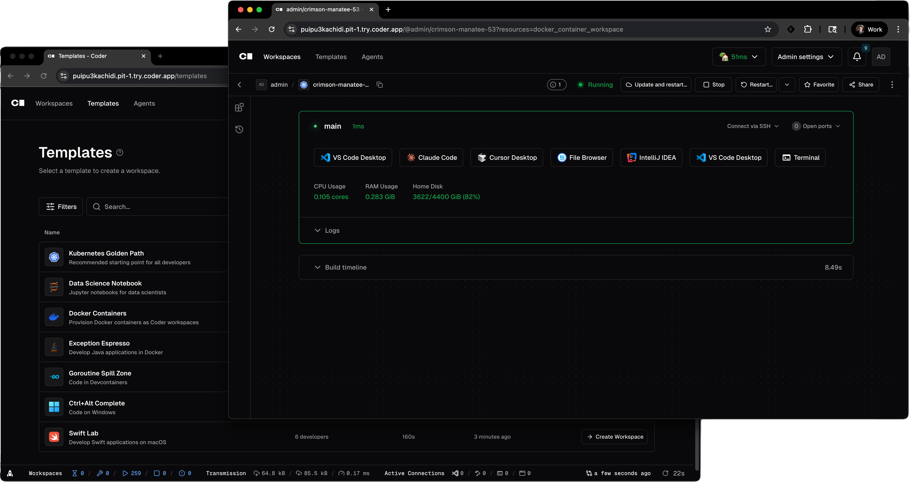

<!-- markdownlint-disable MD041 -->
<div align="center">
  <a href="https://optimus-ide-collab.com#gh-light-mode-only">
    
  </a>
  <a href="https://optimus-ide-collab.com#gh-dark-mode-only">
    
  </a>

  <h1>
  Self-Hosted Cloud Development Environments and AI Agents
  </h1>

  <a href="https://optimus-ide-collab.com#gh-light-mode-only">
    
  </a>
  <a href="https://optimus-ide-collab.com#gh-dark-mode-only">
    
  </a>

  <br>
  <br>

[Quickstart](#quickstart) | [Docs](https://optimus-ide-collab.com/docs) | [Why Optimus-IDE-Collab](https://optimus-ide-collab.com/why) | [Premium](https://optimus-ide-collab.com/pricing#compare-plans)

[](https://cdr.co/discord-Y6fMxGdNRg)
[](https://github.com/optimus-ide-collab/optimus-ide-collab/releases/latest)
[](https://pkg.go.dev/github.com/optimus-ide-collab/optimus-ide-collab)
[](https://goreportcard.com/report/github.com/optimus-ide-collab/optimus-ide-collab/v2)
[](https://www.bestpractices.dev/projects/9511)
[](https://scorecard.dev/viewer/?uri=github.com%2Foptimus-ide-collab%2Foptimus-ide-collab)
[](./LICENSE)

</div>

[Optimus-IDE-Collab](https://optimus-ide-collab.com) is a self-hosted platform for cloud development environments and AI coding agents. Workspaces are defined with Terraform, connected through a secure Wireguard® tunnel, and automatically shut down when not used. Optimus-IDE-Collab Agents runs a native AI coding agent whose loop executes in the control plane on your infrastructure, with no API keys in workspaces.

- Define cloud development environments in Terraform
  - EC2 VMs, Kubernetes Pods, Docker Containers, etc.
- Automatically shutdown idle resources to save on costs
- Onboard developers in seconds instead of days
- Delegate coding work to AI agents on your infrastructure
  - Bring any model (Anthropic, OpenAI, Google, Bedrock, self-hosted)
  - No LLM credentials in workspaces, user identity on every action
  - Centralized model governance, cost tracking, and audit logging

<p align="center">
  
</p>

## Quickstart

The most convenient way to try Optimus-IDE-Collab is to install it on your local machine and experiment with provisioning cloud development environments using Docker (works on Linux, macOS, and Windows).

```shell
# First, install Optimus-IDE-Collab
curl -L https://optimus-ide-collab.com/install.sh | sh

# Start the Optimus-IDE-Collab server (caches data in ~/.cache/optimus-ide-collab)
optimus-ide-collab server

# Navigate to http://localhost:3000 to create your initial user,
# create a Docker template and provision a workspace
```

## Install

The easiest way to install Optimus-IDE-Collab is to use the
[install script](https://github.com/optimus-ide-collab/optimus-ide-collab/blob/main/install.sh) for Linux
and macOS. For Windows, use the latest `..._installer.exe` file from GitHub
Releases.

```shell
curl -L https://optimus-ide-collab.com/install.sh | sh
```

You can run the install script with `--dry-run` to see the commands that will be used to install without executing them. Run the install script with `--help` for additional flags.

> See [install](https://optimus-ide-collab.com/docs/install) for additional methods.

Once installed, you can start a production deployment with a single command:

```shell
# Automatically sets up an external access URL on *.try.optimus-ide-collab.app
optimus-ide-collab server

# Requires a PostgreSQL instance (version 13 or higher) and external access URL
optimus-ide-collab server --postgres-url <url> --access-url <url>
```

Use `optimus-ide-collab --help` to get a list of flags and environment variables. See the [install guides](https://optimus-ide-collab.com/docs/install) for a complete tutorial.

## Documentation

Browse the [documentation](https://optimus-ide-collab.com/docs) or visit a specific section below:

- [**Workspaces**](https://optimus-ide-collab.com/docs/user-guides/workspace-management): Workspaces contain the IDEs, dependencies, and configuration information needed for software development
- [**Templates**](https://optimus-ide-collab.com/docs/admin/templates): Templates are written in Terraform and describe the infrastructure for workspaces
- [**Optimus-IDE-Collab Agents**](https://optimus-ide-collab.com/docs/ai-optimus-ide-collab/agents): Delegate coding work to AI agents running on your self-hosted infrastructure
- [**Administration**](https://optimus-ide-collab.com/docs/admin): Learn how to operate Optimus-IDE-Collab
- [**Premium**](https://optimus-ide-collab.com/pricing#compare-plans): Learn about paid features built for large teams
- [**IDEs**](https://optimus-ide-collab.com/docs/user-guides/workspace-access): Connect your existing editor to a workspace

## Support

Feel free to [open an issue](https://github.com/optimus-ide-collab/optimus-ide-collab/issues/new) if you have questions, run into bugs, or have a feature request.

[Join our Discord](https://discord.gg/optimus-ide-collab) to provide feedback on in-progress features and chat with the community using Optimus-IDE-Collab!

## Integrations

New integrations are always in progress. Open an issue to request one. Contributions are welcome in any official or community repository.

### Official

- [**Optimus-IDE-Collab Registry**](https://registry.optimus-ide-collab.com): Templates, modules, and integrations for common development environments
- [**VS Code Extension**](https://marketplace.visualstudio.com/items?itemName=optimus-ide-collab.optimus-ide-collab-remote): Open any Optimus-IDE-Collab workspace in VS Code with a single click
- [**JetBrains Toolbox Plugin**](https://plugins.jetbrains.com/plugin/26968-optimus-ide-collab): Open any Optimus-IDE-Collab workspace from JetBrains Toolbox with a single click
- [**JetBrains Gateway Plugin**](https://plugins.jetbrains.com/plugin/19620-optimus-ide-collab): Open any Optimus-IDE-Collab workspace in JetBrains Gateway with a single click
- [**Dev Containers**](https://github.com/optimus-ide-collab/envbuilder): Build development environments using `devcontainer.json` on Docker, Kubernetes, and OpenShift
- [**Kubernetes Log Stream**](https://github.com/optimus-ide-collab/optimus-ide-collab-logstream-kube): Stream Kubernetes Pod events to the Optimus-IDE-Collab startup logs
- [**Self-Hosted VS Code Extension Marketplace**](https://github.com/optimus-ide-collab/code-marketplace): A private extension marketplace that works in restricted or airgapped networks integrating with [code-server](https://github.com/optimus-ide-collab/code-server).
- [**GitHub Actions**](https://github.com/marketplace/actions/setup-optimus-ide-collab): An action to set up the Optimus-IDE-Collab CLI in GitHub workflows

### Community

- [**Community Templates**](https://registry.optimus-ide-collab.com/templates): Community-contributed workspace templates in the Optimus-IDE-Collab Registry
- [**Community Modules**](https://registry.optimus-ide-collab.com/modules): Community-contributed modules to extend Optimus-IDE-Collab templates
- [**Provision Optimus-IDE-Collab with Terraform**](https://github.com/ElliotG/optimus-ide-collab-oss-tf): Provision Optimus-IDE-Collab on Google GKE, Azure AKS, AWS EKS, DigitalOcean DOKS, IBMCloud K8s, OVHCloud K8s, and Scaleway K8s Kapsule with Terraform
- [**Optimus-IDE-Collab Template GitHub Action**](https://github.com/marketplace/actions/update-optimus-ide-collab-template): A GitHub Action that updates Optimus-IDE-Collab templates
- [**Discord**](https://cdr.co/discord-5hw2sjadGU): Chat with the community and provide feedback on in-progress features

## Contributing

New contributors are always welcome. If you are new to the Optimus-IDE-Collab codebase, see
[the contribution guide](https://optimus-ide-collab.com/docs/about/contributing/CONTRIBUTING) to get started.

## Hiring

Apply on the [careers page](https://jobs.ashbyhq.com/optimus-ide-collab?utm_source=github&utm_medium=readme&utm_campaign=unknown) if you are interested in joining the team.
