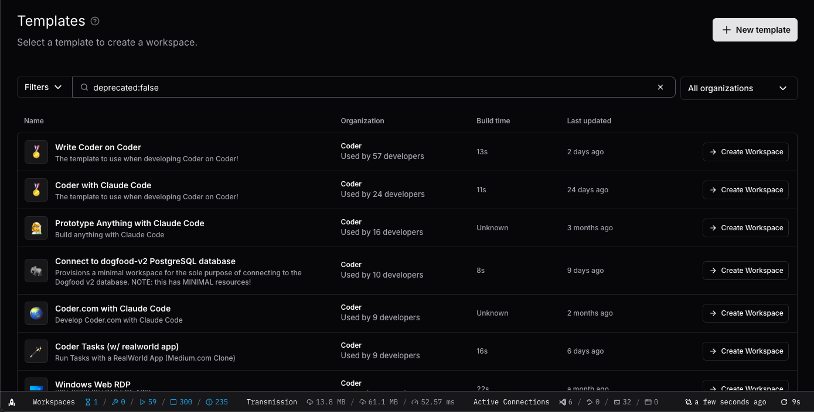
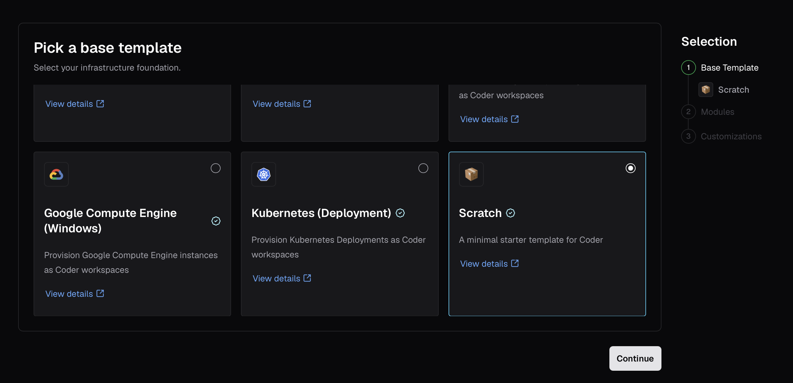
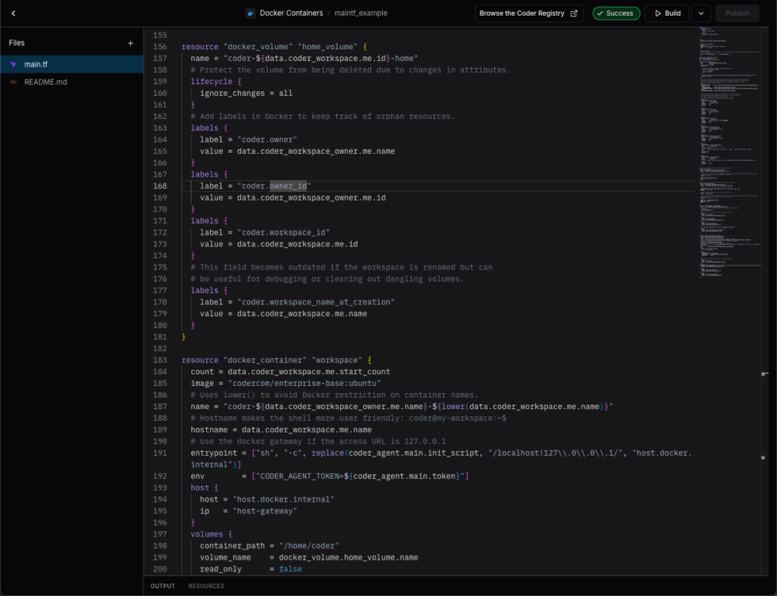
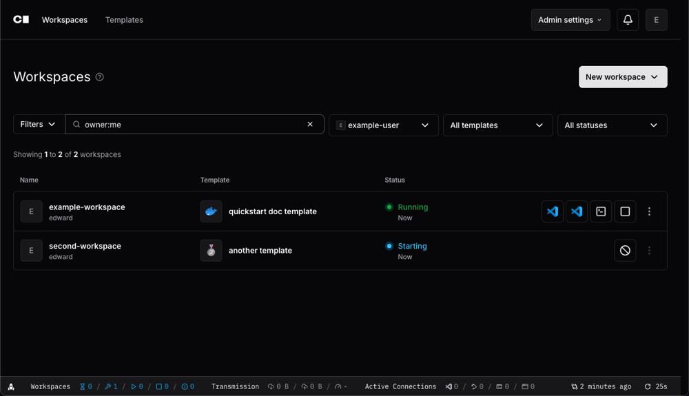
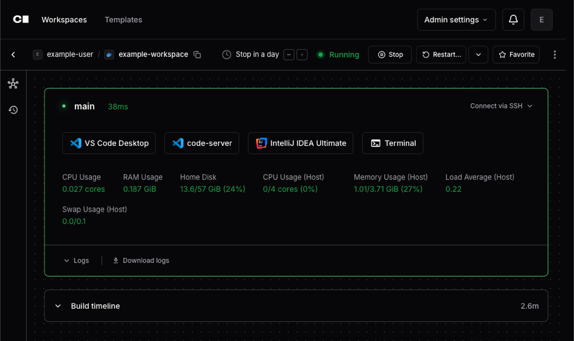
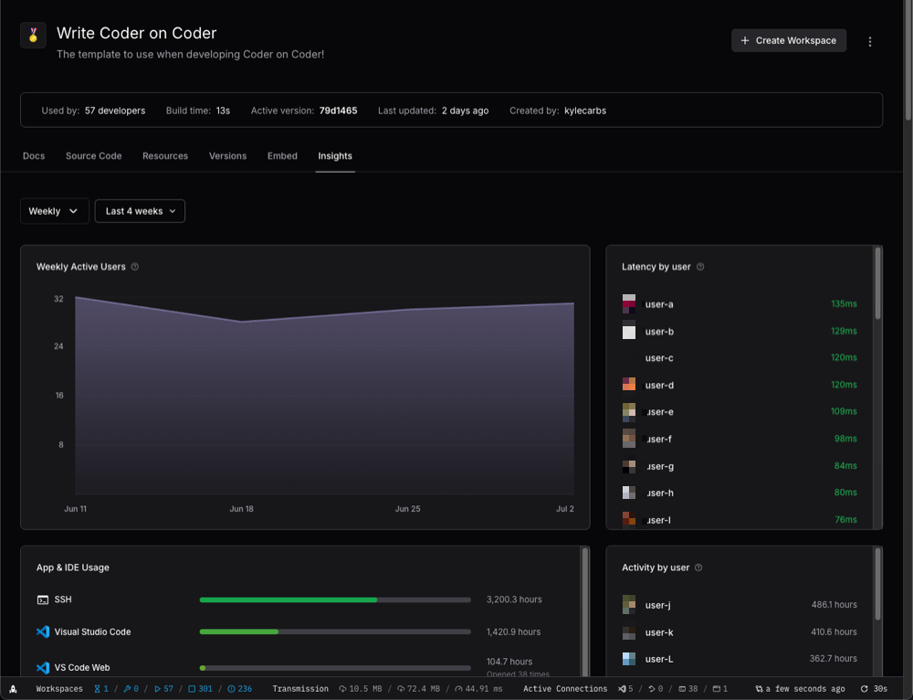
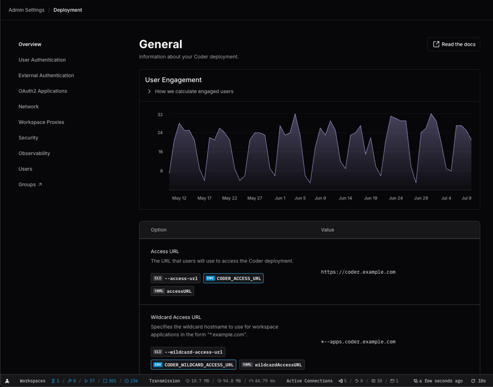
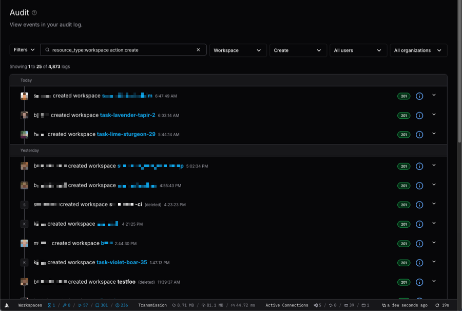
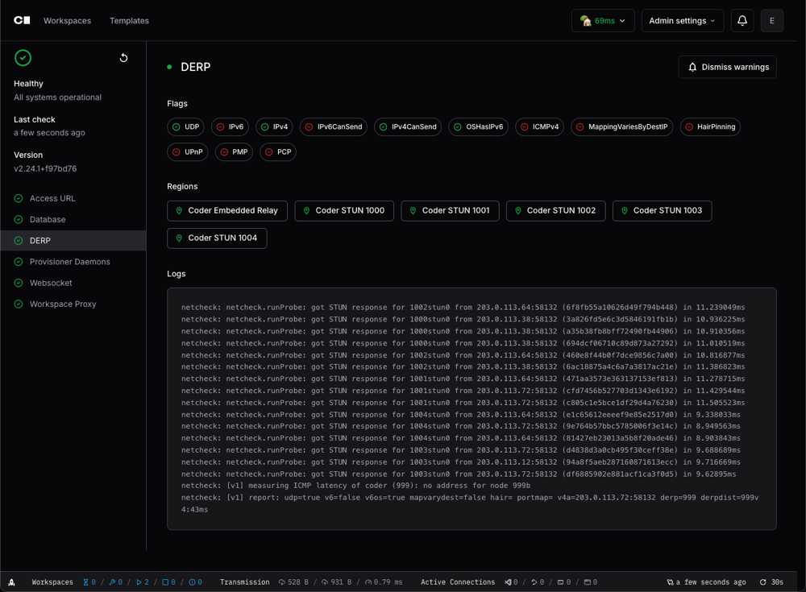

# Screenshots

## Log in

Install Optimus-IDE-Collab in your cloud or air-gapped on-premises. Developers simply log in
via their browser to access their Workspaces.

## Templates

Developers provision their own ephemeral Workspaces in minutes using pre-defined
Templates that include approved tooling and infrastructure.

Template administrators create templates using the template builder, which
guides them through selecting base infrastructure and adding modules. Templates
can also be created from scratch or uploaded directly.

Template administrators build Templates using Terraform. Templates define the
underlying infrastructure that Optimus-IDE-Collab Workspaces run on.

## Workspaces

Developers create and delete their own workspaces. Optimus-IDE-Collab administrators can
easily enforce Workspace scheduling and autostop policies to ensure idle
Workspaces don’t burn unnecessary cloud budget.

Developers launch their favorite web-based or desktop IDE, browse files, or
access their Workspace’s Terminal.

## Administration

Optimus-IDE-Collab administrators can access Template usage insights to understand which
Templates are most popular and how well they perform for developers.

Optimus-IDE-Collab administrators can control *every* aspect of their Optimus-IDE-Collab deployment.

Optimus-IDE-Collab administrators and auditor roles can review how users are interacting with
their Optimus-IDE-Collab Workspaces and Templates.

Optimus-IDE-Collab administrators can monitor the health of their Optimus-IDE-Collab deployment, including
database latency, active provisioners, and more.
