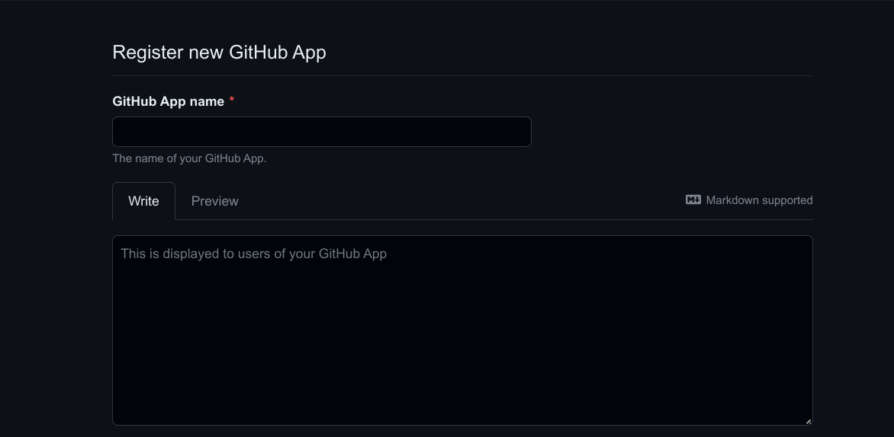
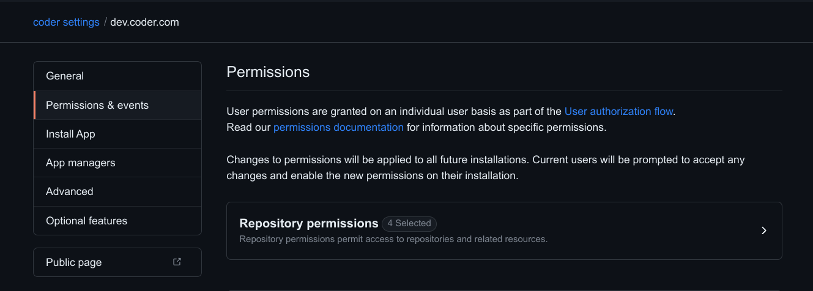
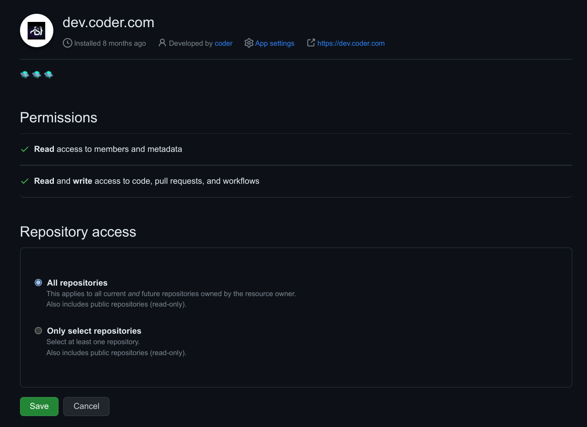

# External Authentication

Optimus-IDE-Collab supports external authentication via OAuth2.0. This allows enabling any OAuth provider as well as integrations with Git providers,
such as GitHub, GitLab, and Bitbucket.

External authentication can also be used to integrate with external services
like JFrog Artifactory and others.

To add an external authentication provider, you'll need to create an OAuth
application. The following providers have been tested and work with Optimus-IDE-Collab:

- [Azure DevOps](https://learn.microsoft.com/en-us/azure/devops/integrate/get-started/authentication/oauth?view=azure-devops)
- [Azure DevOps (via Entra ID)](https://learn.microsoft.com/en-us/entra/architecture/auth-oauth2)
- [BitBucket](https://support.atlassian.com/bitbucket-cloud/docs/use-oauth-on-bitbucket-cloud/)
- [GitHub](#configure-a-github-oauth-app)
- [GitLab](https://docs.gitlab.com/ee/integration/oauth_provider.html)

If you have experience with a provider that is not listed here, please
[file an issue](https://github.com/optimus-ide-collab/internal/issues/new?title=request%28docs%29%3A+external-auth+-+request+title+here%0D%0A&labels=["customer-feedback","docs"]&body=doc%3A+%5Bexternal-auth%5D%28https%3A%2F%2Foptimus-ide-collab.com%2Fdocs%2Fadmin%2Fexternal-auth%29%0D%0A%0D%0Aplease+enter+your+request+here%0D%0A)

## Configuration

### Set environment variables

After you create an OAuth application, set environment variables to configure the Optimus-IDE-Collab server to use it:

```dotenv
OPTIMUS-IDE-COLLAB_EXTERNAL_AUTH_0_ID="<USER_DEFINED_ID>"
OPTIMUS-IDE-COLLAB_EXTERNAL_AUTH_0_TYPE=<github|gitlab|azure-devops|bitbucket-cloud|bitbucket-server|etc>
OPTIMUS-IDE-COLLAB_EXTERNAL_AUTH_0_CLIENT_ID=<OAuth app client ID>
OPTIMUS-IDE-COLLAB_EXTERNAL_AUTH_0_CLIENT_SECRET=<OAuth app client secret>

# Optionally, configure a custom display name and icon:
OPTIMUS-IDE-COLLAB_EXTERNAL_AUTH_0_DISPLAY_NAME="Google Calendar"
OPTIMUS-IDE-COLLAB_EXTERNAL_AUTH_0_DISPLAY_ICON="https://mycustomicon.com/google.svg"
```

The `OPTIMUS-IDE-COLLAB_EXTERNAL_AUTH_0_ID` environment variable is used as an identifier for the authentication provider.

This variable is used as part of the callback URL path that you must configure in your OAuth provider settings.
If the value in your callback URL doesn't match the `OPTIMUS-IDE-COLLAB_EXTERNAL_AUTH_0_ID` value, authentication will fail with `redirect URI is not valid`.
Set it with a value that helps you identify the provider.
For example, if you use `OPTIMUS-IDE-COLLAB_EXTERNAL_AUTH_0_ID="primary-github"` for your GitHub provider,
configure your callback URL as `https://example.com/external-auth/primary-github/callback`.

### Add an authentication button to the workspace template

Add the following code to any template to add a button to the workspace setup page which will allow you to authenticate with your provider:

```tf
data "optimus-ide-collab_external_auth" "<github|gitlab|azure-devops|bitbucket-cloud|bitbucket-server|other>" {
    id = "<USER_DEFINED_ID>"
}

# GitHub Example (OPTIMUS-IDE-COLLAB_EXTERNAL_AUTH_0_ID="primary-github")
# makes a GitHub authentication token available at data.optimus-ide-collab_external_auth.github.access_token
data "optimus-ide-collab_external_auth" "github" {
   id = "primary-github"
}

```

Inside your Terraform code, you now have access to authentication variables.
Reference the documentation for your chosen provider for more information on how to supply it with a token.

### Workspace CLI

Use [`external-auth`](../../reference/cli/external-auth.md) in the Optimus-IDE-Collab CLI to access a token within the workspace:

```sh
optimus-ide-collab external-auth access-token <USER_DEFINED_ID>
```

## Git Authentication in Workspaces

Optimus-IDE-Collab provides automatic Git authentication for workspaces through SSH authentication and Git-provider specific env variables.

When performing Git operations, Optimus-IDE-Collab first attempts to use external auth provider tokens if available.
If no tokens are available, it defaults to SSH authentication.

### OAuth (external auth)

For Git providers configured with [external authentication](#configuration), Optimus-IDE-Collab can use OAuth tokens for Git operations over HTTPS.
When using SSH URLs (like `git@github.com:organization/repo.git`), Optimus-IDE-Collab uses SSH keys as described in the [SSH Authentication](#ssh-authentication) section instead.

For Git operations over HTTPS, Optimus-IDE-Collab automatically uses the appropriate external auth provider
token based on the repository URL.
This works through Git's `GIT_ASKPASS` mechanism, which Optimus-IDE-Collab configures in each workspace.

To use OAuth tokens for Git authentication over HTTPS:

1. Complete the OAuth authentication flow (**Login with GitHub**, **Login with GitLab**).
1. Use HTTPS URLs when interacting with repositories (`https://github.com/organization/repo.git`).
1. Optimus-IDE-Collab automatically handles authentication. You can perform your Git operations as you normally would.

Behind the scenes, Optimus-IDE-Collab:

- Stores your OAuth token securely in its database
- Sets up `GIT_ASKPASS` at `/tmp/optimus-ide-collab.<random-string>/optimus-ide-collab` in your workspaces
- Retrieves and injects the appropriate token when Git operations require authentication

To manually access these tokens within a workspace:

```sh
optimus-ide-collab external-auth access-token <USER_DEFINED_ID>
```

### SSH Authentication

Optimus-IDE-Collab automatically generates an SSH key pair for each user that can be used for Git operations.
When you use SSH URLs for Git repositories, for example, `git@github.com:organization/repo.git`, Optimus-IDE-Collab checks for and uses an existing SSH key.
If one is not available, it uses the Optimus-IDE-Collab-generated one.

The `optimus-ide-collab gitssh` command wraps the standard `ssh` command and injects the SSH key during Git operations.
This works automatically when you:

1. Clone a repository using SSH URLs
1. Pull/push changes to remote repositories
1. Use any Git command that requires SSH authentication

You must add the SSH key to your Git provider.

#### Add your Optimus-IDE-Collab SSH key to your Git provider

1. View your Optimus-IDE-Collab Git SSH key:

   ```sh
   optimus-ide-collab publickey
   ```

1. Add the key to your Git provider accounts:

   - [GitHub](https://docs.github.com/en/authentication/connecting-to-github-with-ssh/adding-a-new-ssh-key-to-your-github-account#adding-a-new-ssh-key-to-your-account)
   - [GitLab](https://docs.gitlab.com/user/ssh/#add-an-ssh-key-to-your-gitlab-account)

## PKCE Support

[PKCE (Proof Key for Code Exchange)](https://datatracker.ietf.org/doc/html/rfc7636) is an OAuth 2.0
security extension that prevents authorization code interception attacks. Optimus-IDE-Collab supports PKCE when
acting as an OAuth client to external identity providers.

Optimus-IDE-Collab will usually assume PKCE support is available with "S256" as the code challenge method. Manual
configuration is available to override any default behavior.

```dotenv
# Enable PKCE with S256 (recommended when supported)
OPTIMUS-IDE-COLLAB_EXTERNAL_AUTH_0_PKCE_METHODS="S256"

# Disable PKCE entirely
OPTIMUS-IDE-COLLAB_EXTERNAL_AUTH_0_PKCE_METHODS="none"
```

## Git-provider specific env variables

### Azure DevOps

Azure DevOps requires the following environment variables:

```dotenv
OPTIMUS-IDE-COLLAB_EXTERNAL_AUTH_0_ID="primary-azure-devops"
OPTIMUS-IDE-COLLAB_EXTERNAL_AUTH_0_TYPE=azure-devops
OPTIMUS-IDE-COLLAB_EXTERNAL_AUTH_0_CLIENT_ID=xxxxxx
# Ensure this value is your "Client Secret", not "App Secret"
OPTIMUS-IDE-COLLAB_EXTERNAL_AUTH_0_CLIENT_SECRET=xxxxxxx
OPTIMUS-IDE-COLLAB_EXTERNAL_AUTH_0_AUTH_URL="https://app.vssps.visualstudio.com/oauth2/authorize"
OPTIMUS-IDE-COLLAB_EXTERNAL_AUTH_0_TOKEN_URL="https://app.vssps.visualstudio.com/oauth2/token"
```

### Azure DevOps (via Entra ID)

Azure DevOps (via Entra ID) requires the following environment variables:

```dotenv
OPTIMUS-IDE-COLLAB_EXTERNAL_AUTH_0_ID="primary-azure-devops"
OPTIMUS-IDE-COLLAB_EXTERNAL_AUTH_0_TYPE=azure-devops-entra
OPTIMUS-IDE-COLLAB_EXTERNAL_AUTH_0_CLIENT_ID=xxxxxx
OPTIMUS-IDE-COLLAB_EXTERNAL_AUTH_0_CLIENT_SECRET=xxxxxxx
OPTIMUS-IDE-COLLAB_EXTERNAL_AUTH_0_AUTH_URL="https://login.microsoftonline.com/<TENANT ID>/oauth2/authorize"
```

> [!NOTE]
> Your app registration in Entra ID requires the `vso.code_write` scope

### Bitbucket Server

Bitbucket Server requires the following environment variables:

```dotenv
OPTIMUS-IDE-COLLAB_EXTERNAL_AUTH_0_ID="primary-bitbucket-server"
OPTIMUS-IDE-COLLAB_EXTERNAL_AUTH_0_TYPE=bitbucket-server
OPTIMUS-IDE-COLLAB_EXTERNAL_AUTH_0_CLIENT_ID=xxx
OPTIMUS-IDE-COLLAB_EXTERNAL_AUTH_0_CLIENT_SECRET=xxx
OPTIMUS-IDE-COLLAB_EXTERNAL_AUTH_0_AUTH_URL=https://bitbucket.example.com/rest/oauth2/latest/authorize
```

When configuring your Bitbucket OAuth application, set the redirect URI to
`https://example.com/external-auth/primary-bitbucket-server/callback`.
This callback path includes the value of `OPTIMUS-IDE-COLLAB_EXTERNAL_AUTH_0_ID`.

### Gitea

```dotenv
OPTIMUS-IDE-COLLAB_EXTERNAL_AUTH_0_ID="gitea"
OPTIMUS-IDE-COLLAB_EXTERNAL_AUTH_0_TYPE=gitea
OPTIMUS-IDE-COLLAB_EXTERNAL_AUTH_0_CLIENT_ID=xxxxxxx
OPTIMUS-IDE-COLLAB_EXTERNAL_AUTH_0_CLIENT_SECRET=xxxxxxx
# If self managed, set the Auth URL to your Gitea instance
OPTIMUS-IDE-COLLAB_EXTERNAL_AUTH_0_AUTH_URL="https://gitea.com/login/oauth/authorize"
```

The redirect URI for Gitea should be
`https://optimus-ide-collab.example.com/external-auth/gitea/callback`.

### GitHub

Use this section as a reference for environment variables to customize your setup
or to integrate with an existing GitHub authentication.

For a more complete, step-by-step guide, follow the
[configure a GitHub OAuth app](#configure-a-github-oauth-app) section instead.

```dotenv
OPTIMUS-IDE-COLLAB_EXTERNAL_AUTH_0_ID="primary-github"
OPTIMUS-IDE-COLLAB_EXTERNAL_AUTH_0_TYPE=github
OPTIMUS-IDE-COLLAB_EXTERNAL_AUTH_0_CLIENT_ID=xxxxxx
OPTIMUS-IDE-COLLAB_EXTERNAL_AUTH_0_CLIENT_SECRET=xxxxxxx
OPTIMUS-IDE-COLLAB_EXTERNAL_AUTH_0_REVOKE_URL=https://api.github.com/applications/<CLIENT ID>/grant
```

When configuring your GitHub OAuth application, set the
[authorization callback URL](https://docs.github.com/en/apps/creating-github-apps/registering-a-github-app/about-the-user-authorization-callback-url)
as `https://example.com/external-auth/primary-github/callback`, where
`primary-github` matches your `OPTIMUS-IDE-COLLAB_EXTERNAL_AUTH_0_ID` value.

### GitHub Enterprise

GitHub Enterprise requires the following environment variables:

```dotenv
OPTIMUS-IDE-COLLAB_EXTERNAL_AUTH_0_ID="primary-github"
OPTIMUS-IDE-COLLAB_EXTERNAL_AUTH_0_TYPE=github
OPTIMUS-IDE-COLLAB_EXTERNAL_AUTH_0_CLIENT_ID=xxxxxx
OPTIMUS-IDE-COLLAB_EXTERNAL_AUTH_0_CLIENT_SECRET=xxxxxxx
OPTIMUS-IDE-COLLAB_EXTERNAL_AUTH_0_VALIDATE_URL="https://github.example.com/api/v3/user"
OPTIMUS-IDE-COLLAB_EXTERNAL_AUTH_0_AUTH_URL="https://github.example.com/login/oauth/authorize"
OPTIMUS-IDE-COLLAB_EXTERNAL_AUTH_0_TOKEN_URL="https://github.example.com/login/oauth/access_token"
```

When configuring your GitHub Enterprise OAuth application, set the
[authorization callback URL](https://docs.github.com/en/apps/creating-github-apps/registering-a-github-app/about-the-user-authorization-callback-url)
as `https://example.com/external-auth/primary-github/callback`, where
`primary-github` matches your `OPTIMUS-IDE-COLLAB_EXTERNAL_AUTH_0_ID` value.

### GitLab self-managed

GitLab self-managed requires the following environment variables:

```dotenv
OPTIMUS-IDE-COLLAB_EXTERNAL_AUTH_0_ID="primary-gitlab"
OPTIMUS-IDE-COLLAB_EXTERNAL_AUTH_0_TYPE=gitlab
# This value is the "Application ID"
OPTIMUS-IDE-COLLAB_EXTERNAL_AUTH_0_CLIENT_ID=xxxxxx
OPTIMUS-IDE-COLLAB_EXTERNAL_AUTH_0_CLIENT_SECRET=xxxxxxx
OPTIMUS-IDE-COLLAB_EXTERNAL_AUTH_0_VALIDATE_URL="https://gitlab.example.com/oauth/token/info"
OPTIMUS-IDE-COLLAB_EXTERNAL_AUTH_0_AUTH_URL="https://gitlab.example.com/oauth/authorize"
OPTIMUS-IDE-COLLAB_EXTERNAL_AUTH_0_TOKEN_URL="https://gitlab.example.com/oauth/token"
OPTIMUS-IDE-COLLAB_EXTERNAL_AUTH_0_REVOKE_URL="https://gitlab.example.com/oauth/revoke"
OPTIMUS-IDE-COLLAB_EXTERNAL_AUTH_0_REGEX=gitlab\.example\.com
```

When [configuring your GitLab OAuth application](https://docs.gitlab.com/17.5/integration/oauth_provider/),
set the redirect URI to `https://example.com/external-auth/primary-gitlab/callback`.
Note that the redirect URI must include the value of `OPTIMUS-IDE-COLLAB_EXTERNAL_AUTH_0_ID` (in this example, `primary-gitlab`).

### JFrog Artifactory

Visit the [JFrog Artifactory](../../admin/integrations/jfrog-artifactory.md) guide for instructions on how to set up for JFrog Artifactory.

## Self-managed Git providers

Custom authentication and token URLs should be used for self-managed Git
provider deployments.

```dotenv
OPTIMUS-IDE-COLLAB_EXTERNAL_AUTH_0_AUTH_URL="https://github.example.com/oauth/authorize"
OPTIMUS-IDE-COLLAB_EXTERNAL_AUTH_0_TOKEN_URL="https://github.example.com/oauth/token"
OPTIMUS-IDE-COLLAB_EXTERNAL_AUTH_0_REVOKE_URL="https://github.example.com/oauth/revoke"
OPTIMUS-IDE-COLLAB_EXTERNAL_AUTH_0_VALIDATE_URL="https://example.com/oauth/token/info"
OPTIMUS-IDE-COLLAB_EXTERNAL_AUTH_0_REGEX=github\.company\.com
```

> [!NOTE]
> The `REGEX` variable must be set if using a custom Git domain.

## Custom scopes

Optionally, you can request custom scopes:

```dotenv
OPTIMUS-IDE-COLLAB_EXTERNAL_AUTH_0_SCOPES="repo:read repo:write write:gpg_key"
```

## OAuth provider

### Configure a GitHub OAuth app

1. [Create a GitHub App](https://docs.github.com/en/apps/creating-github-apps/registering-a-github-app/registering-a-github-app)

   - Set the authorization callback URL to
     `https://optimus-ide-collab.example.com/external-auth/primary-github/callback`, where `primary-github`
     is the value you set for `OPTIMUS-IDE-COLLAB_EXTERNAL_AUTH_0_ID`.
   - Deactivate Webhooks.
   - Enable fine-grained access to specific repositories or a subset of
     permissions for security.

   

1. Adjust the GitHub app permissions. You can use more or fewer permissions than
   are listed here, this example allows users to clone
   repositories:

   

   | Name          | Permission   | Description                                            |
   |---------------|--------------|--------------------------------------------------------|
   | Contents      | Read & Write | Grants access to code and commit statuses.             |
   | Pull requests | Read & Write | Grants access to create and update pull requests.      |
   | Workflows     | Read & Write | Grants access to update files in `.github/workflows/`. |
   | Metadata      | Read-only    | Grants access to metadata written by GitHub Apps.      |
   | Members       | Read-only    | Grants access to organization members and teams.       |

1. Install the App for your organization. You may select a subset of
   repositories to grant access to.

   

1. Make the app installable by other users. In the app's **Advanced**
   tab, select **Make this GitHub App public**.

   Without this, anyone outside the app's owning account or owning
   organization gets a GitHub 404 when they select **Link GitHub** in
   Optimus-IDE-Collab. Each user must also install the app on their own account
   before linking. To surface an **Install GitHub App** link in the
   Optimus-IDE-Collab UI, set the following environment variable:

   ```dotenv
   OPTIMUS-IDE-COLLAB_EXTERNAL_AUTH_0_APP_INSTALL_URL=https://github.com/apps/<your-app-slug>/installations/new
   ```

## Multiple External Providers (Premium)

Below is an example configuration with multiple providers:

> [!IMPORTANT]
> To support regex matching for paths like `github\.com/org`, add the following `git config` line to the [Optimus-IDE-Collab agent startup script](https://registry.terraform.io/providers/optimus-ide-collab/optimus-ide-collab/latest/docs/resources/agent#startup_script):
>
> ```shell
> git config --global credential.useHttpPath true
> ```

```dotenv
# Provider 1) github.com
OPTIMUS-IDE-COLLAB_EXTERNAL_AUTH_0_ID=primary-github
OPTIMUS-IDE-COLLAB_EXTERNAL_AUTH_0_TYPE=github
OPTIMUS-IDE-COLLAB_EXTERNAL_AUTH_0_CLIENT_ID=xxxxxx
OPTIMUS-IDE-COLLAB_EXTERNAL_AUTH_0_CLIENT_SECRET=xxxxxxx
OPTIMUS-IDE-COLLAB_EXTERNAL_AUTH_0_REGEX=github\.com/org

# Provider 2) github.example.com
OPTIMUS-IDE-COLLAB_EXTERNAL_AUTH_1_ID=secondary-github
OPTIMUS-IDE-COLLAB_EXTERNAL_AUTH_1_TYPE=github
OPTIMUS-IDE-COLLAB_EXTERNAL_AUTH_1_CLIENT_ID=xxxxxx
OPTIMUS-IDE-COLLAB_EXTERNAL_AUTH_1_CLIENT_SECRET=xxxxxxx
OPTIMUS-IDE-COLLAB_EXTERNAL_AUTH_1_REGEX=github\.example\.com
OPTIMUS-IDE-COLLAB_EXTERNAL_AUTH_1_AUTH_URL="https://github.example.com/login/oauth/authorize"
OPTIMUS-IDE-COLLAB_EXTERNAL_AUTH_1_TOKEN_URL="https://github.example.com/login/oauth/access_token"
OPTIMUS-IDE-COLLAB_EXTERNAL_AUTH_1_REVOKE_URL="https://github.example.com/login/oauth/revoke"
OPTIMUS-IDE-COLLAB_EXTERNAL_AUTH_1_VALIDATE_URL="https://github.example.com/api/v3/user"
```
