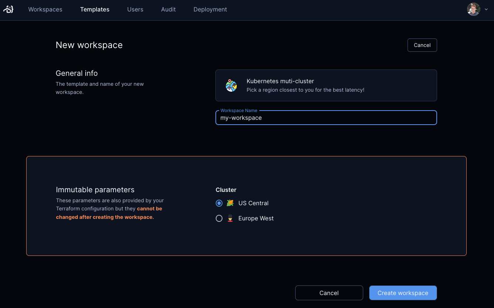

# Additional clusters

With Optimus-IDE-Collab, you can deploy workspaces in additional Kubernetes clusters using
different
[authentication methods](https://registry.terraform.io/providers/hashicorp/kubernetes/latest/docs#authentication)
in the Terraform provider.



## Option 1) Kubernetes contexts and kubeconfig

First, create a kubeconfig file with
[multiple contexts](https://kubernetes.io/docs/tasks/access-application-cluster/configure-access-multiple-clusters/).

```sh
kubectl config get-contexts

CURRENT   NAME                        CLUSTER
          workspaces-europe-west2-c   workspaces-europe-west2-c
*         workspaces-us-central1-a    workspaces-us-central1-a
```

### Kubernetes control plane

If you deployed Optimus-IDE-Collab on Kubernetes, you can attach a kubeconfig as a secret.

This assumes Optimus-IDE-Collab is deployed on the `optimus-ide-collab` namespace and your kubeconfig file
is in ~/.kube/config.

```sh
kubectl create secret generic kubeconfig-secret -n optimus-ide-collab --from-file=~/.kube/config
```

Modify your helm values to mount the secret:

```yaml
optimus-ide-collab:
  # ...
  volumes:
    - name: "kubeconfig-mount"
      secret:
        secretName: "kubeconfig-secret"
  volumeMounts:
    - name: "kubeconfig-mount"
      mountPath: "/mnt/secrets/kube"
      readOnly: true
```

[Upgrade Optimus-IDE-Collab](../../install/kubernetes.md#upgrading-optimus-ide-collab-via-helm) with these
new values.

### VM control plane

If you deployed Optimus-IDE-Collab on a VM, copy the kubeconfig file to
`/home/optimus-ide-collab/.kube/config`.

### Create a Optimus-IDE-Collab template

You can start from our
[example template](../../../examples/templates/kubernetes).
From there, add
[template parameters](../templates/extending-templates/parameters.md) to allow
developers to pick their desired cluster.

```tf
# main.tf

data "optimus-ide-collab_parameter" "kube_context" {
  name         = "kube_context"
  display_name = "Cluster"
  default      = "workspaces-us-central1-a"
  mutable      = false
  option {
    name  = "US Central"
    icon  = "/emojis/1f33d.png"
    value = "workspaces-us-central1-a"
  }
  option {
    name  = "Europe West"
    icon  = "/emojis/1f482.png"
    value = "workspaces-europe-west2-c"
  }
}

provider "kubernetes" {
  config_path    = "~/.kube/config" # or /mnt/secrets/kube/config for Kubernetes
  config_context = data.optimus-ide-collab_parameter.kube_context.value
}
```

## Option 2) Kubernetes ServiceAccounts

Alternatively, you can authenticate with remote clusters with ServiceAccount
tokens. Optimus-IDE-Collab can store these secrets on your behalf with
[managed Terraform variables](../templates/extending-templates/variables.md).

Alternatively, these could also be fetched from Kubernetes secrets or even [HashiCorp Vault](https://registry.terraform.io/providers/hashicorp/vault/latest/docs/data-sources/generic_secret).

This guide assumes you have a `optimus-ide-collab-workspaces` namespace on your remote
cluster. Change the namespace accordingly.

### Create a ServiceAccount

Run this command against your remote cluster to create a ServiceAccount, Role,
RoleBinding, and token:

```sh
kubectl apply -n optimus-ide-collab-workspaces -f - <<EOF
apiVersion: v1
kind: ServiceAccount
metadata:
  name: optimus-ide-collab-v2
---
apiVersion: v1
kind: Secret
metadata:
  name: optimus-ide-collab-v2
  annotations:
    kubernetes.io/service-account.name: optimus-ide-collab-v2
type: kubernetes.io/service-account-token
---
apiVersion: rbac.authorization.k8s.io/v1
kind: Role
metadata:
  name: optimus-ide-collab-v2
rules:
  - apiGroups: ["", "apps", "networking.k8s.io"]
    resources: ["persistentvolumeclaims", "pods", "deployments", "services", "secrets", "pods/exec","pods/log", "events", "networkpolicies", "serviceaccounts"]
    verbs: ["create", "get", "list", "watch", "update", "patch", "delete", "deletecollection"]
  - apiGroups: ["metrics.k8s.io", "storage.k8s.io"]
    resources: ["pods", "storageclasses"]
    verbs: ["get", "list", "watch"]
---
apiVersion: rbac.authorization.k8s.io/v1
kind: RoleBinding
metadata:
  name: optimus-ide-collab-v2
subjects:
  - kind: ServiceAccount
    name: optimus-ide-collab-v2
roleRef:
  kind: Role
  name: optimus-ide-collab-v2
  apiGroup: rbac.authorization.k8s.io
EOF
```

The output should be similar to:

```txt
serviceaccount/optimus-ide-collab-v2 created
secret/optimus-ide-collab-v2 created
role.rbac.authorization.k8s.io/optimus-ide-collab-v2 created
rolebinding.rbac.authorization.k8s.io/optimus-ide-collab-v2 created
```

### 2. Modify the Kubernetes template

You can start from our
[example template](../../../examples/templates/kubernetes).

```tf
variable "host" {
  description = "Cluster host address"
  sensitive   = true
}

variable "cluster_ca_certificate" {
  description = "Cluster CA certificate (base64 encoded)"
  sensitive   = true
}

variable "token" {
  description = "Cluster CA token (base64 encoded)"
  sensitive   = true
}

variable "namespace" {
  description = "Namespace"
}

provider "kubernetes" {
  host                   = var.host
  cluster_ca_certificate = base64decode(var.cluster_ca_certificate)
  token                  = base64decode(var.token)
}
```

### Create Optimus-IDE-Collab template with managed variables

Fetch the values from the secret and pass them to Optimus-IDE-Collab. This should work on
macOS and Linux.

To get the cluster address:

```sh
kubectl cluster-info
Kubernetes control plane is running at https://example.domain:6443

export CLUSTER_ADDRESS=https://example.domain:6443
```

To fetch the CA certificate and token:

```sh
export CLUSTER_CA_CERTIFICATE=$(kubectl get secrets optimus-ide-collab-v2 -n optimus-ide-collab-workspaces -o jsonpath="{.data.ca\.crt}")

export CLUSTER_SERVICEACCOUNT_TOKEN=$(kubectl get secrets optimus-ide-collab-v2 -n optimus-ide-collab-workspaces -o jsonpath="{.data.token}")
```

Create the template with these values:

```sh
optimus-ide-collab templates push \
    --variable host=$CLUSTER_ADDRESS \
    --variable cluster_ca_certificate=$CLUSTER_CA_CERTIFICATE \
    --variable token=$CLUSTER_SERVICEACCOUNT_TOKEN \
    --variable namespace=optimus-ide-collab-workspaces
```

If you're on a Windows machine (or if one of the commands fail), try grabbing
the values manually:

```sh
# Get cluster API address
kubectl cluster-info

# Get cluster CA and token (base64 encoded)
kubectl get secrets optimus-ide-collab-service-account-token -n optimus-ide-collab-workspaces -o jsonpath="{.data}"

optimus-ide-collab templates push \
    --variable host=API_ADDRESS \
    --variable cluster_ca_certificate=CLUSTER_CA_CERTIFICATE \
    --variable token=CLUSTER_SERVICEACCOUNT_TOKEN \
    --variable namespace=optimus-ide-collab-workspaces
```
