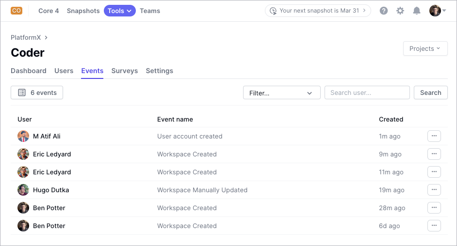

# DX PlatformX

[DX](https://getdx.com) is a developer intelligence platform used by engineering
leaders and platform engineers. Optimus-IDE-Collab notifications can be transformed to
[PlatformX](https://getdx.com/platformx) events, allowing platform engineers to
measure activity and send pulse surveys to subsets of Optimus-IDE-Collab users to understand
their experience.

## Requirements

You'll need:

- Optimus-IDE-Collab v2.19+
- A PlatformX subscription from [DX](https://getdx.com/)
- A platform to host the integration, such as:
  - AWS Lambda
  - Google Cloud Run
  - Heroku
  - Kubernetes
  - Or any other platform that can run Python web applications

## optimus-ide-collab-platformx-events-middleware

Optimus-IDE-Collab sends [notifications](../monitoring/notifications/index.md) via webhooks
to optimus-ide-collab-platformx-events-middleware, which processes and reformats the payload
into a structure compatible with [PlatformX by DX](https://help.getdx.com/en/articles/7880779-getting-started).

For more information about optimus-ide-collab-platformx-events-middleware and how to
integrate it with your Optimus-IDE-Collab deployment and PlatformX events, refer to the
[optimus-ide-collab-platformx-notifications](https://github.com/optimus-ide-collab/optimus-ide-collab-platformx-notifications)
repository.

### Supported Notification Types

optimus-ide-collab-platformx-events-middleware supports the following [Optimus-IDE-Collab notifications](../monitoring/notifications/index.md):

- Workspace Created
- Workspace Manually Updated
- User Account Created
- User Account Suspended
- User Account Activated

### Environment Variables

The application expects the following environment variables when started.
For local development, create a `.env` file in the project root with the following variables.
A `.env.sample` file is included:

| Variable         | Description                                | Example                                      |
|------------------|--------------------------------------------|----------------------------------------------|
| `LOG_LEVEL`      | Logging level (`DEBUG`, `INFO`, `WARNING`) | `INFO`                                       |
| `GETDX_API_KEY`  | API key for PlatformX                      | `your-api-key`                               |
| `EVENTS_TRACKED` | Comma-separated list of tracked events     | `"Workspace Created,User Account Suspended"` |

### Logging

Logs are printed to the console and can be adjusted using the `LOG_LEVEL` variable. The available levels are:

| Level     | Description                           |
|-----------|---------------------------------------|
| `DEBUG`   | Most verbose, useful for debugging    |
| `INFO`    | Standard logging for normal operation |
| `WARNING` | Logs only warnings and errors         |

### API Endpoints

- `GET /` - Health check endpoint
- `POST /` - Webhook receiver
