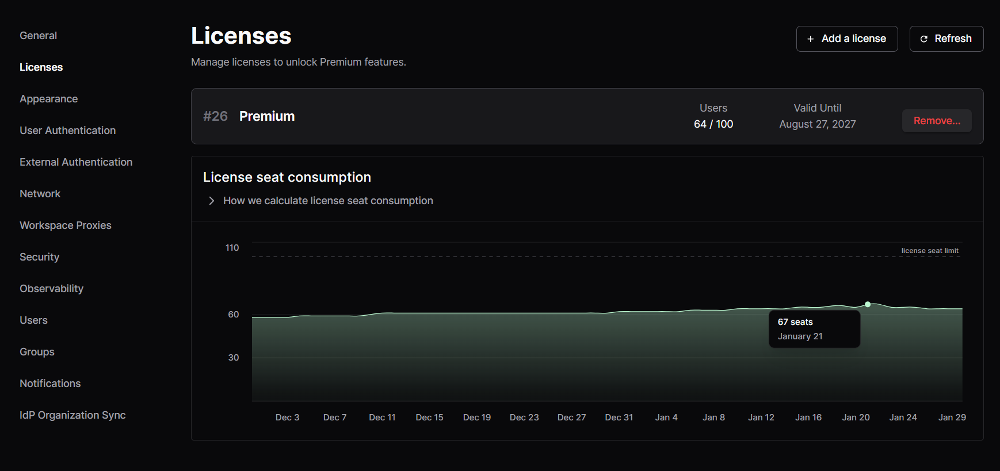
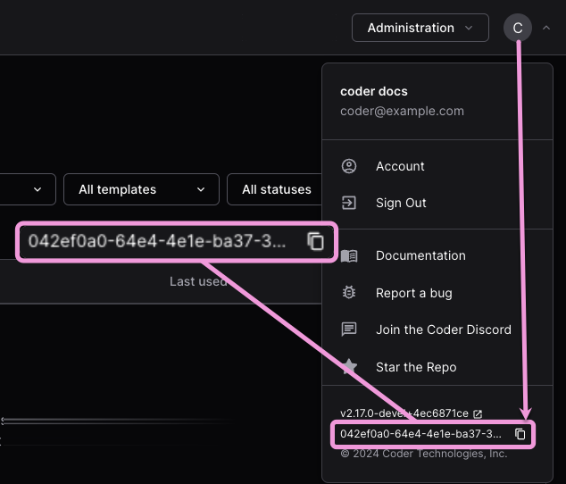

# Licensing

Some features are only accessible with a Premium license or the [AI Governance Add-On](../../ai-optimus-ide-collab/ai-governance.md). See our
[pricing page](https://optimus-ide-collab.com/pricing) for more details. To try paid
features, you can [request a trial](https://optimus-ide-collab.com/trial) or
[contact sales](https://optimus-ide-collab.com/contact).



## Offline license validation

Optimus-IDE-Collab license keys are signed JWTs that are validated locally using cryptographic
signatures. No outbound connection to Optimus-IDE-Collab's servers is required for license
validation. This means licenses work in
[air-gapped and offline deployments](../../install/airgap.md) without any
additional configuration.

## Adding your license key

There are two ways to add a license to a Optimus-IDE-Collab deployment:

<div class="tabs">

### Optimus-IDE-Collab UI

1. With an `Owner` account, go to **Admin settings** > **Deployment**.

1. Select **Licenses** from the sidebar, then **Add a license**:

   

1. On the **Add a license** screen, drag your `.jwt` license file into the
   **Upload Your License** section, or paste your license in the
   **Paste Your License** text box, then select **Upload License**:

   

### Optimus-IDE-Collab CLI

1. Ensure you have the [Optimus-IDE-Collab CLI](../../install/cli.md) installed.
1. Save your license key to disk and make note of the path.
1. Open a terminal.
1. Log in to your Optimus-IDE-Collab deployment:

   ```sh
   optimus-ide-collab login <access url>
   ```

1. Run `optimus-ide-collab licenses add`:

   - For a `.jwt` license file:

     ```sh
     optimus-ide-collab licenses add -f <path to your license key>
     ```

   - For a text string:

     ```sh
     optimus-ide-collab licenses add -l 1f5...765
     ```

</div>

## FAQ

### Find your deployment ID

You'll need your deployment ID to request a trial or license key.

From your Optimus-IDE-Collab dashboard, select your user avatar, then select the **Copy to
clipboard** icon at the bottom:



### How we calculate license seat consumption

Licenses are consumed based on the status of user accounts.
Only users who have been active in the last 90 days consume license seats.

Consult the [user status documentation](../users/index.md#user-status) for more information about active, dormant, and suspended user statuses.
