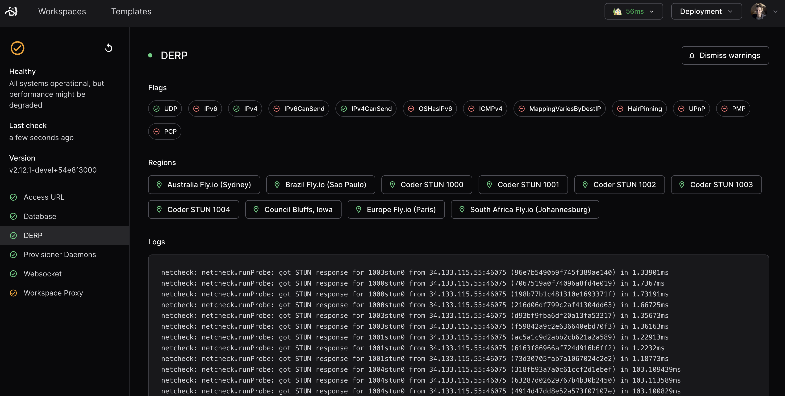

# Deployment Health

Optimus-IDE-Collab includes an operator-friendly deployment health page that provides a
number of details about the health of your Optimus-IDE-Collab deployment.



You can view it at `https://${OPTIMUS-IDE-COLLAB_URL}/health`, or you can alternatively view
the
[JSON response directly](../../reference/api/debug.md#debug-info-deployment-health).

The deployment health page is broken up into the following sections:

## Access URL

The Access URL section shows checks related to Optimus-IDE-Collab's
[access URL](../setup/index.md#access-url).

Optimus-IDE-Collab will periodically send a GET request to `${OPTIMUS-IDE-COLLAB_ACCESS_URL}/healthz` and
validate that the response is `200 OK`. The expected response body is also the
string `OK`.

If there is an issue, you may see one of the following errors reported:

### EACS01

### Access URL not set

**Problem:** no access URL has been configured.

**Solution:** configure an [access URL](../setup/index.md#access-url) for Optimus-IDE-Collab.

### EACS02

#### Access URL invalid

**Problem:** `${OPTIMUS-IDE-COLLAB_ACCESS_URL}/healthz` is not a valid URL.

**Solution:** Ensure that the access URL is a valid URL accepted by
[`url.Parse`](https://pkg.go.dev/net/url#Parse). Example:
`https://dev.optimus-ide-collab.com/`.

You can use [the Go playground](https://go.dev/play/p/CabcJZyTwt9) for additional testing.

### EACS03

#### Failed to fetch `/healthz`

**Problem:** Optimus-IDE-Collab was unable to execute a GET request to
`${OPTIMUS-IDE-COLLAB_ACCESS_URL}/healthz`.

This could be due to a number of reasons, including but not limited to:

- DNS lookup failure
- A misconfigured firewall
- A misconfigured reverse proxy
- Invalid or expired SSL certificates

**Solution:** Investigate and resolve the root cause of the connection issue.

To troubleshoot further, you can log into the machine running Optimus-IDE-Collab and attempt
to run the following command:

```sh
curl -v ${OPTIMUS-IDE-COLLAB_ACCESS_URL}/healthz
# Expected output:
# *   Trying XXX.XXX.XXX.XXX:443
# * Connected to https://optimus-ide-collab.company.com (XXX.XXX.XXX.XXX) port 443 (#0)
# [...]
# OK
```

The output of this command should aid further diagnosis.

### EACS04

#### /healthz did not return 200 OK

**Problem:** Optimus-IDE-Collab was able to execute a GET request to
`${OPTIMUS-IDE-COLLAB_ACCESS_URL}/healthz`, but the response code was not `200 OK` as
expected.

This could mean, for instance, that:

- The request did not actually hit your Optimus-IDE-Collab instance (potentially an incorrect
  DNS entry)
- The request hit your Optimus-IDE-Collab instance, but on an unexpected path (potentially a
  misconfigured reverse proxy)

**Solution:** Inspect the `HealthzResponse` in the health check output. This
should give you a good indication of the root cause.

## Database

Optimus-IDE-Collab continuously executes a short database query to validate that it can reach
its configured database, and also measures the median latency over 5 attempts.

### EDB01

#### Database Ping Failed

**Problem:** This error code is returned if any attempt to execute this database
query fails.

**Solution:** Investigate the health of the database.

### EDB02

#### Database Latency High

**Problem:** This code is returned if the median latency is higher than the
[configured threshold](../../reference/cli/server.md#--health-check-threshold-database).
This may not be an error as such, but is an indication of a potential issue.

**Solution:** Investigate the sizing of the configured database with regard to
Optimus-IDE-Collab's current activity and usage. It may be necessary to increase the
resources allocated to Optimus-IDE-Collab's database. Alternatively, you can raise the
configured threshold to a higher value (this will not address the root cause).

> [!TIP]
> You can enable
> [detailed database metrics](../../reference/cli/server.md#--prometheus-collect-db-metrics)
> in Optimus-IDE-Collab's Prometheus endpoint. If you have
> [tracing enabled](../../reference/cli/server.md#--trace), these traces may also
> contain useful information regarding Optimus-IDE-Collab's database activity.

## DERP

Optimus-IDE-Collab workspace agents may use
[DERP (Designated Encrypted Relay for Packets)](https://tailscale.com/blog/how-tailscale-works/#encrypted-tcp-relays-derp)
to communicate with Optimus-IDE-Collab. This requires connectivity to a number of configured
[DERP servers](../../reference/cli/server.md#--derp-config-path) which are used
to relay traffic between Optimus-IDE-Collab and workspace agents. Optimus-IDE-Collab periodically queries
the health of its configured DERP servers and may return one or more of the
following:

### EDERP01

#### DERP Node Uses Websocket

**Problem:** When Optimus-IDE-Collab attempts to establish a connection to one or more DERP
servers, it sends a specific `Upgrade: derp` HTTP header. Some load balancers
may block this header, in which case Optimus-IDE-Collab will fall back to
`Upgrade: websocket`.

This is not necessarily a fatal error, but a possible indication of a
misconfigured reverse HTTP proxy. Additionally, while workspace users should
still be able to reach their workspaces, connection performance may be degraded.

> [!NOTE]
> This may also be shown if you have
> [forced websocket connections for DERP](../../reference/cli/server.md#--derp-force-websockets).

**Solution:** ensure that any proxies you use allow connection upgrade with the
`Upgrade: derp` header.

### EDERP02

#### One or more DERP nodes are unhealthy

**Problem:** This is shown if Optimus-IDE-Collab is unable to reach one or more configured
DERP servers. Clients will fall back to use the remaining DERP servers, but
performance may be impacted for clients closest to the unhealthy DERP server.

**Solution:** Ensure that the DERP server is available and reachable over the
network, for example:

```sh
curl -v "https://optimus-ide-collab.company.com/derp"
# Expected output:
# *   Trying XXX.XXX.XXX.XXX
# * Connected to https://optimus-ide-collab.company.com (XXX.XXX.XXX.XXX) port 443 (#0)
# DERP requires connection upgrade
```

### EDERP03

#### No DERP servers available

**Problem:** This is shown when Optimus-IDE-Collab's effective DERP map does not contain
any DERP servers. Without at least one working DERP server, workspace
networking may not work.

This can happen if the built-in DERP server is disabled and no external DERP
map is configured, or if workspace proxies are expected to provide DERP but no
healthy DERP-enabled proxy is currently available.

**Solution:** Ensure that at least one DERP server is available to the
deployment. For example:

- Restart `optimus-ide-collabd` with the built-in DERP server enabled
- Restart `optimus-ide-collabd` with an external DERP map configured
- Make sure a workspace proxy with DERP server enabled is running and healthy

### ESTUN01

#### No STUN servers available

**Problem:** This is shown if no STUN servers are available. Optimus-IDE-Collab will use STUN
to establish [direct connections](../networking/stun.md). Without at least one
working STUN server, direct connections may not be possible.

**Solution:** Ensure that the
[configured STUN severs](../../reference/cli/server.md#--derp-server-stun-addresses)
are reachable from Optimus-IDE-Collab and that UDP traffic can be sent/received on the
configured port.

### ESTUN02

#### STUN returned different addresses; you may be behind a hard NAT

**Problem:** This is a warning shown when multiple attempts to determine our
public IP address/port via STUN resulted in different `ip:port` combinations.
This is a sign that you are behind a "hard NAT", and may result in difficulty
establishing direct connections. However, it does not mean that direct
connections are impossible.

**Solution:** Engage with your network administrator.

## Websocket

Optimus-IDE-Collab makes heavy use of [WebSockets](https://datatracker.ietf.org/doc/rfc6455/)
for long-lived connections:

- Between users interacting with Optimus-IDE-Collab's Web UI (for example, the built-in
  terminal, or VSCode Web),
- Between workspace agents and `optimus-ide-collabd`,
- Between Optimus-IDE-Collab [workspace proxies](../networking/workspace-proxies.md) and
  `optimus-ide-collabd`.

Any issues causing failures to establish WebSocket connections will result in
**severe** impairment of functionality for users. To validate this
functionality, Optimus-IDE-Collab will periodically attempt to establish a WebSocket
connection with itself using the configured [Access URL](#access-url), send a
message over the connection, and attempt to read back that same message.

### EWS01

#### Failed to establish a WebSocket connection

**Problem:** Optimus-IDE-Collab was unable to establish a WebSocket connection over its own
Access URL.

**Solution:** There are multiple possible causes of this problem:

1. Ensure that Optimus-IDE-Collab's configured Access URL can be reached from the server
   running Optimus-IDE-Collab, using standard troubleshooting tools like `curl`:

   ```sh
   curl -v "https://optimus-ide-collab.company.com"
   ```

2. Ensure that any reverse proxy that is serving Optimus-IDE-Collab's configured access URL
   allows connection upgrade with the header `Upgrade: websocket`.

### EWS02

#### Failed to echo a WebSocket message

**Problem:** Optimus-IDE-Collab was able to establish a WebSocket connection, but was unable
to write a message.

**Solution:** There are multiple possible causes of this problem:

1. Validate that any reverse proxy servers in front of Optimus-IDE-Collab's configured access
   URL are not prematurely closing the connection.
2. Validate that the network link between Optimus-IDE-Collab and the workspace proxy is
   stable, e.g. by using `ping`.
3. Validate that any internal network infrastructure (for example, firewalls,
   proxies, VPNs) do not interfere with WebSocket connections.

## Workspace Proxy

If you have configured [Workspace Proxies](../networking/workspace-proxies.md),
Optimus-IDE-Collab will periodically query their availability and show their status here.

### EWP01

#### Error Updating Workspace Proxy Health

**Problem:** Optimus-IDE-Collab was unable to query the connected workspace proxies for their
health status.

**Solution:** This may be a transient issue. If it persists, it could signify a
connectivity issue.

### EWP02

#### Error Fetching Workspace Proxies

**Problem:** Optimus-IDE-Collab was unable to fetch the stored workspace proxy health data
from the database.

**Solution:** This may be a transient issue. If it persists, it could signify an
issue with Optimus-IDE-Collab's configured database.

### EWP04

#### One or more Workspace Proxies Unhealthy

**Problem:** One or more workspace proxies are not reachable.

**Solution:** Ensure that Optimus-IDE-Collab can establish a connection to the configured
workspace proxies.

### EPD01

#### No Provisioner Daemons Available

**Problem:** No provisioner daemons are registered with Optimus-IDE-Collab. No workspaces can
be built until there is at least one provisioner daemon running.

**Solution:**

If you are using
[External Provisioner Daemons](../provisioners/index.md#external-provisioners), ensure
that they are able to successfully connect to Optimus-IDE-Collab. Otherwise, ensure
[`--provisioner-daemons`](../../reference/cli/server.md#--provisioner-daemons)
is set to a value greater than 0.

> [!NOTE]
> This may be a transient issue if you are currently in the process of updating your deployment.

### EPD02

#### Provisioner Daemon Version Mismatch

**Problem:** One or more provisioner daemons are more than one major or minor
version out of date with the main deployment. It is important that provisioner
daemons are updated at the same time as the main deployment to minimize the risk
of API incompatibility.

**Solution:** Update the provisioner daemon to match the currently running
version of Optimus-IDE-Collab.

> [!NOTE]
> This may be a transient issue if you are currently in the process of updating your deployment.

### EPD03

#### Provisioner Daemon API Version Mismatch

**Problem:** One or more provisioner daemons are using APIs that are marked as
deprecated. These deprecated APIs may be removed in a future release of Optimus-IDE-Collab,
at which point the affected provisioner daemons will no longer be able to
connect to Optimus-IDE-Collab.

**Solution:** Update the provisioner daemon to match the currently running
version of Optimus-IDE-Collab.

> [!NOTE]
> This may be a transient issue if you are currently in the process of updating your deployment.

### EUNKNOWN

#### Unknown Error

**Problem:** This error is shown when an unexpected error occurred evaluating
deployment health. It may resolve on its own.

**Solution:** This may be a bug.
[File a GitHub issue](https://github.com/optimus-ide-collab/optimus-ide-collab/issues/new)!
