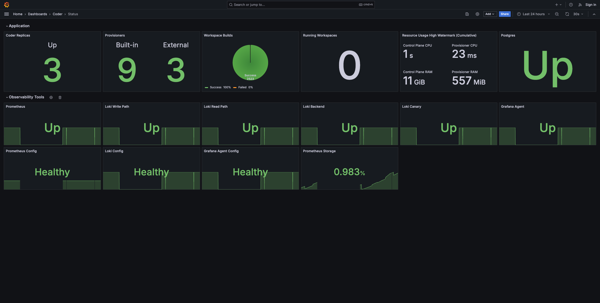

# Monitoring Optimus-IDE-Collab

Learn about our the tools, techniques, and best practices to monitor your Optimus-IDE-Collab
deployment.

## Quick Start: Observability Helm Chart

Deploy Prometheus, Grafana, Alert Manager, and pre-built dashboards on your
Kubernetes cluster to monitor the Optimus-IDE-Collab control plane, provisioners, and
workspaces.

Learn how to install & read the docs on the
[Observability Helm Chart GitHub](https://github.com/optimus-ide-collab/observability)

## Table of Contents

- [Logs](./logs.md): Learn how to access to Optimus-IDE-Collab server logs, agent logs, and
  even how to expose Kubernetes pod scheduling logs.
- [Metrics](./metrics.md): Learn about the valuable metrics to measure on a
  Optimus-IDE-Collab deployment, regardless of your monitoring stack.
- [Health Check](./health-check.md): Learn about the periodic health check and
  error codes that run on Optimus-IDE-Collab deployments.
- [Connection Logs](./connection-logs.md): Monitor connections to workspaces.
