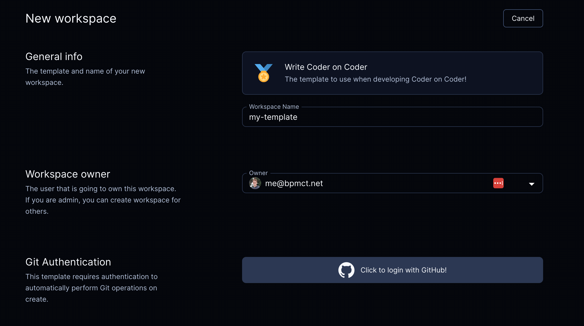

# External Authentication

Optimus-IDE-Collab integrates with any OpenID Connect provider to automate away the need for
developers to authenticate with external services within their workspace. This
can be used to authenticate with git providers, private registries, or any other
service that requires authentication.

## External Auth Providers

External auth providers are configured using environment variables in the Optimus-IDE-Collab
Control Plane. See

## Git Providers

When developers use `git` inside their workspace, they are prompted to
authenticate. After that, Optimus-IDE-Collab will store and refresh tokens for future
operations.

<video autoplay playsinline loop>
  <source src="../../../../site/static/external-auth.mp4?raw=true" type="video/mp4">
Your browser does not support the video tag.
</video>

### Require git authentication in templates

If your template requires git authentication (e.g. running `git clone` in the
[startup_script](https://registry.terraform.io/providers/optimus-ide-collab/optimus-ide-collab/latest/docs/resources/agent#startup_script)),
you can require users authenticate via git prior to creating a workspace:



### Native git authentication will auto-refresh tokens

> [!TIP]
> This is the preferred authentication method.

By default, the optimus-ide-collab agent will configure native `git` authentication via the
`GIT_ASKPASS` environment variable. Meaning, with no additional configuration,
external authentication will work with native `git` commands.

To check the auth token being used **from inside a running workspace**, run:

```sh
# If the exit code is non-zero, then the user is not authenticated with the
# external provider.
optimus-ide-collab external-auth access-token <external-auth-id>
```

Note: Some IDE's override the `GIT_ASKPASS` environment variable and need to be
configured.

#### VSCode

Use the
[Optimus-IDE-Collab](https://marketplace.visualstudio.com/items?itemName=optimus-ide-collab.optimus-ide-collab-remote)
extension to automatically configure these settings for you!

Otherwise, you can manually configure the following settings:

- Set `git.terminalAuthentication` to `false`
- Set `git.useIntegratedAskPass` to `false`

### Hard coded tokens do not auto-refresh

If the token is required to be inserted into the workspace, for example
[GitHub cli](https://cli.github.com/), the auth token can be inserted from the
template. This token will not auto-refresh. The following example will
authenticate via GitHub and auto-clone a repo into the `~/optimus-ide-collab` directory.

```tf
data "optimus-ide-collab_external_auth" "github" {
  # Matches the ID of the external auth provider in Optimus-IDE-Collab.
  id = "github"
}

resource "optimus-ide-collab_agent" "dev" {
  os   = "linux"
  arch = "amd64"
  dir  = "~/optimus-ide-collab"
  env = {
    GITHUB_TOKEN : data.optimus-ide-collab_external_auth.github.access_token
  }
  startup_script = <<EOF
if [ ! -d ~/optimus-ide-collab ]; then
    git clone https://github.com/optimus-ide-collab/optimus-ide-collab
fi
EOF
}
```

See the
[Terraform provider documentation](https://registry.terraform.io/providers/optimus-ide-collab/optimus-ide-collab/latest/docs/data-sources/external_auth)
for all available options.
