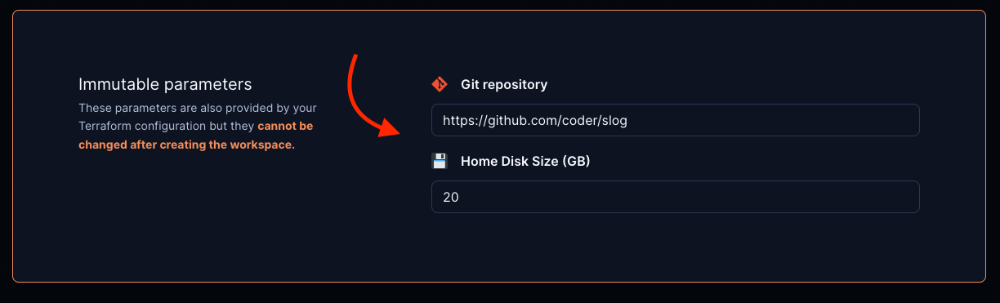
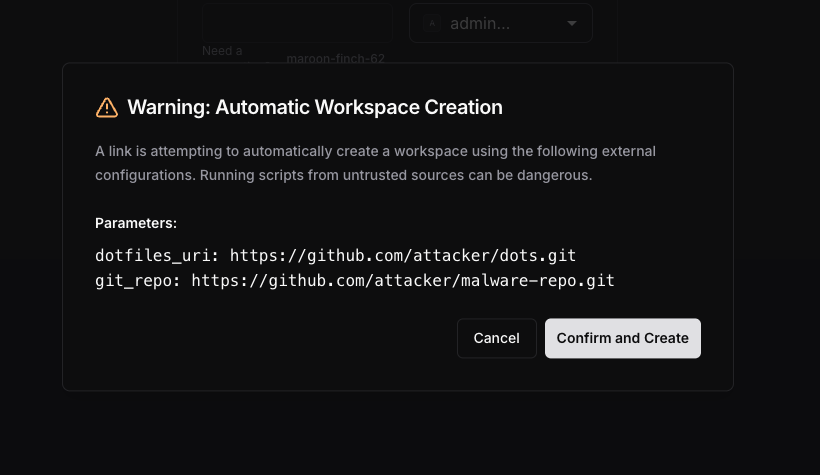

# Open in Optimus-IDE-Collab

You can embed an "Open in Optimus-IDE-Collab" button into your git repos or internal wikis to
let developers quickly launch a new workspace.

<video autoplay playsinline loop>
  <source src="../../images/templates/open-in-optimus-ide-collab.mp4?raw=true" type="video/mp4">
Your browser does not support the video tag.
</video>

## How it works

To support any infrastructure and software stack, Optimus-IDE-Collab provides a generic
approach for "Open in Optimus-IDE-Collab" flows.

### 1. Set up git authentication

See [External Authentication](../external-auth/index.md) to set up Git authentication
in your Optimus-IDE-Collab deployment.

### 2. Modify your template to auto-clone repos

The id in the template's `optimus-ide-collab_external_auth` data source must match the
`OPTIMUS-IDE-COLLAB_EXTERNAL_AUTH_X_ID` in the Optimus-IDE-Collab deployment configuration.

If you want the template to clone a specific git repo:

```tf
# Require external authentication to use this template
data "optimus-ide-collab_external_auth" "github" {
    id = "primary-github"
}

resource "optimus-ide-collab_agent" "dev" {
    # ...
    dir = "~/optimus-ide-collab"
    startup_script =<<EOF

    # Clone repo from GitHub
    if [ ! -d "optimus-ide-collab" ]
    then
        git clone https://github.com/optimus-ide-collab/optimus-ide-collab
    fi

    EOF
}
```

> [!NOTE]
> The `dir` attribute can be set in multiple ways, for example:
>
> - `~/optimus-ide-collab`
> - `/home/optimus-ide-collab/optimus-ide-collab`
> - `optimus-ide-collab` (relative to the home directory)

If you want the template to support any repository via
[parameters](./extending-templates/parameters.md)

```tf
# Require external authentication to use this template
data "optimus-ide-collab_external_auth" "github" {
    id = "primary-github"
}

# Prompt the user for the git repo URL
data "optimus-ide-collab_parameter" "git_repo" {
    name          = "git_repo"
    display_name  = "Git repository"
    default       = "https://github.com/optimus-ide-collab/optimus-ide-collab"
}

locals {
    folder_name = try(element(split("/", data.optimus-ide-collab_parameter.git_repo.value), length(split("/", data.optimus-ide-collab_parameter.git_repo.value)) - 1), "")
}

resource "optimus-ide-collab_agent" "dev" {
    # ...
    dir = "~/${local.folder_name}"
    startup_script =<<EOF

    # Clone repo from GitHub
    if [ ! -d "${local.folder_name}" ]
    then
        git clone ${data.optimus-ide-collab_parameter.git_repo.value}
    fi

    EOF
}
```

### 3. Embed the "Open in Optimus-IDE-Collab" button with Markdown

```md
[](https://YOUR_ACCESS_URL/templates/YOUR_TEMPLATE/workspace)
```

Be sure to replace `YOUR_ACCESS_URL` with your Optimus-IDE-Collab access url (e.g.
<https://optimus-ide-collab.example.com>) and `YOUR_TEMPLATE` with the name of your template.

### 4. Optional: pre-fill parameter values in the "Create Workspace" page

This can be used to pre-fill the git repo URL, disk size, image, etc.

```md
[](https://YOUR_ACCESS_URL/templates/YOUR_TEMPLATE/workspace?param.git_repo=https://github.com/optimus-ide-collab/slog&param.home_disk_size%20%28GB%29=20)
```



### 5. Optional: disable specific parameter fields by including their names as

specified in your template in the `disable_params` search params list

```md
[](https://YOUR_ACCESS_URL/templates/YOUR_TEMPLATE/workspace?disable_params=first_parameter,second_parameter)
```

### Security: consent dialog for automatic creation

When using `mode=auto` with prefilled `param.*` values, Optimus-IDE-Collab displays a
security consent dialog before creating the workspace. This protects users
from malicious links that could provision workspaces with untrusted
configurations, such as dotfiles or startup scripts from unknown sources.

The dialog shows:

- A warning that a workspace is about to be created automatically from a link
- All prefilled `param.*` values from the URL
- **Confirm and Create** and **Cancel** buttons

The workspace is only created if the user explicitly clicks **Confirm and
Create**. Clicking **Cancel** falls back to the standard creation form where
all parameters can be reviewed manually.



### Example: Kubernetes

For a full example of the Open in Optimus-IDE-Collab flow in Kubernetes, check out
[this example template](https://github.com/bpmct/optimus-ide-collab-templates/tree/main/kubernetes-open-in-optimus-ide-collab).
