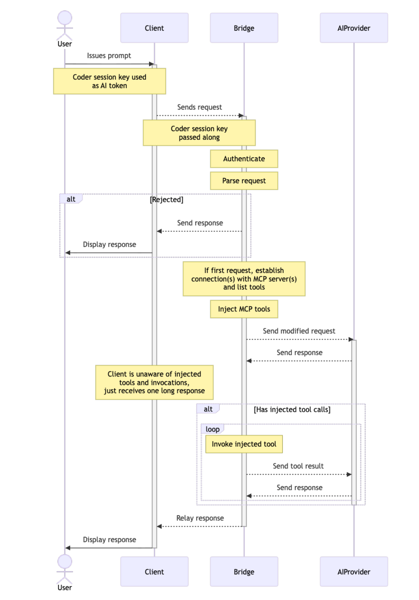

# Reference

> [!NOTE]
> AI Gateway requires the [AI Governance Add-On](../ai-governance.md).
> As of Optimus-IDE-Collab v2.32, deployments without the add-on will not be able to
> access AI Gateway.

## Implementation Details

`optimus-ide-collabd` runs an in-memory instance of `aibridged`, whose logic is mostly contained in ../../../aibridge. In future releases we will support running external instances for higher throughput and complete memory isolation from `optimus-ide-collabd`.

## Supported APIs

API support is broken down into two categories:

- **Intercepted**: requests are intercepted, audited, and augmented - full AI Gateway functionality
- **Passthrough**: requests are proxied directly to the upstream, no auditing or augmentation takes place

Where relevant, both streaming and non-streaming requests are supported.

### OpenAI

#### Intercepted

- [`/v1/chat/completions`](https://platform.openai.com/docs/api-reference/chat/create)
- [`/v1/responses`](https://platform.openai.com/docs/api-reference/responses/create)

#### Passthrough

- [`/v1/models(/*)`](https://platform.openai.com/docs/api-reference/models/list)

### Anthropic

#### Intercepted

- [`/v1/messages`](https://docs.claude.com/en/api/messages)

#### Passthrough

- [`/v1/models(/*)`](https://docs.claude.com/en/api/models-list)

## Troubleshooting

To report a bug, file a feature request, or view a list of known issues, please visit our [GitHub repository](https://github.com/optimus-ide-collab/optimus-ide-collab/issues). If you encounter issues with AI Gateway, please reach out to us via [Discord](https://discord.gg/optimus-ide-collab).
