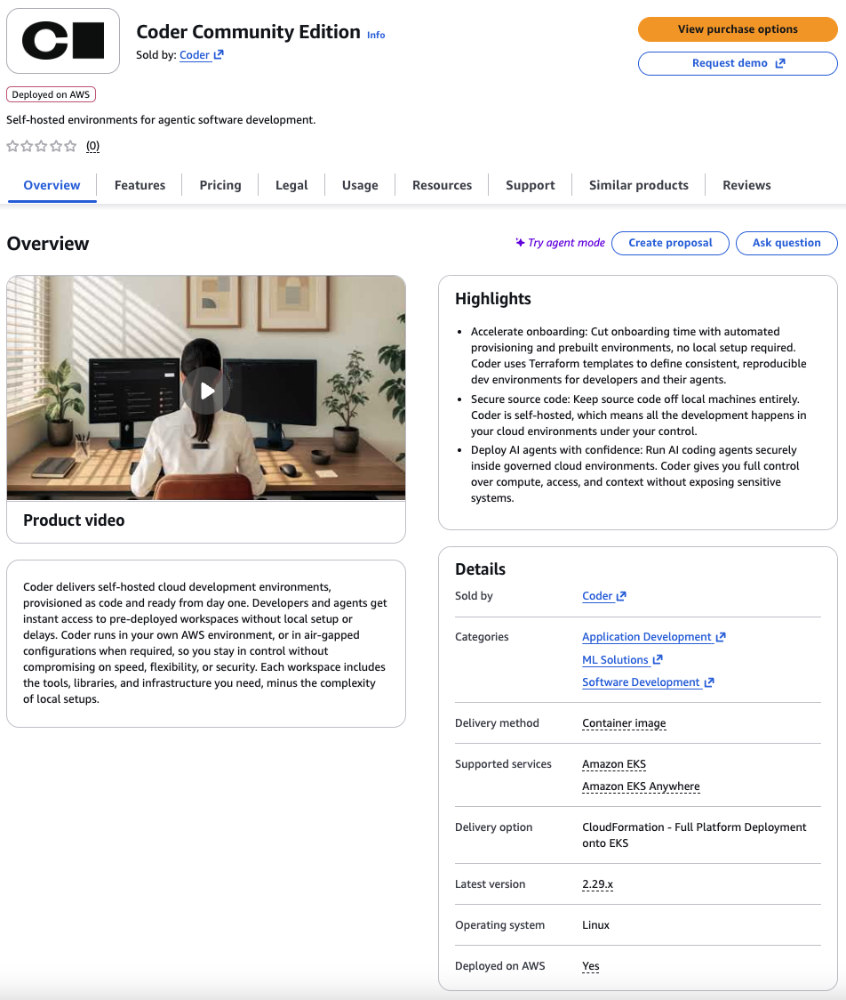
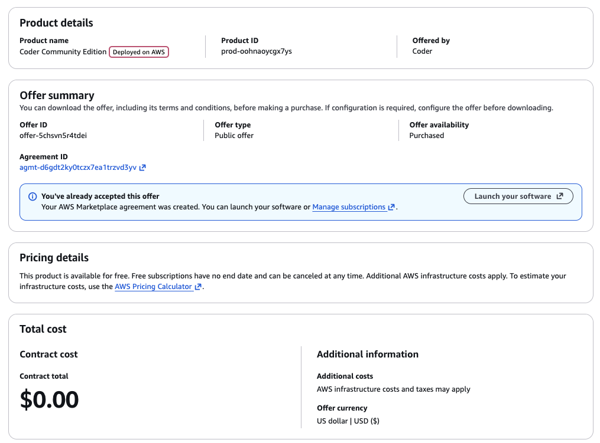
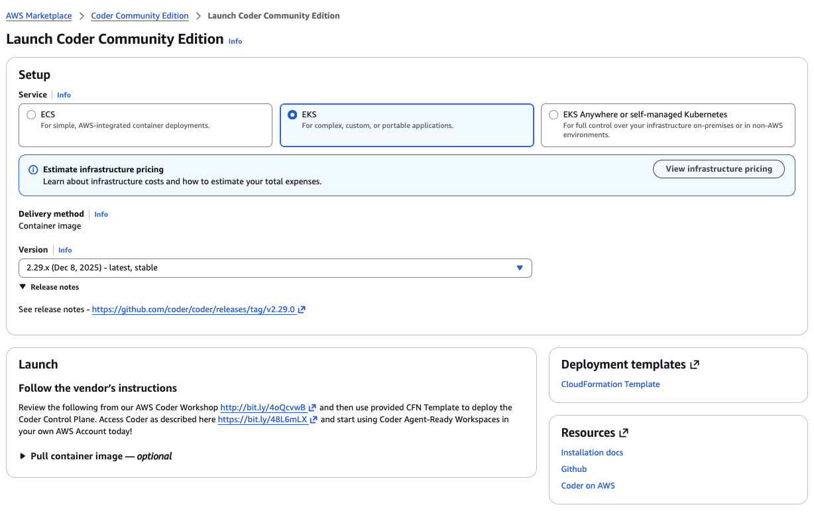
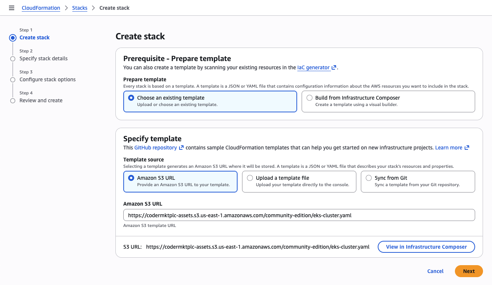
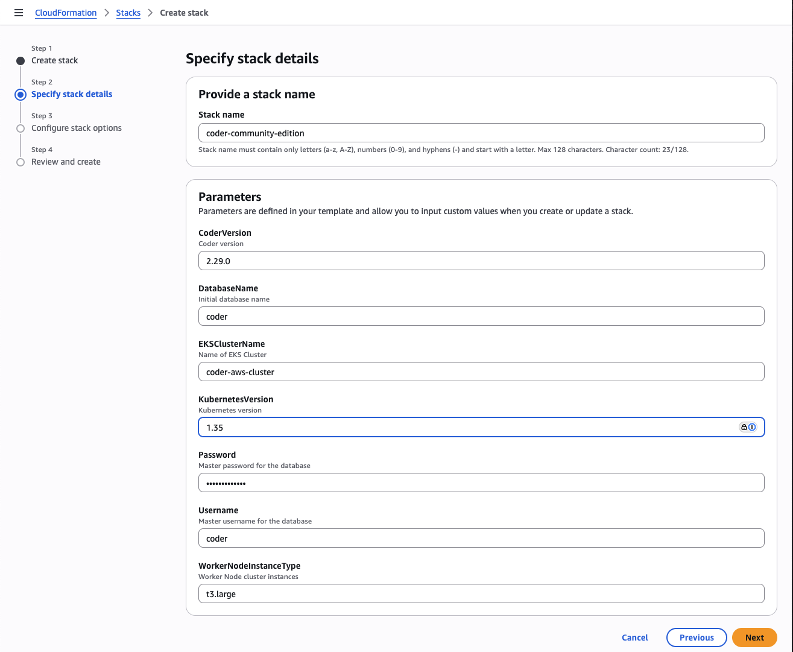
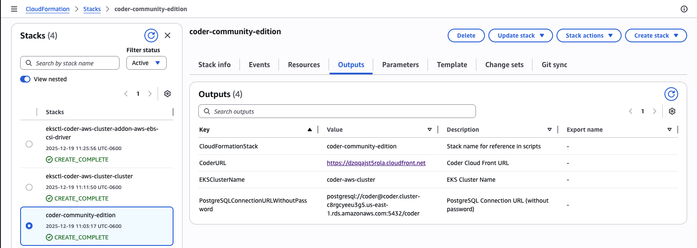

# Amazon Web Services

This guide is designed to get you up and running with a Optimus-IDE-Collab proof-of-concept
on AWS EKS using a [Optimus-IDE-Collab-provided CloudFormation Template](https://optimus-ide-collabmktplc-assets.s3.us-east-1.amazonaws.com/community-edition/eks-cluster.yaml).  The deployed AWS Optimus-IDE-Collab Reference Architecture is below:

If you are familiar with EC2 however, you can use our
[install script](../cli.md) to run Optimus-IDE-Collab on any popular Linux distribution.

## Requirements

This guide assumes your AWS account has `AdministratorAccess` permissions given the number and types of AWS Services deployed.  After deployment of Optimus-IDE-Collab into a AWS POC or Sandbox account, it is recommended that the permissions be scaled back to only what your deployment requires.

## Launch Optimus-IDE-Collab Community Edition from the from AWS Marketplace

We publish an Ubuntu 22.04 Container Image with Optimus-IDE-Collab pre-installed and a supporting AWS Marketplace Launch guide. Search for `Optimus-IDE-Collab Community Edition` in the AWS Marketplace or
[launch directly from the Optimus-IDE-Collab listing](https://aws.amazon.com/marketplace/pp/prodview-34vmflqoi3zo4).

Use `View purchase options` to create a zero-cost subscription to Optimus-IDE-Collab Community Edition and then use `Launch your software` to deploy to your current AWS Account.

Select `EKS` for the Launch setup, choose the desired/lastest version to deploy, and then review the **Launch** instructions for more detail explanation of what will be deployed.  When you are ready to proceed, click the `CloudFormation Template` link under **Deployment templates**.

You will then be taken to the AWS Management Console, CloudFormation `Create stack` in the currently selected AWS Region.  Select `Next` to view the Optimus-IDE-Collab Community Edition CloudFormation Stack parameters.

The default parameters will support POCs and small team deployments of Optimus-IDE-Collab using `t3.large` (2 cores and 8 GB memory) Nodes.  While the deployment uses EKS Auto-mode and will scale using Karpenter, keep in mind this platforms is intended for proof-of-concept
deployments. You should adjust your infrastructure when preparing for
production use. See: [Scaling Optimus-IDE-Collab](../../admin/infrastructure/index.md)

Select `Next` and follow the prompts to submit the CloudFormation Stack.  Deployment of the Stack can take 10-20 minutes, and will create EKS related sub-stacks and a CodeBuild pipeline that automates the initial Helm deployment of Optimus-IDE-Collab and final AWS network services integration.  Once the Stack successfully creates, access the `Outputs` as shown below:

Look for the `Optimus-IDE-CollabURL` output link, and use to navigate to your newly deployed instance of Optimus-IDE-Collab Community Edition.

That's all! Use the UI to create your first user, template, and workspace. We recommend starting with a Kubernetes template since Optimus-IDE-Collab Community Edition is deployed to EKS.

### Next steps

- [IDEs with Optimus-IDE-Collab](../../user-guides/workspace-access/index.md)
- [Writing custom templates for Optimus-IDE-Collab](../../admin/templates/index.md)
- [Configure the Optimus-IDE-Collab server](../../admin/setup/index.md)
- [Use your own domain + TLS](../../admin/setup/index.md#tls--reverse-proxy)
