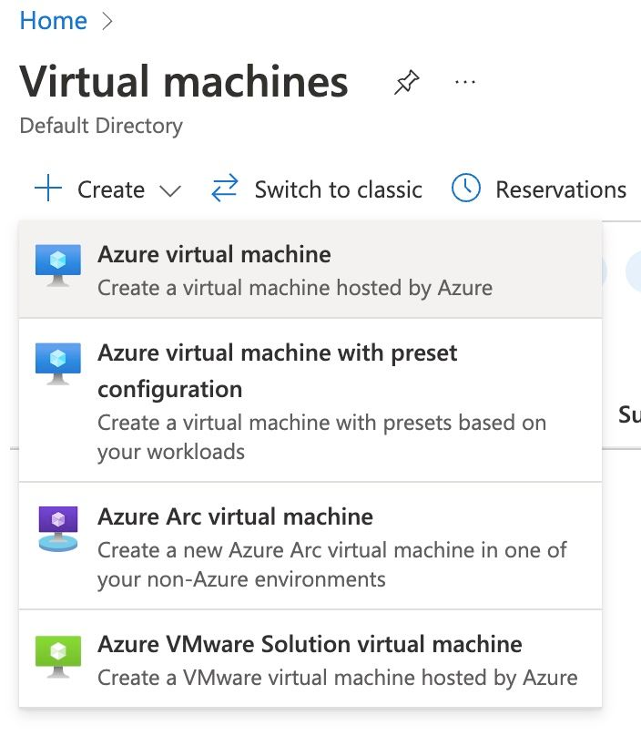
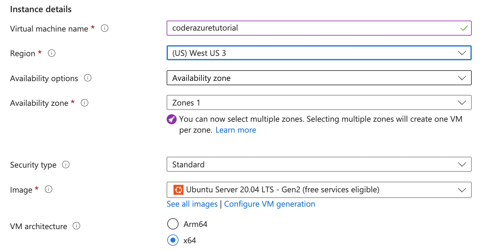
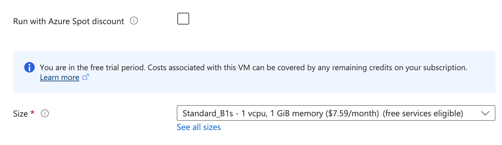
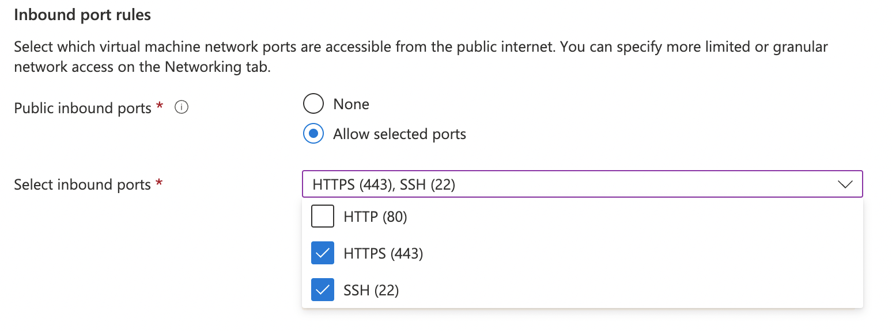
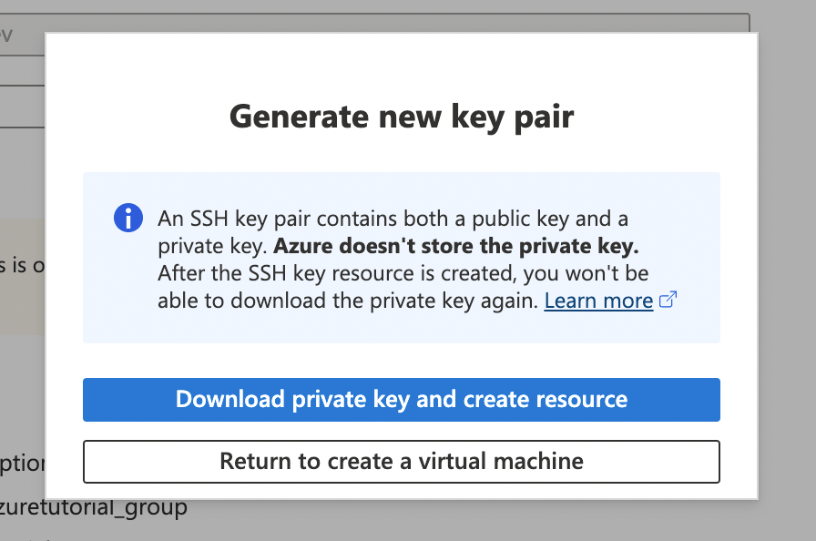
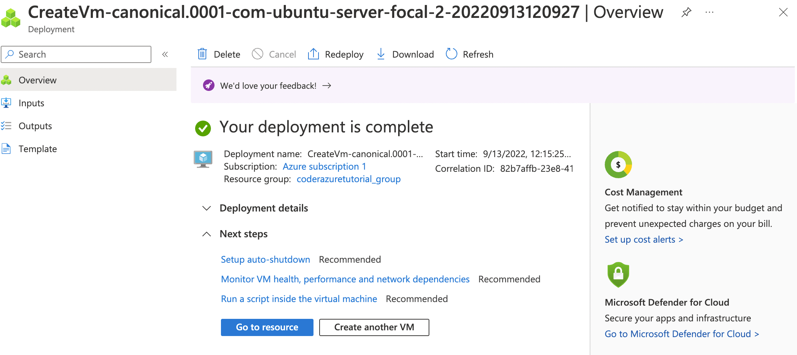
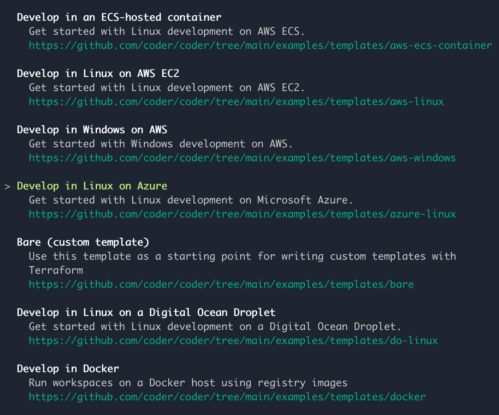
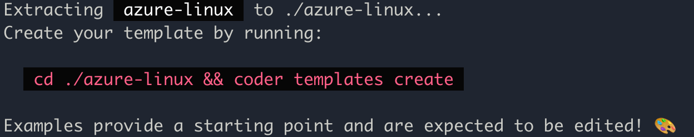

# Microsoft Azure

This guide shows you how to set up the Optimus-IDE-Collab server on Azure which will
provision Azure-hosted Linux workspaces.

## Requirements

This guide assumes you have full administrator privileges on Azure.

## Create An Azure VM

From the Azure Portal, navigate to the Virtual Machines Dashboard. Click Create,
and select creating a new Azure Virtual machine .



This will bring you to the `Create a virtual machine` page. Select the
subscription group of your choice, or create one if necessary.

Next, name the VM something relevant to this project using the naming convention
of your choice. Change the region to something more appropriate for your current
location. For this tutorial, we will use the base selection of the Ubuntu Gen2
Image and keep the rest of the base settings for this image the same.





Up next, under `Inbound port rules` modify the Select `inbound ports` to also
take in `HTTPS` and `HTTP`.



The set up for the image is complete at this stage. Click `Review and Create` -
review the information and click `Create`. A popup will appear asking you to
download the key pair for the server. Click
`Download private key and create resource` and place it into a folder of your
choice on your local system.



Click `Return to create a virtual machine`. Your VM will start up!



Click `Go to resource` in the virtual machine and copy the public IP address.
You will need it to SSH into the virtual machine via your local machine.

Follow
[these instructions](https://learn.microsoft.com/en-us/azure/virtual-machines/linux-vm-connect?tabs=Linux)
to SSH into the virtual machine. Once on the VM, you can run and install Optimus-IDE-Collab
using your method of choice. For the fastest install, we recommend running Optimus-IDE-Collab
as a system service.

## Install Optimus-IDE-Collab

For this instance, we will run Optimus-IDE-Collab as a system service, however you can run
Optimus-IDE-Collab a multitude of different ways. You can learn more about those
[here](https://optimus-ide-collab.com/docs/install).

In the Azure VM instance, run the following command to install Optimus-IDE-Collab

```sh
curl -fsSL https://optimus-ide-collab.com/install.sh | sh
```

## Run Optimus-IDE-Collab

Run the following command to start Optimus-IDE-Collab as a system level service:

```sh
sudo systemctl enable --now optimus-ide-collab
```

The following command will get you information about the Optimus-IDE-Collab launch service

```sh
journalctl -u optimus-ide-collab.service -b
```

This will return a series of logs related to running Optimus-IDE-Collab as a system service.
Embedded in the logs is the Optimus-IDE-Collab Access URL.

Copy the URL and run the following command to create the first user, either on
your local machine or in the instance terminal.

```sh
optimus-ide-collab login <url***.try.optimus-ide-collab.app>
```

Fill out the prompts. Be sure to save use email and password as these are your
admin username and password.

You can now access Optimus-IDE-Collab on your local machine with the relevant
`***.try.optimus-ide-collab.app` URL and logging in with the username and password.

## Creating and Uploading Your First Template

First, run `optimus-ide-collab template init` to create your first template. You’ll be given
a list of possible templates to use. This tutorial will show you how to set up
your Optimus-IDE-Collab instance to create a Linux based machine on Azure.



Press `enter` to select `Develop in Linux on Azure` template. This will return
the following:



To get started using the Azure template, install the Azure CLI by following the
instructions
[here](https://learn.microsoft.com/en-us/cli/azure/install-azure-cli-linux?pivots=apt).
Run `az login` and follow the instructions to configure the Azure command line.

Optimus-IDE-Collab is running as a system service, which creates the system user `optimus-ide-collab` for
handling processes. The Optimus-IDE-Collab user will require access to the Azure credentials
to initialize the template.

Run the following commands to copy the Azure credentials and give the `optimus-ide-collab`
user access to them:

```sh
sudo cp -r ~/.azure /home/optimus-ide-collab/.azure
sudo chown -R optimus-ide-collab:optimus-ide-collab /home/optimus-ide-collab/.azure/
```

Navigate to the `./azure-linux` folder where you created your template and run
the following command to put the template on your Optimus-IDE-Collab instance.

```sh
optimus-ide-collab templates push
```

Congrats! You can now navigate to your Optimus-IDE-Collab dashboard and use this Linux on
Azure template to create a new workspace!
