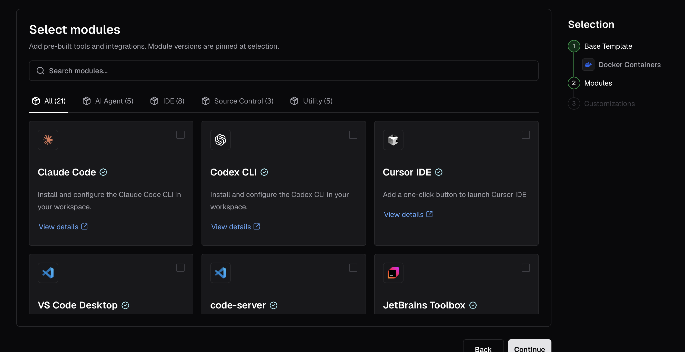
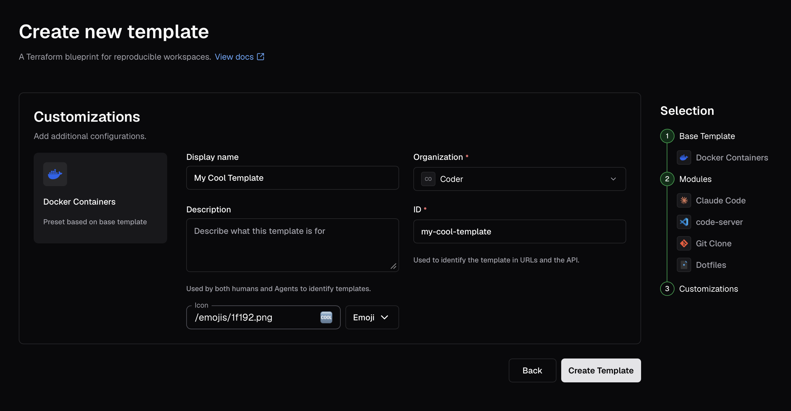
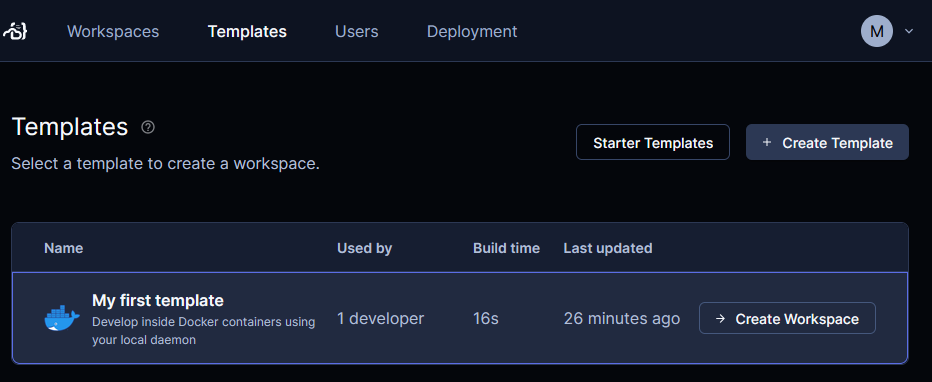
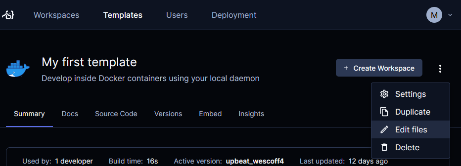
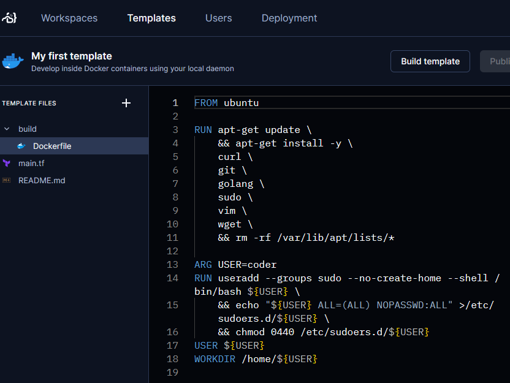
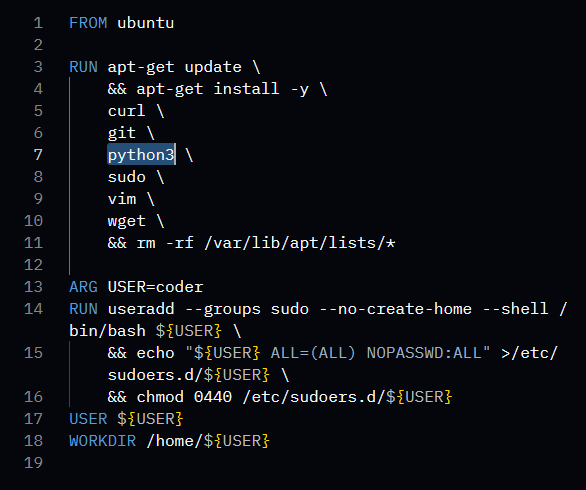
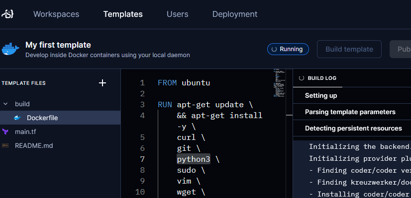
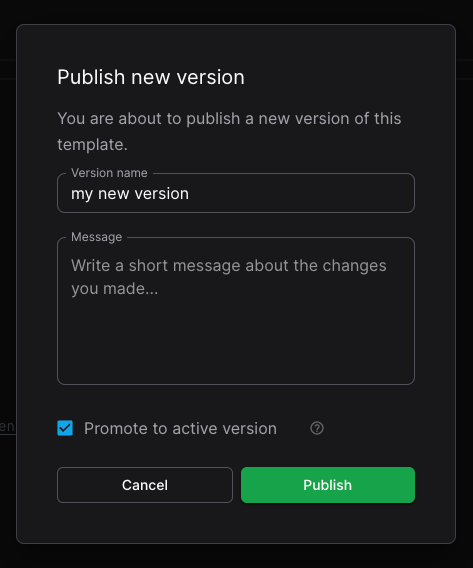

# Your first template

The fastest way to create a template is with the template builder. The builder
guides you through selecting base infrastructure, adding modules for IDEs and
tools, and configuring your template, all without writing Terraform. Once your
template is up and running, you can edit it in the Optimus-IDE-Collab dashboard. Optimus-IDE-Collab
handles versioning for you so you can publish official updates or revert to
previous versions.

In this tutorial, you'll create your first template from the Docker base
template using the template builder.

## Before you start

Use the [previous section](./local-deploy.md) of this guide to set up
[Docker](https://docs.docker.com/get-docker/) and [Optimus-IDE-Collab](../install/cli.md) on
your local machine to continue.

## 1. Log in to Optimus-IDE-Collab

In your web browser, go to your Optimus-IDE-Collab dashboard using the URL provided during
setup to log in.

## 2. Open the template builder

Select **Templates** then **New Template**. The template builder opens and
displays a list of base infrastructure templates.

## 3. Select a base template

Select the **Docker Containers** base template. This provides a working
Docker-based workspace with the Optimus-IDE-Collab agent pre-configured.

## 4. Add modules (optional)

The builder shows a list of available modules grouped by category. You can add
IDEs like **code-server** (VS Code in the browser) or tools like **git-clone**.
For your first template, you can skip this step and add modules later.

Select **Continue** to proceed.

## 5. Create your template

On the final step, fill in **Name** and **Display name**, then select
**Create Template**. Optimus-IDE-Collab composes the Terraform configuration, validates it,
and creates your template.

## 6. Modify your template

Now you can modify your template to suit your team's needs.

Let's replace the `golang` package in the Docker image with the `python3`
package. You can do this by editing the template's `Dockerfile` directly in your
web browser.

In the Optimus-IDE-Collab dashboard, select **Templates** then your first template.

In the drop-down menu, select **Edit files**.

Expand the **build** directory and select **Dockerfile**.

Edit `build/Dockerfile` to replace `golang` with `python3`.

Select **Build template** and wait for Optimus-IDE-Collab to prepare the template for
workspaces.

Select **Publish version**. In the **Publish new version** dialog, make sure
**Promote to active version** is checked then select **Publish**.

Now when developers create a new workspace from this template, they can use
Python 3 instead of Go.

For developers with workspaces that were created with a previous version of your
template, Optimus-IDE-Collab will notify them that there's a new version of the template.

You can also handle
[change management](../admin/templates/managing-templates/change-management.md)
through your own repo and continuous integration.

## Next steps

- [Setting up templates](../admin/templates/creating-templates.md)
