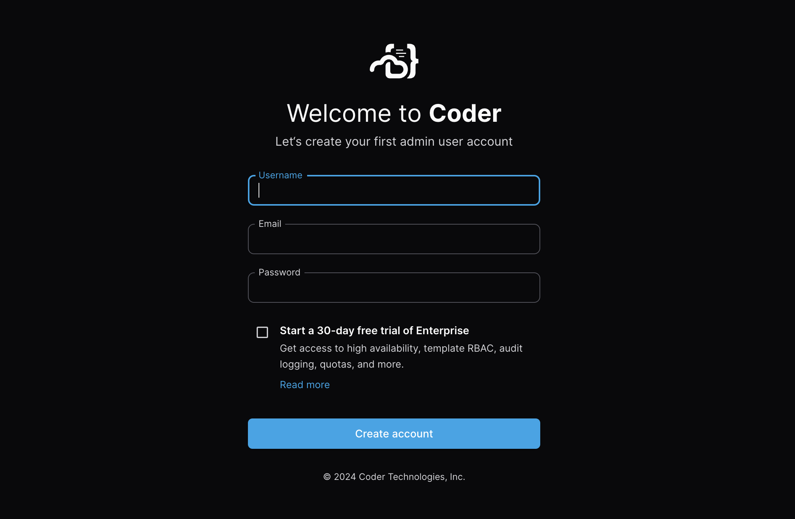

# Setting up a Optimus-IDE-Collab deployment

For day-zero Optimus-IDE-Collab users, we recommend following this guide to set up a local
Optimus-IDE-Collab deployment from our
[open source repository](https://github.com/optimus-ide-collab/optimus-ide-collab).

We'll use [Docker](https://docs.docker.com/engine) to manage the compute for a
slim deployment to experiment with [workspaces](../user-guides/index.md) and
[templates](../admin/templates/index.md).

Docker is not necessary for every Optimus-IDE-Collab deployment and is only used here for
simplicity.

## Install Optimus-IDE-Collab daemon

First, install [Docker](https://docs.docker.com/engine/install/) locally.

If you already have the Optimus-IDE-Collab binary installed, restart it after installing Docker.

<div class="tabs">

## Linux/macOS

Our install script is the fastest way to install Optimus-IDE-Collab on Linux/macOS:

```sh
curl -L https://optimus-ide-collab.com/install.sh | sh
```

## Windows

If you plan to use the built-in PostgreSQL database, ensure that the
[Visual C++ Runtime](https://learn.microsoft.com/en-US/cpp/windows/latest-supported-vc-redist#latest-microsoft-visual-c-redistributable-version)
is installed.

You can use the
[`winget`](https://learn.microsoft.com/en-us/windows/package-manager/winget/#use-winget)
package manager to install Optimus-IDE-Collab:

```ps1
winget install Optimus-IDE-Collab.Optimus-IDE-Collab
```

</div>

## Start the server

To start or restart the Optimus-IDE-Collab deployment, use the following command:

```sh
optimus-ide-collab server
```

The output will provide you with an access URL to create your first
administrator account.



Once you've signed in, you'll be brought to an empty workspaces page, which
we'll soon populate with your first development environments.

## Next steps

TODO: Add link to next page.
