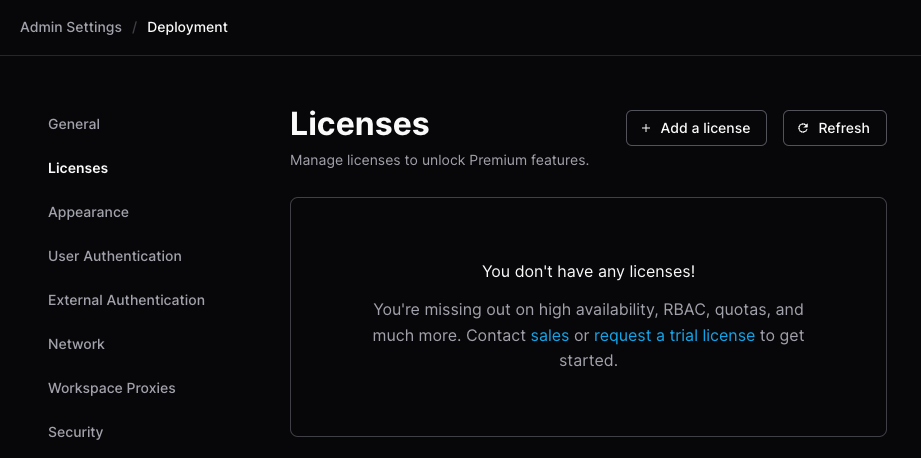
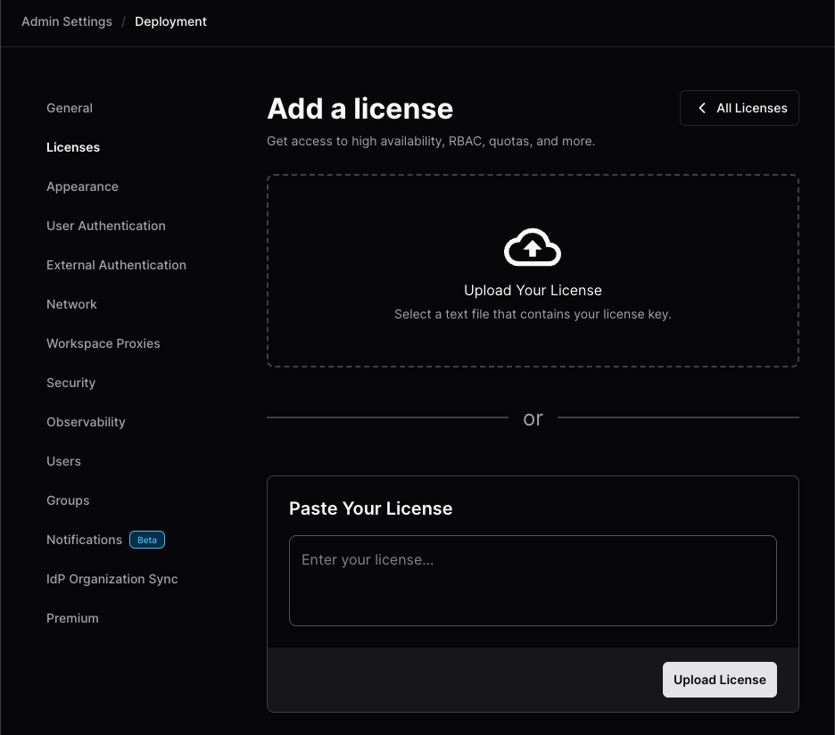

# FAQs

Frequently asked questions on Optimus-IDE-Collab OSS and licensed deployments. These FAQs
come from our community and customers, feel free to
[contribute to this page](https://github.com/optimus-ide-collab/optimus-ide-collab/edit/main/docs/tutorials/faqs.md).

For other community resources, see our
[GitHub discussions](https://github.com/optimus-ide-collab/optimus-ide-collab/discussions), or join our
[Discord server](https://discord.gg/optimus-ide-collab).

## How do I add a Premium trial license?

Visit <https://optimus-ide-collab.com/trial> or contact
[sales@optimus-ide-collab.com](mailto:sales@optimus-ide-collab.com?subject=License) to get a trial key.

<details>

<summary>You can add a license through the UI or CLI</summary>

<!-- copied from docs/admin/licensing/index.md -->

<div class="tabs">

### Optimus-IDE-Collab UI

1. With an `Owner` account, go to **Admin settings** > **Deployment**.

1. Select **Licenses** from the sidebar, then **Add a license**:

   

1. On the **Add a license** screen, drag your `.jwt` license file into the
   **Upload Your License** section, or paste your license in the
   **Paste Your License** text box, then select **Upload License**:

   

### Optimus-IDE-Collab CLI

1. Ensure you have the [Optimus-IDE-Collab CLI](../install/cli.md) installed.
1. Save your license key to disk and make note of the path.
1. Open a terminal.
1. Log in to your Optimus-IDE-Collab deployment:

   ```sh
   optimus-ide-collab login <access url>
   ```

1. Run `optimus-ide-collab licenses add`:

   - For a `.jwt` license file:

     ```sh
     optimus-ide-collab licenses add -f <path to your license key>
     ```

   - For a text string:

     ```sh
     optimus-ide-collab licenses add -l 1f5...765
     ```

</div>

</details>

Visit the [licensing documentation](../admin/licensing/index.md) for more
information about licenses.

## I'm experiencing networking issues, so want to disable Tailscale, STUN, Direct connections and force use of websocket

The primary developer use case is a local IDE connecting over SSH to a Optimus-IDE-Collab
workspace.

Optimus-IDE-Collab's networking stack has intelligence to attempt a peer-to-peer or
[Direct connection](../admin/networking/index.md#direct-connections) between the
local IDE and the workspace. However, this requires some additional protocols
like UDP and being able to reach a STUN server to echo the IP addresses of the
local IDE machine and workspace, for sharing using a Wireguard Coordination
Server. By default, Optimus-IDE-Collab assumes Internet and attempts to reach Google's STUN
servers to perform this IP echo.

Operators experimenting with Optimus-IDE-Collab may run into networking issues if UDP (which
STUN requires) or the STUN servers are unavailable, potentially resulting in
lengthy local IDE and SSH connection times as the Optimus-IDE-Collab control plane attempts
to establish these direct connections.

Setting the following flags as shown disables this logic to simplify
troubleshooting.

| Flag                                                                                          | Value       | Meaning                               |
|-----------------------------------------------------------------------------------------------|-------------|---------------------------------------|
| [`OPTIMUS-IDE-COLLAB_BLOCK_DIRECT`](../reference/cli/server.md#--block-direct-connections)                 | `true`      | Blocks direct connections             |
| [`OPTIMUS-IDE-COLLAB_DERP_SERVER_STUN_ADDRESSES`](../reference/cli/server.md#--derp-server-stun-addresses) | `"disable"` | Disables STUN                         |
| [`OPTIMUS-IDE-COLLAB_DERP_FORCE_WEBSOCKETS`](../reference/cli/server.md#--derp-force-websockets)           | `true`      | Forces websockets over Tailscale DERP |

## How do I configure NGINX as the reverse proxy in front of Optimus-IDE-Collab?

[This tutorial](./reverse-proxy-nginx.md) in our docs explains in detail how to
configure NGINX with Optimus-IDE-Collab so that our Tailscale Wireguard networking functions
properly.

## How do I hide some of the default icons in a workspace like VS Code Desktop, Terminal, SSH, Ports?

The visibility of Optimus-IDE-Collab apps is configurable in the template. To change the
default (shows all), add this block inside the
[`optimus-ide-collab_agent`](https://registry.terraform.io/providers/optimus-ide-collab/optimus-ide-collab/latest/docs/resources/agent)
of a template and configure as needed:

```tf
  display_apps {
    vscode = false
    vscode_insiders = false
    ssh_helper = false
    port_forwarding_helper = false
    web_terminal = true
  }
```

This example will hide all built-in
[`optimus-ide-collab_app`](https://registry.terraform.io/providers/optimus-ide-collab/optimus-ide-collab/latest/docs/resources/app)
icons except the web terminal.

## I want to allow code-server to be accessible by other users in my deployment

We don't recommend that you share a web IDE, but if you need to, the following
deployment environment variable settings are required.

Set deployment (Kubernetes) to allow path app sharing:

```yaml
# allow authenticated users to access path-based workspace apps
- name: OPTIMUS-IDE-COLLAB_DANGEROUS_ALLOW_PATH_APP_SHARING
  value: "true"
# allow Optimus-IDE-Collab owner roles to access path-based workspace apps
- name: OPTIMUS-IDE-COLLAB_DANGEROUS_ALLOW_PATH_APP_SITE_OWNER_ACCESS
  value: "true"
```

In the template, set
[`optimus-ide-collab_app`](https://registry.terraform.io/providers/optimus-ide-collab/optimus-ide-collab/latest/docs/resources/app)
[`share`](https://registry.terraform.io/providers/optimus-ide-collab/optimus-ide-collab/latest/docs/resources/app#share)
option to `authenticated` and when a workspace is built with this template, the
pretty globe shows up next to path-based `code-server`:

```tf
resource "optimus-ide-collab_app" "code-server" {
  ...
  share        = "authenticated"
  ...
}
```

## I installed Optimus-IDE-Collab and created a workspace but the icons do not load

An important concept to understand is that Optimus-IDE-Collab creates workspaces which have
an agent that must be able to reach the `optimus-ide-collab server`.

If the [`OPTIMUS-IDE-COLLAB_ACCESS_URL`](../admin/setup/index.md#access-url) is not
accessible from a workspace, the workspace may build, but the agent cannot reach
Optimus-IDE-Collab, and thus the missing icons. e.g., Terminal, IDEs, Apps.

By default, `optimus-ide-collab server` automatically creates an Internet-accessible
reverse proxy so that workspaces you create can reach the server.

If you are doing a standalone install, e.g., on a MacBook and want to build
workspaces in Docker Desktop, everything is self-contained and workspaces
(containers in Docker Desktop) can reach the Optimus-IDE-Collab server.

```sh
optimus-ide-collab server --access-url http://localhost:3000 --address 0.0.0.0:3000
```

Even `optimus-ide-collab server` which creates a reverse proxy, will let you use
<http://localhost> to access Optimus-IDE-Collab from a browser.

## I updated a template, and an existing workspace based on that template fails to start

When updating a template, be aware of potential issues with input variables. For
example, if a template prompts users to choose options like a
[code-server](https://github.com/optimus-ide-collab/code-server)
[VS Code](https://code.visualstudio.com/) IDE release, a
[container image](https://hub.docker.com/u/optimus-ide-collabcom), or a
[VS Code extension](https://marketplace.visualstudio.com/vscode), removing any
of these values can lead to existing workspaces failing to start. This issue
occurs because the Terraform state will not be in sync with the new template.

However, a lesser-known CLI sub-command,
[`optimus-ide-collab update`](../reference/cli/update.md), can resolve this issue. This
command re-prompts users to re-enter the input variables, potentially saving the
workspace from a failed status.

```sh
optimus-ide-collab update --always-prompt <workspace name>
```

## I'm running optimus-ide-collab on a VM with systemd but latest release installed isn't showing up

Take, for example, a Optimus-IDE-Collab deployment on a VM with a 2 shared vCPU systemd
service. In this scenario, it's necessary to reload the daemon and then restart
the Optimus-IDE-Collab service. This prevents the `systemd` daemon from trying to reference
the previous Optimus-IDE-Collab release service since the unit file has changed.

The following commands can be used to update Optimus-IDE-Collab and refresh the service:

```sh
curl -fsSL https://optimus-ide-collab.com/install.sh | sh
sudo systemctl daemon-reload
sudo systemctl restart optimus-ide-collab.service
```

## I'm using the built-in Postgres database and forgot admin email I set up

1. Run the `optimus-ide-collab server` command below to retrieve the `psql` connection URL
   which includes the database user and password.
2. `psql` into Postgres, and do a select query on the `users` table.
3. Restart the `optimus-ide-collab server`, pull up the Optimus-IDE-Collab UI and log in (you will still
   need your password)

```sh
optimus-ide-collab server postgres-builtin-url
psql "postgres://optimus-ide-collab@localhost:53737/optimus-ide-collab?sslmode=disable&password=I2S...pTk"
```

## How to find out Optimus-IDE-Collab's latest Terraform provider version?

[Optimus-IDE-Collab is on the HashiCorp's Terraform registry](https://registry.terraform.io/providers/optimus-ide-collab/optimus-ide-collab/latest).
Check this frequently to make sure you are on the latest version.

Sometimes, the version may change and `resource` configurations will either
become deprecated or new ones will be added when you get warnings or errors
creating and pushing templates.

## How can I set up TLS for my deployment and not create a signed certificate?

Caddy is an easy-to-configure reverse proxy that also automatically creates
certificates from Let's Encrypt.
[Install docs here](https://caddyserver.com/docs/quick-starts/reverse-proxy) You
can start Caddy as a `systemd` service.

The Caddyfile configuration will appear like this where `127.0.0.1:3000` is your
`OPTIMUS-IDE-COLLAB_ACCESS_URL`:

```txt
optimus-ide-collab.example.com {

  reverse_proxy 127.0.0.1:3000

  tls {

    issuer acme {
      email user@example.com
    }

  }
}
```

## I'm using Caddy as my reverse proxy in front of Optimus-IDE-Collab. How do I set up a wildcard domain for port forwarding?

Caddy requires your DNS provider's credentials to create wildcard certificates.
This involves building the Caddy binary
[from source](https://github.com/caddyserver/caddy) with the DNS provider plugin
added. e.g.,
[Google Cloud DNS provider here](https://github.com/caddy-dns/googleclouddns)

To compile Caddy, the host running Optimus-IDE-Collab requires Go. Once installed, replace
the existing Caddy binary in `usr/bin` and restart the Caddy service.

The updated Caddyfile configuration will look like this:

```txt
*.optimus-ide-collab.example.com, optimus-ide-collab.example.com {

  reverse_proxy 127.0.0.1:3000

  tls {
    issuer acme {
      email user@example.com
      dns googleclouddns {
        gcp_project my-gcp-project
      }
    }
  }

}
```

## Can I use local or remote Terraform Modules in Optimus-IDE-Collab templates?

One way is to reference a Terraform module from a GitHub repo to avoid
duplication and then just extend it or pass template-specific
parameters/resources:

```tf
# template1/main.tf
module "central-optimus-ide-collab-module" {
  source = "github.com/org/central-optimus-ide-collab-module"
  myparam = "custom-for-template1"
}

resource "ebs_volume" "custom_template1_only_resource" {
}
```

```tf
# template2/main.tf
module "central-optimus-ide-collab-module" {
  source = "github.com/org/central-optimus-ide-collab-module"
  myparam = "custom-for-template2"
  myparam2 = "bar"
}

resource "aws_instance" "custom_template2_only_resource" {
}
```

Another way using local modules is to symlink the module directory inside the
template directory and then `tar` the template.

```sh
ln -s modules template_1/modules
tar -cvh -C ./template_1 | optimus-ide-collab templates <push|create> -d - <name>
```

References:

- [Public GitHub Issue 6117](https://github.com/optimus-ide-collab/optimus-ide-collab/issues/6117)
- [Public GitHub Issue 5677](https://github.com/optimus-ide-collab/optimus-ide-collab/issues/5677)
- [Optimus-IDE-Collab docs: Templates/Change Management](../admin/templates/managing-templates/change-management.md)

## Can I run Optimus-IDE-Collab in an air-gapped or offline mode? (no Internet)?

Yes, Optimus-IDE-Collab can be deployed in
[air-gapped or offline mode](../install/airgap.md).

Our product bundles with the Terraform binary so assume access to terraform.io
during installation. The docs outline rebuilding the Optimus-IDE-Collab container with
Terraform built-in as well as any required Terraform providers.

Direct networking from local SSH to a Optimus-IDE-Collab workspace needs a STUN server. Optimus-IDE-Collab
defaults to Google's STUN servers, so you can either create your STUN server in
your network or disable and force all traffic through the control plane's DERP
proxy.

## Create a randomized computer_name for an Azure VM

Azure VMs have a 15 character limit for the `computer_name` which can lead to
duplicate name errors.

This code produces a hashed value that will be difficult to replicate.

```tf
locals {
  concatenated_string = "${data.optimus-ide-collab_workspace.me.name}+${data.optimus-ide-collab_workspace_owner.me.name}"
  hashed_string = md5(local.concatenated_string)
  truncated_hash = substr(local.hashed_string, 0, 16)
}
```

## Do you have example JetBrains Gateway templates?

In August 2023, JetBrains certified the Optimus-IDE-Collab plugin signifying enhanced
stability and reliability.

The Optimus-IDE-Collab plugin will appear in the Gateway UI when opened.

Selecting the most suitable template depends on how the deployment manages
JetBrains IDE versions. If downloading from
[jetbrains.com](https://www.jetbrains.com/remote-development/gateway/) is
acceptable, see the example templates below which specifies the product code,
IDE version and build number in the
[`optimus-ide-collab_app`](https://registry.terraform.io/providers/optimus-ide-collab/optimus-ide-collab/latest/docs/resources/app#share)
resource. This will present an icon in the workspace dashboard which when
clicked, will look for a locally installed Gateway, and open it. Alternatively,
the IDE can be baked into the container image and manually open Gateway (or
IntelliJ which has Gateway built-in), using a session token to Optimus-IDE-Collab and then
open the IDE.

## What options do I have for adding VS Code extensions into code-server, VS Code Desktop or Microsoft's Code Server?

Optimus-IDE-Collab has an open-source project called
[`code-marketplace`](https://github.com/optimus-ide-collab/code-marketplace) which is a
private VS Code extension marketplace. There is even integration with JFrog
Artifactory.

- [Blog post](https://optimus-ide-collab.com/blog/running-a-private-vs-code-extension-marketplace)
- [OSS project](https://github.com/optimus-ide-collab/code-marketplace)

You can also use Microsoft's code-server - which is like Optimus-IDE-Collab's, but it
can connect to Microsoft's extension marketplace so Copilot and chat can be
retrieved there.

Another option is to use VS Code Desktop (local) and that connects to
Microsoft's marketplace.

## I want to run Docker for my workspaces but not install Docker Desktop

[Colima](https://github.com/abiosoft/colima) is a Docker Desktop alternative.

This example is meant for a users who want to try out Optimus-IDE-Collab on a macOS device.

Install Colima and docker with:

```sh
brew install colima
brew install docker
```

Start Colima:

```sh
colima start
```

Start Colima with specific compute options:

```sh
colima start --cpu 4 --memory 8
```

Starting Colima on a M3 MacBook Pro:

```sh
colima start --arch x86_64  --cpu 4 --memory 8 --disk 10
```

Colima will show the path to the docker socket so we have a
[community template](https://github.com/sharkymark/v2-templates/tree/main/src/templates/docker/docker-code-server)
that prompts the Optimus-IDE-Collab admin to enter the Docker socket as a Terraform variable.

## How to make a `optimus-ide-collab_app` optional?

An example use case is the user should decide if they want a browser-based IDE
like code-server when creating the workspace.

1. Add a `optimus-ide-collab_parameter` with type `bool` to ask the user if they want the
   code-server IDE

    ```tf
    data "optimus-ide-collab_parameter" "code_server" {
        name        = "Do you want code-server in your workspace?"
        description = "Use VS Code in a browser."
        type        = "bool"
        default     = false
        mutable     = true
        icon        = "/icon/code.svg"
        order       = 6
    }
    ```

2. Add conditional logic to the `startup_script` to install and start
   code-server depending on the value of the added `optimus-ide-collab_parameter`

    ```sh
    # install and start code-server, VS Code in a browser

    if [ ${data.optimus-ide-collab_parameter.code_server.value} = true ]; then
    echo "🧑🏼‍💻 Downloading and installing the latest code-server IDE..."
    curl -fsSL https://code-server.dev/install.sh | sh
    code-server --auth none --port 13337 >/dev/null 2>&1 &
    fi
    ```

3. Add a Terraform meta-argument
   [`count`](https://developer.hashicorp.com/terraform/language/meta-arguments/count)
   in the `optimus-ide-collab_app` resource so it will only create the resource if the
   `optimus-ide-collab_parameter` is `true`

    ```tf
    # code-server
    resource "optimus-ide-collab_app" "code-server" {
    count         = data.optimus-ide-collab_parameter.code_server.value ? 1 : 0
    agent_id      = optimus-ide-collab_agent.optimus-ide-collab.id
    slug          = "code-server"
    display_name  = "code-server"
    icon          = "/icon/code.svg"
    url           = "http://localhost:13337?folder=/home/optimus-ide-collab"
    subdomain = false
    share     = "owner"

    healthcheck {
        url       = "http://localhost:13337/healthz"
        interval  = 3
        threshold = 10
    }
    }
    ```

## Why am I getting this "remote host doesn't meet VS Code Server's prerequisites" error when opening up VSCode remote in a Linux environment?


It is because, more than likely, the supported OS of either the container image
or VM/VPS doesn't have the proper C libraries to run the VS Code Server. For
instance, Alpine is not supported at all. If so, you need to find a container
image or supported OS for the VS Code Server. For more information on OS
prerequisites for Linux, please look at the VSCode docs.
<https://code.visualstudio.com/docs/remote/linux#_local-linux-prerequisites>

## How can I resolve disconnects when connected to Optimus-IDE-Collab via JetBrains Gateway?

If your JetBrains IDE is disconnected for a long period of time due to a network
change (for example turning off a VPN), you may find that the IDE will not
reconnect once the network is re-established (for example turning a VPN back
on). When this happens a persistent message will appear similar to the below:

```console
No internet connection. Changes in the document might be lost. Trying to reconnect…
```

To resolve this, add this entry to your SSH config file on your local machine:

```console
Host optimus-ide-collab-jetbrains--*
  ServerAliveInterval 5
```

This will make SSH check that it can contact the server every five seconds. If
it fails to do so `ServerAliveCountMax` times (3 by default for a total of 15
seconds) then it will close the connection which forces JetBrains to recreate
the hung session. You can tweak `ServerAliveInterval` and `ServerAliveCountMax`
to increase or decrease the total timeout.

Note that the JetBrains Gateway configuration blocks for each host in your SSH
config file will be overwritten by the JetBrains Gateway client when it
re-authenticates to your Optimus-IDE-Collab deployment so you must add the above config as a
separate block and not add it to any existing ones.

## How can I restrict inbound/outbound file transfers from Optimus-IDE-Collab workspaces?

In certain environments, it is essential to keep confidential files within
workspaces and prevent users from uploading or downloading resources using tools
like `scp` or `rsync`.

To achieve this, template admins can use the environment variable
`OPTIMUS-IDE-COLLAB_AGENT_BLOCK_FILE_TRANSFER` to enable additional SSH command controls.
This variable allows the system to check if the executed application is on the
block list, which includes `scp`, `rsync`, `ftp`, and `nc`.

```tf
resource "docker_container" "workspace" {
  ...
  env = [
    "OPTIMUS-IDE-COLLAB_AGENT_TOKEN=${optimus-ide-collab_agent.main.token}",
    "OPTIMUS-IDE-COLLAB_AGENT_BLOCK_FILE_TRANSFER=true",
    ...
  ]
}
```

### Important Notice

This control operates at the `ssh-exec` level or during `sftp` sessions. While
it can help prevent automated file transfers using the specified tools, users
can still SSH into the workspace and manually initiate file transfers. The
primary purpose of this feature is to warn and discourage users from downloading
confidential resources to their local machines.

For more advanced security needs, consider adopting an endpoint security
solution.

## How do I change the access URL for my Optimus-IDE-Collab server?

You may want to change the default domain that's used to access optimus-ide-collab, i.e. `yourcompany.optimus-ide-collab.com` and find yourself unfamiliar with the process.

To change the access URL associated with your server, you can edit any of the following variables:

- CLI using the `--access-url` flag
- YAML using the `accessURL` option
- or ENV using the `OPTIMUS-IDE-COLLAB_ACCESS_URL` environmental variable.

For example, if you're using an environment file to configure your server, you'll want to edit the file located at `/etc/optimus-ide-collab.d/optimus-ide-collab.env` and edit the following:

`OPTIMUS-IDE-COLLAB_ACCESS_URL=https://yourcompany.optimus-ide-collab.com` to your new desired URL.

Then save your changes, and reload daemon-ctl using the following command:

`systemctl daemon-reload`

and restart the service using:

`systemctl restart optimus-ide-collab`

After optimus-ide-collab restarts, your changes should be applied and should reflect in the admin settings.
