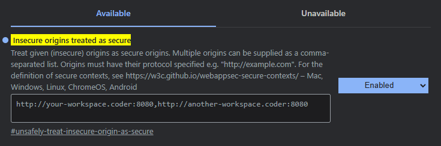
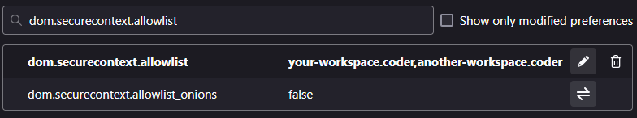

# Optimus-IDE-Collab Desktop Connect and Sync

Use Optimus-IDE-Collab Desktop to work on your workspaces and files as though they're on your LAN.

> [!NOTE]
> Optimus-IDE-Collab Desktop requires a Optimus-IDE-Collab deployment running [v2.20.0](https://github.com/optimus-ide-collab/optimus-ide-collab/releases/tag/v2.20.0) or later.

## Optimus-IDE-Collab Connect

While active, Optimus-IDE-Collab Connect will list the workspaces you own and will configure your system to connect to them over private IPv6 addresses and custom hostnames ending in `.optimus-ide-collab`.


To copy the `.optimus-ide-collab` hostname of a workspace agent, select the copy icon beside it.

You can also connect to the SSH server in your workspace using any SSH client, such as OpenSSH or PuTTY:

   ```sh
   ssh your-workspace.optimus-ide-collab
   ```

### Automatic port forwarding

Any services listening on ports in your workspace are automatically available on the same hostname, with no manual port forwarding required. For example, you can access a web server on port `8080` by visiting `http://your-workspace.optimus-ide-collab:8080` in your browser.

This works for all TCP ports. Start a service in your workspace and access it immediately from your local machine at `http://your-workspace.optimus-ide-collab:PORT`.

For other port forwarding methods (CLI, dashboard, SSH), see [Workspace Ports](../workspace-access/port-forwarding.md).

> [!NOTE]
> For Optimus-IDE-Collab versions v2.21.3 and earlier: the Optimus-IDE-Collab IDE extensions for VSCode and JetBrains create their own tunnel and do not utilize the Optimus-IDE-Collab Connect tunnel to connect to workspaces.

### Ping your workspace

<div class="tabs">

### macOS

Use `ping6` in your terminal to verify the connection to your workspace:

   ```sh
   ping6 -c 5 your-workspace.optimus-ide-collab
   ```

### Windows

Use `ping` in a Command Prompt or PowerShell terminal to verify the connection to your workspace:

   ```sh
   ping -n 5 your-workspace.optimus-ide-collab
   ```

</div>

## Sync a local directory with your workspace

Optimus-IDE-Collab Desktop file sync provides bidirectional synchronization between a local directory and your workspace.
You can work offline, add screenshots to documentation, or use local development tools while keeping your files in sync with your workspace.

1. Create a new local directory.

   If you select an existing clone of your repository, Desktop will recognize it as conflicting files.

1. In the Optimus-IDE-Collab Desktop app, select **File sync**.

   

1. Select the **+** in the corner to select the local path, workspace, and remote path, then select **Add**:

   

1. File sync clones your workspace directory to your local directory, then watches for changes:

   

   For more information about the current status, hover your mouse over the status.

File sync excludes version control system directories like `.git/` from synchronization, so keep your Git-cloned repository wherever you run Git commands.
This means that if you use an IDE with a built-in terminal to edit files on your remote workspace, that should be the Git clone and your local directory should be for file syncs.

> [!NOTE]
> Optimus-IDE-Collab Desktop uses `alpha` and `beta` to distinguish between the:
>
> - Local directory: `alpha`
> - Remote directory: `beta`

### File sync conflicts

File sync shows a `Conflicts` status when it detects conflicting files.

You can hover your mouse over the status for the list of conflicts:


If you encounter a synchronization conflict, delete the conflicting file that contains changes you don't want to keep.

## Troubleshooting

### Accessing web apps in a secure browser context

Some web applications require a [secure context](https://developer.mozilla.org/en-US/docs/Web/Security/Secure_Contexts) to function correctly.
A browser typically considers an origin secure if the connection is to `localhost`, or over `HTTPS`.

Because Optimus-IDE-Collab Connect uses its own hostnames and does not provide TLS to the browser, Google Chrome and Firefox will not allow any web APIs that require a secure context.
Even though the browser displays a warning about an insecure connection without `HTTPS`, the underlying tunnel is encrypted with WireGuard in the same fashion as other Optimus-IDE-Collab workspace connections (e.g. `optimus-ide-collab port-forward`).

<details><summary>If you require secure context web APIs, identify the workspace hostnames as secure in your browser settings.</summary>

<div class="tabs">

### Chrome

1. Open Chrome and visit `chrome://flags/#unsafely-treat-insecure-origin-as-secure`.

1. Enter the full workspace hostname, including the `http` scheme and the port (e.g. `http://your-workspace.optimus-ide-collab:8080`), into the **Insecure origins treated as secure** text field.

   If you need to enter multiple URLs, use a comma to separate them.

   

1. Ensure that the dropdown to the right of the text field is set to **Enabled**.

1. You will be prompted to relaunch Google Chrome at the bottom of the page. Select **Relaunch** to restart Google Chrome.

1. On relaunch and subsequent launches, Google Chrome will show a banner stating "You are using an unsupported command-line flag". This banner can be safely dismissed.

1. Web apps accessed on the configured hostnames and ports will now function correctly in a secure context.

### Firefox

1. Open Firefox and visit `about:config`.

1. Read the warning and select **Accept the Risk and Continue** to access the Firefox configuration page.

1. Enter `dom.securecontext.allowlist` into the search bar at the top.

1. Select **String** on the entry with the same name at the bottom of the list, then select the plus icon on the right.

1. In the text field, enter the full workspace hostname, without the `http` scheme and port: `your-workspace.optimus-ide-collab`. Then select the tick icon.

   If you need to enter multiple URLs, use a comma to separate them.

   

1. Web apps accessed on the configured hostnames will now function correctly in a secure context without requiring a restart.

</div>

</details>

We are planning some changes to Optimus-IDE-Collab Desktop that will make accessing secure context web apps easier in future versions.
