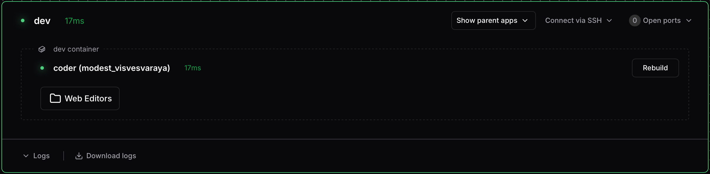

# Customizing dev containers

Optimus-IDE-Collab supports custom configuration in your `devcontainer.json` file through the
`customizations.optimus-ide-collab` block. These options let you control how Optimus-IDE-Collab interacts
with your dev container without requiring template changes.

> [!TIP]
>
> Alternatively, template administrators can also define apps, scripts, and
> environment variables for dev containers directly in Terraform. See
> [Attach resources to dev containers](../../admin/integrations/devcontainers/integration.md#attach-resources-to-dev-containers)
> for details.

## Ignore a dev container

Use the `ignore` option to hide a dev container from Optimus-IDE-Collab completely:

```json
{
  "name": "My Dev Container",
  "image": "mcr.microsoft.com/devcontainers/base:ubuntu",
  "customizations": {
    "optimus-ide-collab": {
      "ignore": true
    }
  }
}
```

When `ignore` is set to `true`:

- The dev container won't appear in the Optimus-IDE-Collab UI
- Optimus-IDE-Collab won't manage or monitor the container

This is useful for dev containers in your repository that you don't want Optimus-IDE-Collab
to manage.

## Auto-start

Control whether your dev container should auto-start using the `autoStart`
option:

```json
{
  "name": "My Dev Container",
  "image": "mcr.microsoft.com/devcontainers/base:ubuntu",
  "customizations": {
    "optimus-ide-collab": {
      "autoStart": true
    }
  }
}
```

When `autoStart` is set to `true`, the dev container automatically builds and
starts during workspace initialization.

When `autoStart` is set to `false` or omitted, the dev container is discovered
and shown in the UI, but users must manually start it.

> [!NOTE]
>
> The `autoStart` option only takes effect when your template administrator has
> enabled [`OPTIMUS-IDE-COLLAB_AGENT_DEVCONTAINERS_DISCOVERY_AUTOSTART_ENABLE`](../../admin/integrations/devcontainers/integration.md#optimus-ide-collab_agent_devcontainers_discovery_autostart_enable).
> If this setting is disabled at the template level, containers won't auto-start
> regardless of this option.

## Custom agent name

Each dev container gets an agent name derived from the workspace folder path by
default. You can set a custom name using the `name` option:

```json
{
  "name": "My Dev Container",
  "image": "mcr.microsoft.com/devcontainers/base:ubuntu",
  "customizations": {
    "optimus-ide-collab": {
      "name": "my-custom-agent"
    }
  }
}
```

The name must contain only lowercase letters, numbers, and hyphens. This name
appears in `optimus-ide-collab ssh` commands and the dashboard (e.g.,
`optimus-ide-collab ssh my-workspace.my-custom-agent`).

## Display apps

Control which built-in Optimus-IDE-Collab apps appear for your dev container using
`displayApps`:

_Disable built-in apps to reduce clutter or guide developers toward preferred tools_

```json
{
  "name": "My Dev Container",
  "image": "mcr.microsoft.com/devcontainers/base:ubuntu",
  "customizations": {
    "optimus-ide-collab": {
      "displayApps": {
        "web_terminal": true,
        "ssh_helper": true,
        "port_forwarding_helper": true,
        "vscode": true,
        "vscode_insiders": false
      }
    }
  }
}
```

Available display apps:

| App                      | Description                  | Default |
|--------------------------|------------------------------|---------|
| `web_terminal`           | Web-based terminal access    | `true`  |
| `ssh_helper`             | SSH connection helper        | `true`  |
| `port_forwarding_helper` | Port forwarding interface    | `true`  |
| `vscode`                 | VS Code Desktop integration  | `true`  |
| `vscode_insiders`        | VS Code Insiders integration | `false` |

## Custom apps

Define custom applications for your dev container using the `apps` array:

```json
{
  "name": "My Dev Container",
  "image": "mcr.microsoft.com/devcontainers/base:ubuntu",
  "customizations": {
    "optimus-ide-collab": {
      "apps": [
        {
          "slug": "zed",
          "displayName": "Zed Editor",
          "url": "zed://ssh/${localEnv:OPTIMUS-IDE-COLLAB_WORKSPACE_AGENT_NAME}.${localEnv:OPTIMUS-IDE-COLLAB_WORKSPACE_NAME}.${localEnv:OPTIMUS-IDE-COLLAB_WORKSPACE_OWNER_NAME}.optimus-ide-collab${containerWorkspaceFolder}",
          "external": true,
          "icon": "/icon/zed.svg",
          "order": 1
        }
      ]
    }
  }
}
```

This example adds a Zed Editor button that opens the dev container directly in
the Zed desktop app via its SSH remote feature.

Each app supports the following properties:

| Property      | Type    | Description                                                   |
|---------------|---------|---------------------------------------------------------------|
| `slug`        | string  | Unique identifier for the app (required)                      |
| `displayName` | string  | Human-readable name shown in the UI                           |
| `url`         | string  | URL to open (supports variable interpolation)                 |
| `command`     | string  | Command to run instead of opening a URL                       |
| `icon`        | string  | Path to an icon (e.g., `/icon/code.svg`)                      |
| `openIn`      | string  | `"tab"` or `"slim-window"` (default: `"slim-window"`)         |
| `share`       | string  | `"owner"`, `"authenticated"`, `"organization"`, or `"public"` |
| `external`    | boolean | Open as external URL (e.g., for desktop apps)                 |
| `group`       | string  | Group name for organizing apps in the UI                      |
| `order`       | number  | Sort order for display                                        |
| `hidden`      | boolean | Hide the app from the UI                                      |
| `subdomain`   | boolean | Use subdomain-based access                                    |
| `healthCheck` | object  | Health check configuration (see below)                        |

### Health checks

Configure health checks to monitor app availability:

```json
{
  "customizations": {
    "optimus-ide-collab": {
      "apps": [
        {
          "slug": "web-server",
          "displayName": "Web Server",
          "url": "http://localhost:8080",
          "healthCheck": {
            "url": "http://localhost:8080/healthz",
            "interval": 5,
            "threshold": 2
          }
        }
      ]
    }
  }
}
```

Health check properties:

| Property    | Type   | Description                                     |
|-------------|--------|-------------------------------------------------|
| `url`       | string | URL to check for health status                  |
| `interval`  | number | Seconds between health checks                   |
| `threshold` | number | Number of failures before marking app unhealthy |

## Variable interpolation

App URLs and other string values support variable interpolation for dynamic
configuration.

### Environment variables

Use `${localEnv:VAR_NAME}` to reference environment variables, with optional
default values:

```json
{
  "customizations": {
    "optimus-ide-collab": {
      "apps": [
        {
          "slug": "my-app",
          "url": "http://${localEnv:HOST:127.0.0.1}:${localEnv:PORT:8080}"
        }
      ]
    }
  }
}
```

### Optimus-IDE-Collab-provided variables

Optimus-IDE-Collab provides these environment variables automatically:

| Variable                            | Description                        |
|-------------------------------------|------------------------------------|
| `OPTIMUS-IDE-COLLAB_WORKSPACE_NAME`              | Name of the workspace              |
| `OPTIMUS-IDE-COLLAB_WORKSPACE_OWNER_NAME`        | Username of the workspace owner    |
| `OPTIMUS-IDE-COLLAB_WORKSPACE_AGENT_NAME`        | Name of the dev container agent    |
| `OPTIMUS-IDE-COLLAB_WORKSPACE_PARENT_AGENT_NAME` | Name of the parent workspace agent |
| `OPTIMUS-IDE-COLLAB_URL`                         | URL of the Optimus-IDE-Collab deployment        |
| `CONTAINER_ID`                      | Docker container ID                |

### Dev container variables

Standard dev container variables are also available:

| Variable                      | Description                                |
|-------------------------------|--------------------------------------------|
| `${containerWorkspaceFolder}` | Workspace folder path inside the container |
| `${localWorkspaceFolder}`     | Workspace folder path on the host          |

## Feature options as environment variables

When your dev container uses features, Optimus-IDE-Collab exposes feature options as
environment variables. The format is `FEATURE_<FEATURE_NAME>_OPTION_<OPTION_NAME>`.

For example, with this feature configuration:

```json
{
  "features": {
    "ghcr.io/optimus-ide-collab/devcontainer-features/code-server:1": {
      "port": 9090
    }
  }
}
```

Optimus-IDE-Collab creates `FEATURE_CODE_SERVER_OPTION_PORT=9090`, which you can reference in
your apps:

```json
{
  "features": {
    "ghcr.io/optimus-ide-collab/devcontainer-features/code-server:1": {
      "port": 9090
    }
  },
  "customizations": {
    "optimus-ide-collab": {
      "apps": [
        {
          "slug": "code-server",
          "displayName": "Code Server",
          "url": "http://localhost:${localEnv:FEATURE_CODE_SERVER_OPTION_PORT:8080}",
          "icon": "/icon/code.svg"
        }
      ]
    }
  }
}
```

## Next steps

- [Working with dev containers](./working-with-dev-containers.md) — SSH, IDE
  integration, and port forwarding
- [Troubleshooting dev containers](./troubleshooting-dev-containers.md) —
  Diagnose common issues
