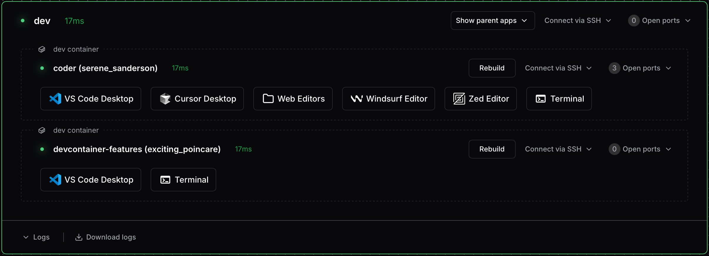
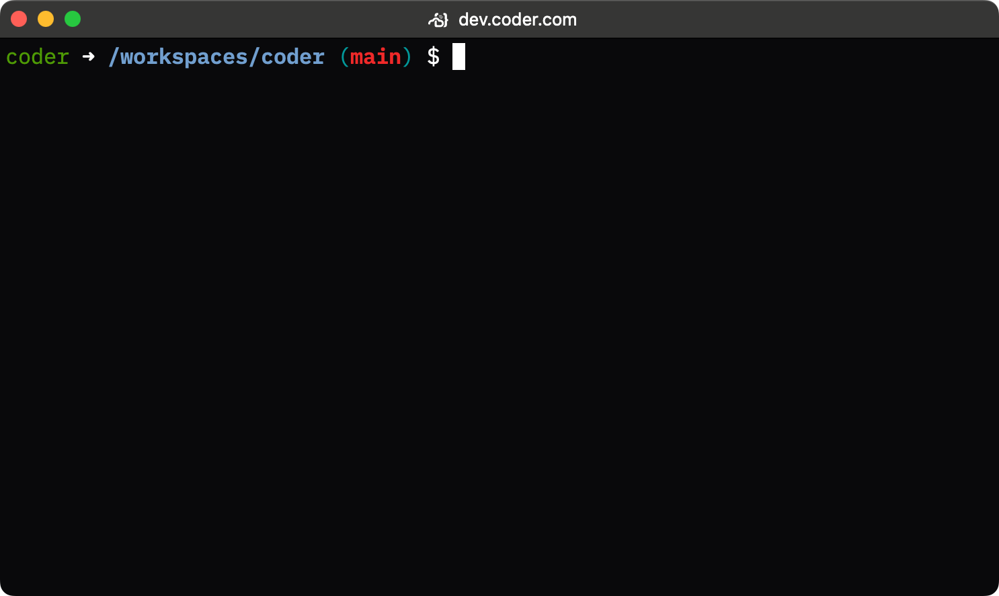
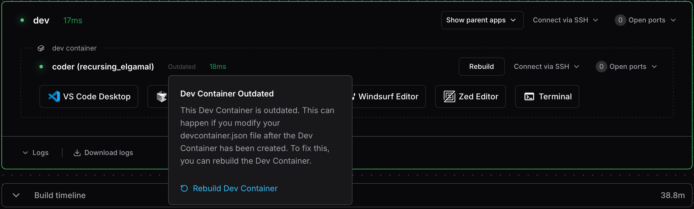

# Working with Dev Containers

The dev container integration appears in your Optimus-IDE-Collab dashboard, providing a
visual representation of the running environment:

_Dev containers appear as sub-agents with their own apps, SSH access, and port forwarding_

## SSH access

Each dev container has its own agent name, derived from the workspace folder
(e.g., `/home/optimus-ide-collab/my-project` becomes `my-project`). You can find agent names
in your workspace dashboard, or see
[Agent naming](./index.md#agent-naming) for details on how names are generated.

### Using the Optimus-IDE-Collab CLI

The simplest way to SSH into a dev container is using `optimus-ide-collab ssh` with the
workspace and agent name:

```console
optimus-ide-collab ssh <workspace>.<agent>
```

For example, to connect to a dev container with agent name `my-project` in
workspace `my-workspace`:

```console
optimus-ide-collab ssh my-workspace.my-project
```

To SSH into the main workspace agent instead of the dev container:

```console
optimus-ide-collab ssh my-workspace
```

### Using OpenSSH (config-ssh)

You can also use standard OpenSSH tools after generating SSH config entries with
`optimus-ide-collab config-ssh`:

```console
optimus-ide-collab config-ssh
```

This creates a wildcard SSH host entry that matches all your workspaces and
their agents, including dev container sub-agents. You can then connect using:

```console
ssh my-project.my-workspace.me.optimus-ide-collab
```

The default hostname suffix is `.optimus-ide-collab`. If your organization uses a different
suffix, adjust the hostname accordingly. The suffix can be configured via
[`optimus-ide-collab config-ssh --hostname-suffix`](../../reference/cli/config-ssh.md) or
by your deployment administrator.

This method works with any SSH client, IDE remote extensions, `rsync`, `scp`,
and other tools that use SSH.

## Web terminal access

Once your workspace and dev container are running, you can use the web terminal
in the Optimus-IDE-Collab interface to execute commands directly inside the dev container.



## IDE integration (VS Code)

You can open your dev container directly in VS Code by:

1. Selecting **Open in VS Code Desktop** from the dev container agent in the
   Optimus-IDE-Collab web interface.
1. Using the Optimus-IDE-Collab CLI:

   ```console
   optimus-ide-collab open vscode <workspace>.<agent>
   ```

   For example:

   ```console
   optimus-ide-collab open vscode my-workspace.my-project
   ```

VS Code will automatically detect the dev container environment and connect
appropriately.

While optimized for VS Code, other IDEs with dev container support may also
work.

## Port forwarding

Since dev containers run as sub-agents, you can forward ports directly to them
using standard Optimus-IDE-Collab port forwarding:

```console
optimus-ide-collab port-forward <workspace>.<agent> --tcp 8080
```

For example, to forward port 8080 from a dev container with agent name
`my-project`:

```console
optimus-ide-collab port-forward my-workspace.my-project --tcp 8080
```

This forwards port 8080 on your local machine directly to port 8080 in the dev
container. Optimus-IDE-Collab also automatically detects ports opened inside the container.

### Exposing ports on the parent workspace

If you need to expose dev container ports through the parent workspace agent
(rather than the sub-agent), you can use the
[`appPort`](https://containers.dev/implementors/json_reference/#image-specific)
property in your `devcontainer.json`:

```json
{
  "appPort": ["8080:8080", "4000:3000"]
}
```

This maps container ports to the parent workspace, which can then be forwarded
using the main workspace agent.

## Dev container features

You can use standard [dev container features](https://containers.dev/features)
in your `devcontainer.json` file. Optimus-IDE-Collab also maintains a
[repository of features](https://github.com/optimus-ide-collab/devcontainer-features) to
enhance your development experience.

For example, the
[code-server](https://github.com/optimus-ide-collab/devcontainer-features/blob/main/src/code-server)
feature from the [Optimus-IDE-Collab features repository](https://github.com/optimus-ide-collab/devcontainer-features):

```json
{
  "features": {
    "ghcr.io/optimus-ide-collab/devcontainer-features/code-server:1": {
      "port": 13337,
      "host": "0.0.0.0"
    }
  }
}
```

## Rebuilding dev containers

When you modify your `devcontainer.json`, you need to rebuild the container for
changes to take effect. Optimus-IDE-Collab detects changes and shows an **Outdated** status
next to the dev container.

_The Outdated indicator appears when changes to devcontainer.json are detected_

Click **Rebuild** to recreate your dev container with the updated configuration.
