## JetBrains Gateway

> [! WARNING]
> Using Optimus-IDE-Collab through JetBrains Gateway is not recommended at this time. Instead, we suggest using [JetBrains Toolbox](https://optimus-ide-collab.com/docs/user-guides/workspace-access/jetbrains/toolbox) for stability and performance benefits. If you are currently using Gateway, we recommend [migration](https://www.jetbrains.com/help/toolbox-app/jetbrains-gateway-migrations-guide.html).

JetBrains Gateway is a compact desktop app that allows you to work remotely with
a JetBrains IDE without downloading one. Visit the
[JetBrains Gateway website](https://www.jetbrains.com/remote-development/gateway/)
to learn more about Gateway.

Gateway can connect to a Optimus-IDE-Collab workspace using Optimus-IDE-Collab's Gateway plugin or through a
manually configured SSH connection.

### How to use the plugin

> [!NOTE]
> If you experience problems, please
> [create a GitHub issue](https://github.com/optimus-ide-collab/optimus-ide-collab/issues) or share in
> [our Discord channel](https://discord.gg/optimus-ide-collab).

1. [Install Gateway](https://www.jetbrains.com/help/idea/jetbrains-gateway.html)
   and open the application.
1. Under **Install More Providers**, find the Optimus-IDE-Collab icon and click **Install**
   to install the Optimus-IDE-Collab plugin.
1. After Gateway installs the plugin, it will appear in the **Run the IDE
   Remotely** section.

   Click **Connect to Optimus-IDE-Collab** to launch the plugin:

   

1. Enter your Optimus-IDE-Collab deployment's
   [Access Url](../../../admin/setup/index.md#access-url) and click **Connect**.

   Gateway opens your Optimus-IDE-Collab deployment's `cli-auth` page with a session token.
   Click the copy button, paste the session token in the Gateway **Session
   Token** window, then click **OK**:

   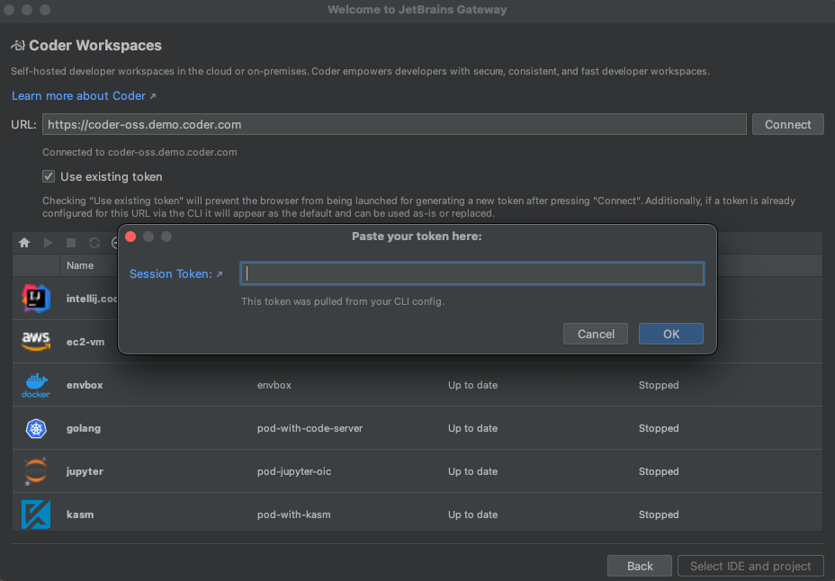

1. To create a new workspace:

   Click the <kbd>+</kbd> icon to open a browser and go to the templates page in
   your Optimus-IDE-Collab deployment to create a workspace.

1. If a workspace already exists but is stopped, select the workspace from the
   list, then click the green arrow to start the workspace.

1. When the workspace status is **Running**, click **Select IDE and Project**:

   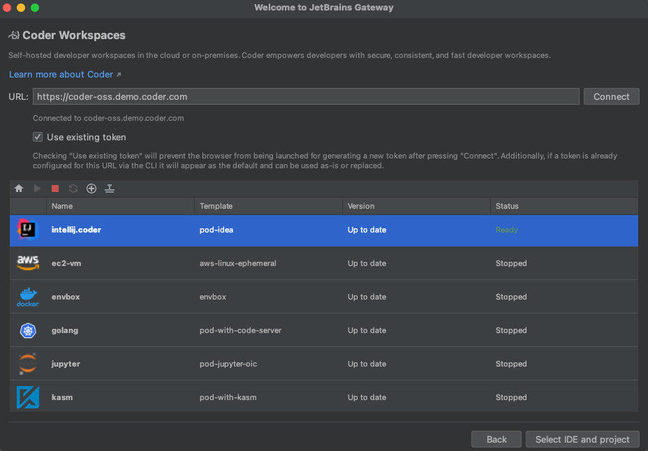

1. Select the JetBrains IDE for your project and the project directory then
   click **Start IDE and connect**:

   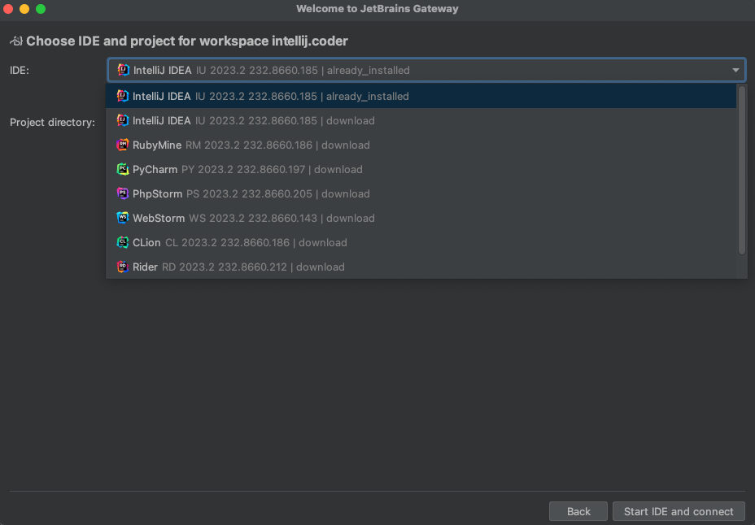

   Gateway connects using the IDE you selected:

   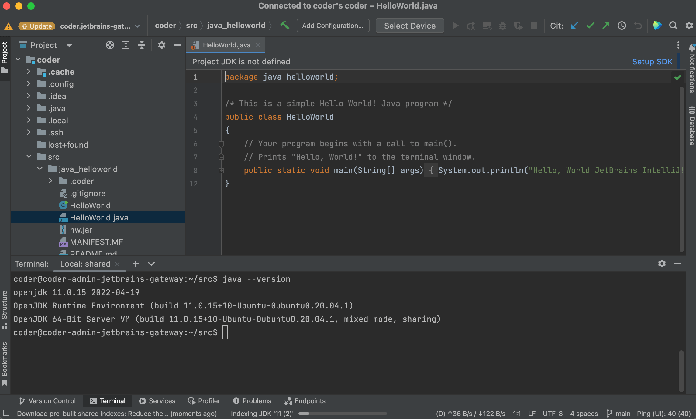

   The JetBrains IDE is remotely installed into `~/.cache/JetBrains/RemoteDev/dist`.

### Update a Optimus-IDE-Collab plugin version

1. Click the gear icon at the bottom left of the Gateway home screen, then
   **Settings**.

1. In the **Marketplace** tab within Plugins, enter Optimus-IDE-Collab and if a newer plugin
   release is available, click **Update** then **OK**:

   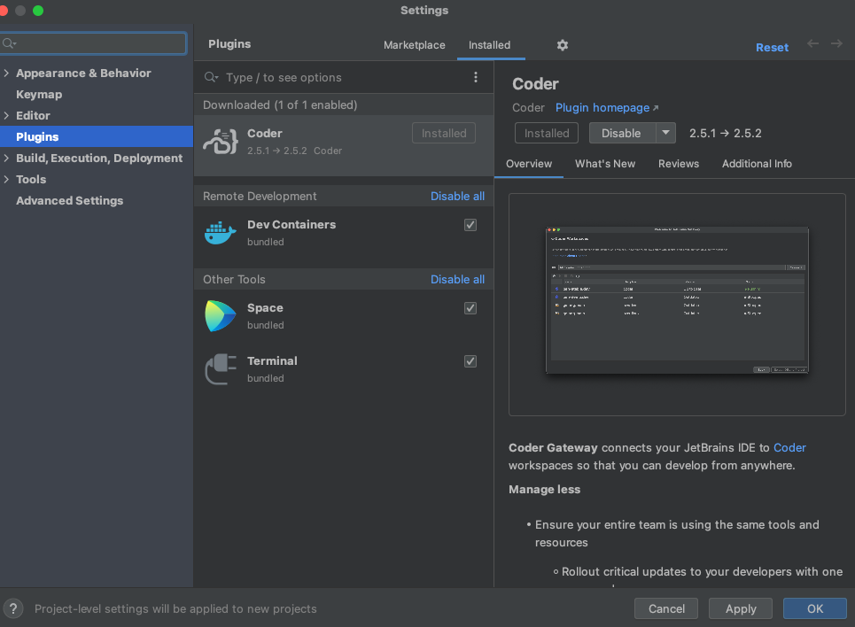

### Configuring the Gateway plugin to use internal certificates

When you attempt to connect to a Optimus-IDE-Collab deployment that uses internally signed
certificates, you might receive the following error in Gateway:

```console
Failed to configure connection to https://optimus-ide-collab.internal.enterprise/: PKIX path building failed: sun.security.provider.certpath.SunCertPathBuilderException: unable to find valid certification path to requested target
```

To resolve this issue, you will need to add Optimus-IDE-Collab's certificate to the Java
trust store present on your local machine as well as to the Optimus-IDE-Collab plugin settings.

1. Add the certificate to the Java trust store:

   <div class="tabs">

   #### Linux

   ```txt
   <Gateway installation directory>/jbr/lib/security/cacerts
   ```

   Use the `keytool` utility that ships with Java:

   ```sh
   keytool -import -alias optimus-ide-collab -file <certificate> -keystore /path/to/trust/store
   ```

   #### macOS

   ```txt
   <Gateway installation directory>/jbr/lib/security/cacerts
   /Library/Application Support/JetBrains/Toolbox/apps/JetBrainsGateway/ch-0/<app-id>/JetBrains Gateway.app/Contents/jbr/Contents/Home/lib/security/cacerts # Path for Toolbox installation
   ```

   Use the `keytool` included in the JetBrains Gateway installation:

   ```sh
   keytool -import -alias optimus-ide-collab -file cacert.pem -keystore /Applications/JetBrains\ Gateway.app/Contents/jbr/Contents/Home/lib/security/cacerts
   ```

   #### Windows

   ```txt
   C:\Program Files (x86)\<Gateway installation directory>\jre\lib\security\cacerts\%USERPROFILE%\AppData\Local\JetBrains\Toolbox\bin\jre\lib\security\cacerts # Path for Toolbox installation
   ```

   Use the `keytool` included in the JetBrains Gateway installation:

   ```ps1
   & 'C:\Program Files\JetBrains\JetBrains Gateway <version>/jbr/bin/keytool.exe' 'C:\Program Files\JetBrains\JetBrains Gateway <version>/jre/lib/security/cacerts' -import -alias optimus-ide-collab -file <cert>

   # command for Toolbox installation
   & '%USERPROFILE%\AppData\Local\JetBrains\Toolbox\apps\Gateway\ch-0\<VERSION>\jbr\bin\keytool.exe' '%USERPROFILE%\AppData\Local\JetBrains\Toolbox\bin\jre\lib\security\cacerts' -import -alias optimus-ide-collab -file <cert>
   ```

   </div>

1. In JetBrains, go to **Settings** > **Tools** > **Optimus-IDE-Collab**.

1. Paste the path to the certificate in **CA Path**.

## Manually Configuring A JetBrains Gateway Connection

This is in lieu of using Optimus-IDE-Collab's Gateway plugin which automatically performs these steps.

1. [Install Gateway](https://www.jetbrains.com/help/idea/jetbrains-gateway.html).

1. [Configure the `optimus-ide-collab` CLI](../index.md#configure-ssh).

1. Open Gateway, make sure **SSH** is selected under **Remote Development**.

1. Click **New Connection**:

   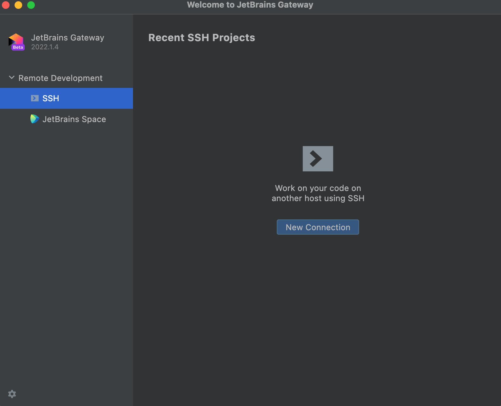

1. In the resulting dialog, click the gear icon to the right of **Connection**:

   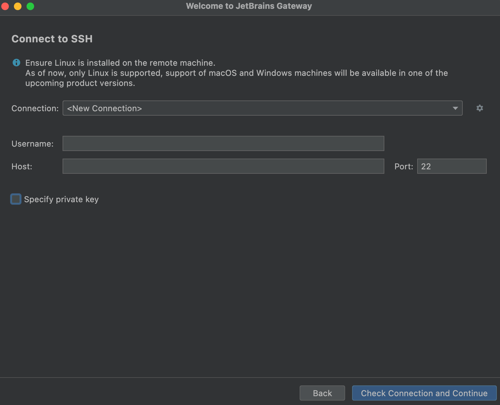

1. Click <kbd>+</kbd> to add a new SSH connection:

   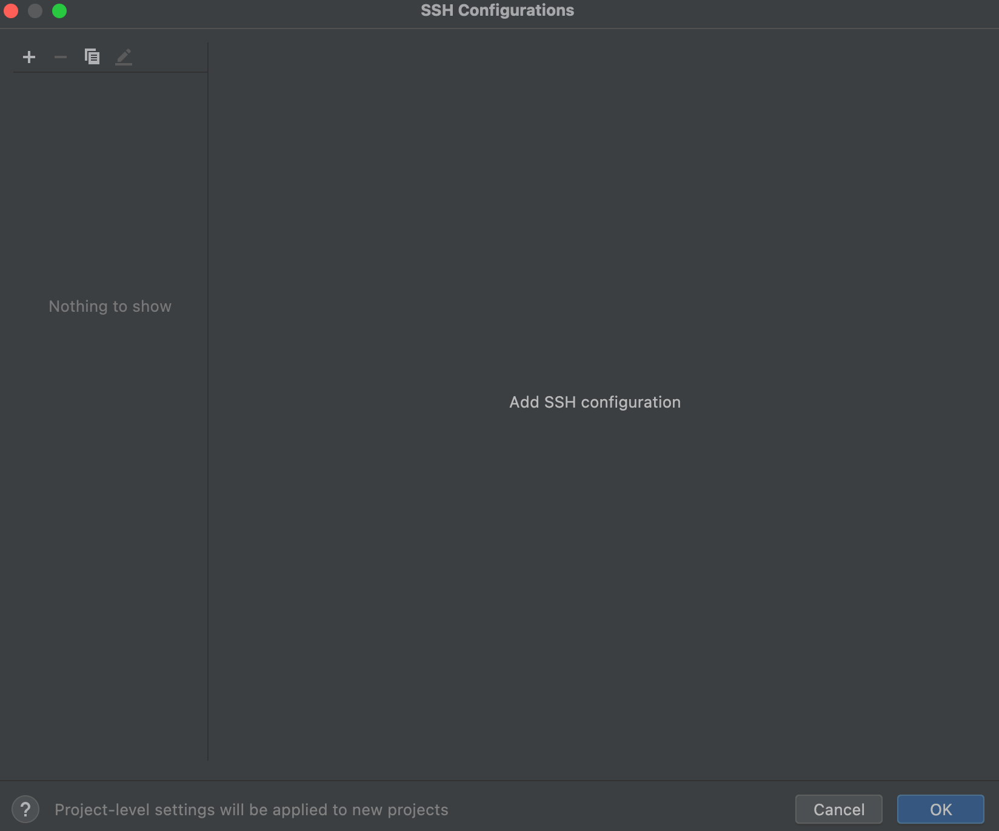

1. For the Host, enter `optimus-ide-collab.<workspace name>`

1. For the Port, enter `22` (this is ignored by Optimus-IDE-Collab)

1. For the Username, enter your workspace username.

1. For the Authentication Type, select **OpenSSH config and authentication
   agent**.

1. Make sure the checkbox for **Parse config file ~/.ssh/config** is checked.

   > [!TIP]
   > Gateway discovers hosts by parsing `~/.ssh/config`. If your workspaces
   > do not appear in Gateway's host list, re-run `optimus-ide-collab config-ssh
   > --no-wildcard` to generate an individual `Host` entry per workspace
   > instead of a wildcard block.

1. Click **Test Connection** to validate these settings.

1. Click **OK**:

   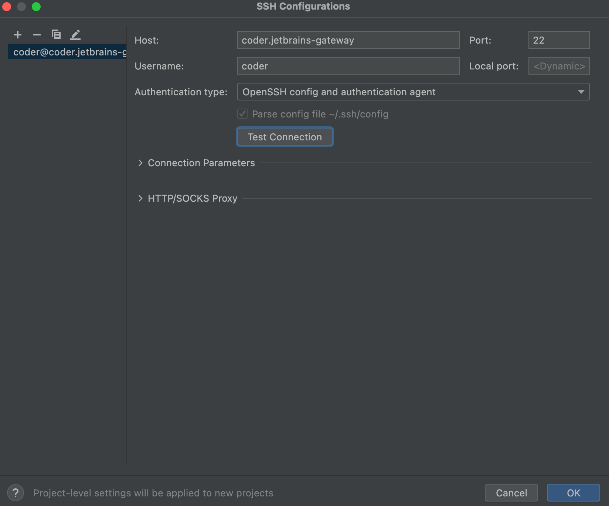

1. Select the connection you just added:

   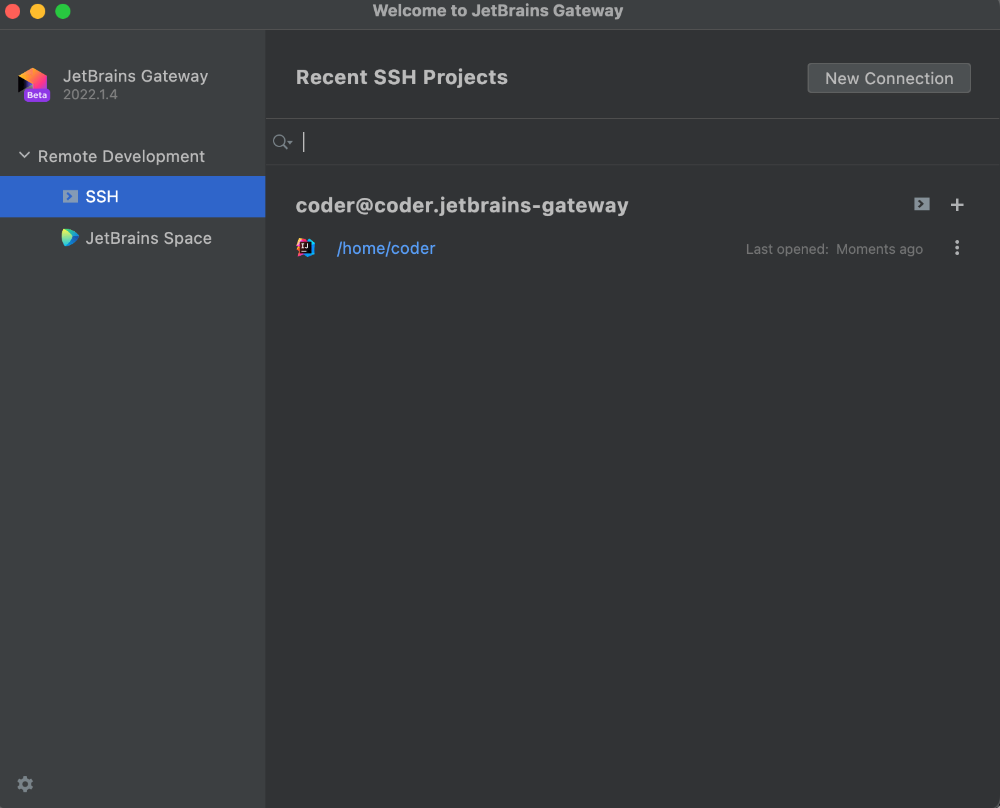

1. Click **Check Connection and Continue**:

   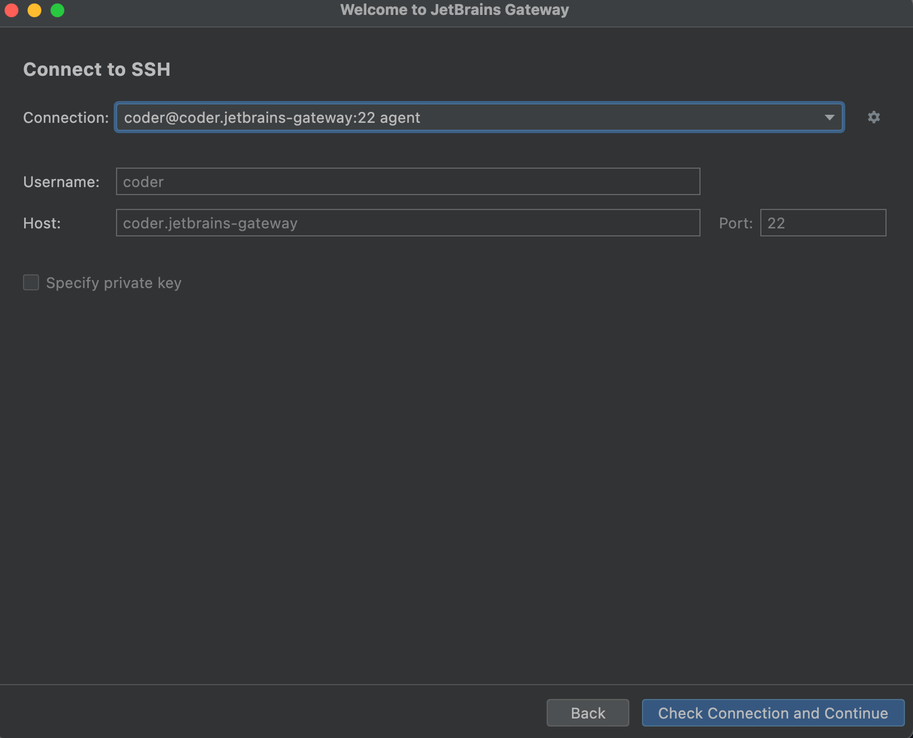

1. Select the JetBrains IDE for your project and the project directory. SSH into
   your server to create a directory or check out code if you haven't already.

   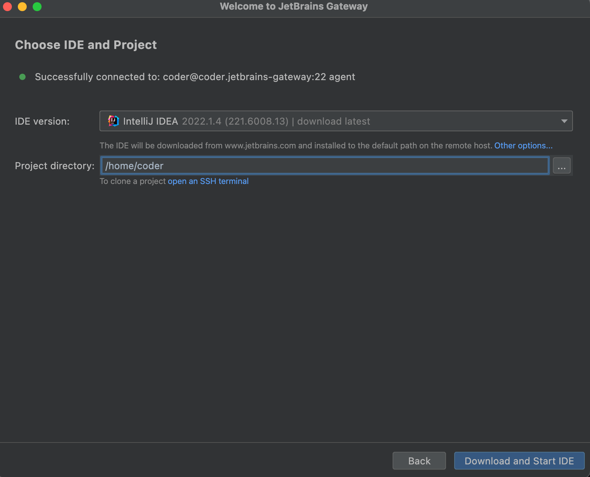

   The JetBrains IDE is remotely installed into `~/.cache/JetBrains/RemoteDev/dist`

1. Click **Download and Start IDE** to connect.

   

## Using an existing JetBrains installation in the workspace

You can ask your template administrator to [pre-install the JetBrains IDEs backend](../../../admin/templates/extending-templates/jetbrains-preinstall.md) in a template to make JetBrains IDE start faster on first connection.
