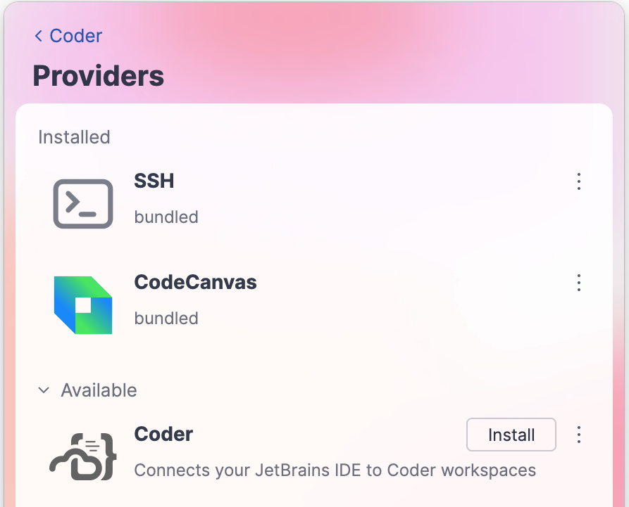
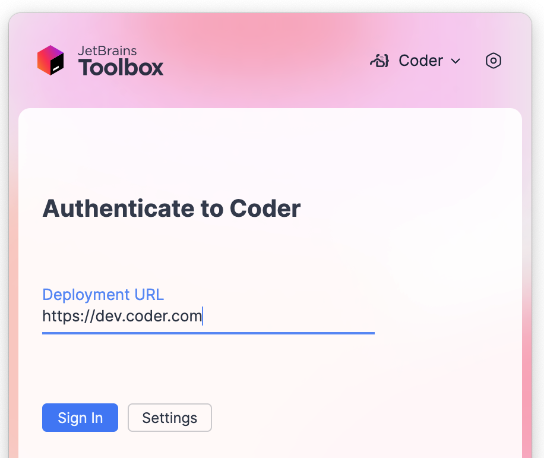
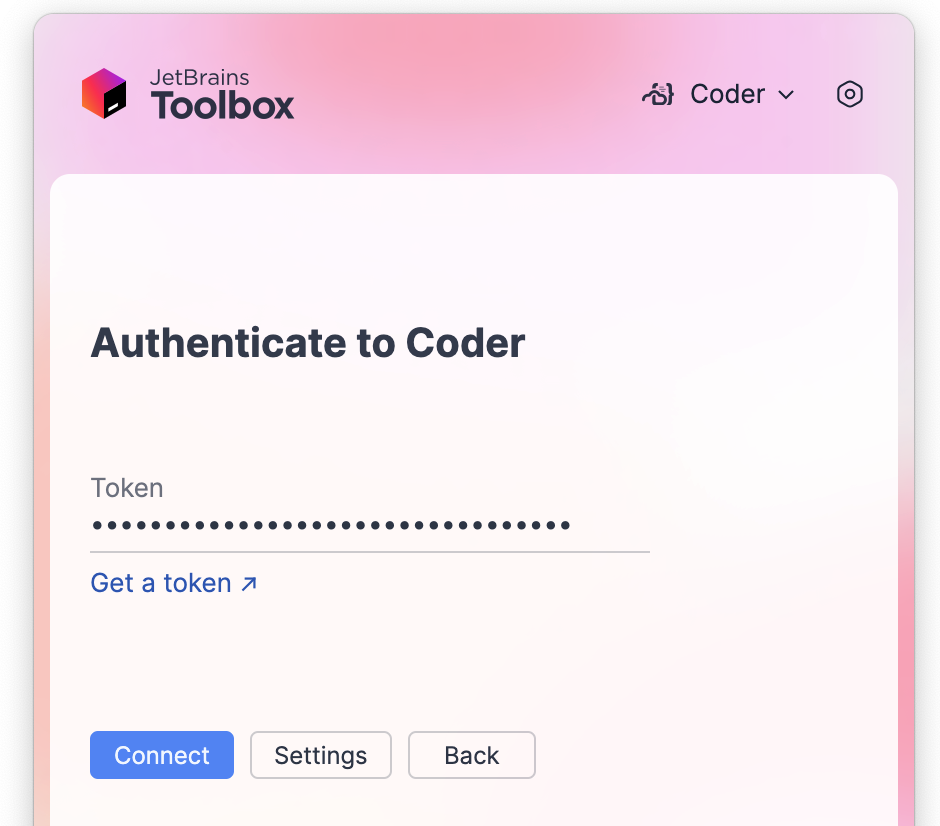
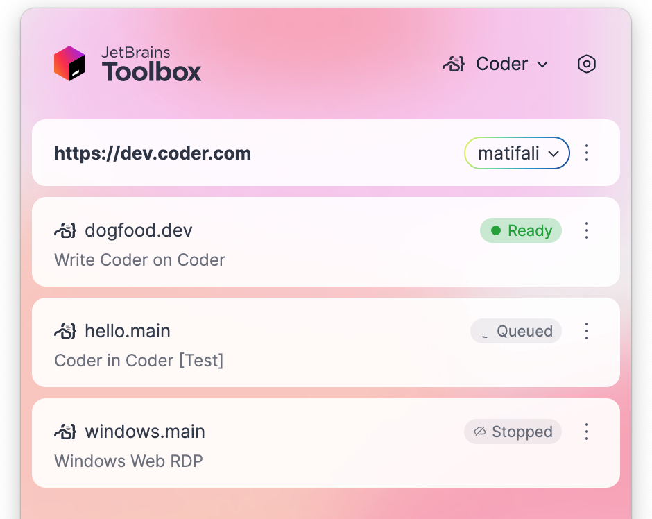
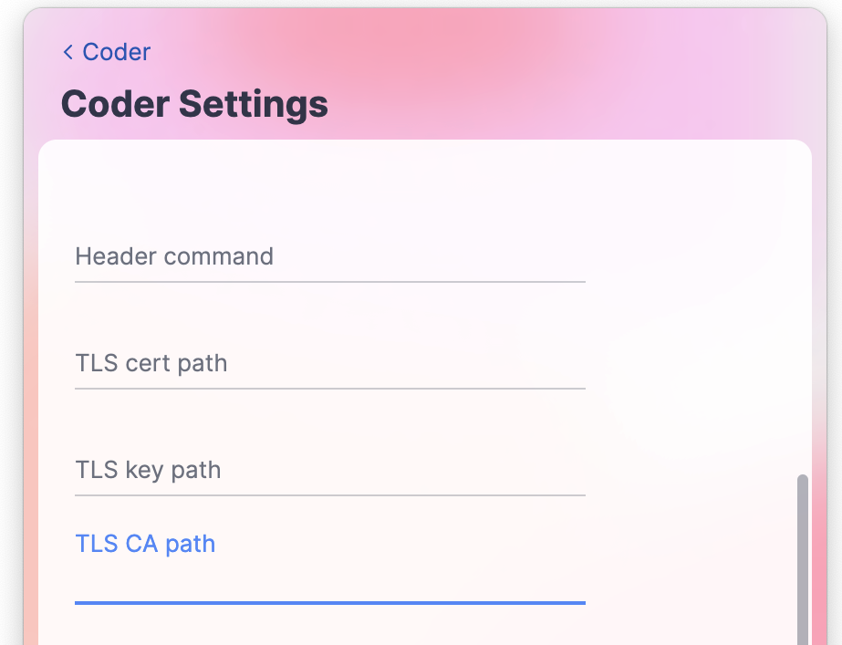

# JetBrains Toolbox (beta)

JetBrains Toolbox helps you manage JetBrains products and includes remote development capabilities for connecting to Optimus-IDE-Collab workspaces.

For more details, visit the [official JetBrains documentation](https://www.jetbrains.com/help/toolbox-app/manage-providers.html#shx3a8_18).

## Install the Optimus-IDE-Collab provider for Toolbox

1. Install [JetBrains Toolbox](https://www.jetbrains.com/toolbox-app/) version 2.6.0.40632 or later.
1. Open the Toolbox App.
1. From the switcher drop-down, select **Manage Providers**.
1. In the **Providers** window, under the Available node, locate the **Optimus-IDE-Collab** provider and click **Install**.



## Connect

1. In the Toolbox App, click **Optimus-IDE-Collab**.
1. Enter the URL address and click **Sign In**.
   
1. Authenticate to Optimus-IDE-Collab adding a token for the session and click **Connect**.
   
   After the authentication is completed, you are connected to your development environment and can open and work on projects.
   

## Use URI parameters

For direct connections or creating bookmarks, use custom URI links with parameters:

```sh
jetbrains://gateway/com.optimus-ide-collab.toolbox?url=https://optimus-ide-collab.example.com&token=<auth-token>&workspace=my-workspace
```

Required parameters:

- `url`: Your Optimus-IDE-Collab deployment URL
- `token`: Optimus-IDE-Collab authentication token
- `workspace`: Name of your workspace

Optional parameters:

- `agent_id`: ID of the agent (only required if workspace has multiple agents)
- `folder`: Specific project folder path to open
- `ide_product_code`: Specific IDE product code (e.g., "IU" for IntelliJ IDEA Ultimate)
- `ide_build_number`: Specific build number of the JetBrains IDE

For more details, see the [optimus-ide-collab-jetbrains-toolbox repository](https://github.com/optimus-ide-collab/optimus-ide-collab-jetbrains-toolbox#connect-to-a-optimus-ide-collab-workspace-via-jetbrains-toolbox-uri).

## Configure internal certificates

To connect to a Optimus-IDE-Collab deployment that uses internal certificates, configure the certificates directly in the Optimus-IDE-Collab plugin settings in JetBrains Toolbox:

1. In the Toolbox App, click **Optimus-IDE-Collab**.
1. Click the (⋮) next to the username in top right corner.
1. Select **Settings**.
1. Add your certificate path in the **CA Path** field.
   

## Troubleshooting

If you encounter issues connecting to your Optimus-IDE-Collab workspace via JetBrains Toolbox, follow these steps to enable and capture debug logs:

### Enable Debug Logging

1. Open Toolbox
1. Navigate to the **Toolbox App Menu (hexagonal menu icon) > Settings > Advanced**.
1. In the screen that appears, select `DEBUG` for the Log level: section.
1. Hit the back button at the top.
1. Retry the same operation

### Capture Debug Logs

1. Access logs via **Toolbox App Menu > About > Show log files**.
2. Locate the log file named `jetbrains-toolbox.log` and attach it to your support ticket.
3. If you need to capture logs for a specific workspace, you can also generate a ZIP file using the Workspace action menu, available either on the main Workspaces page in Optimus-IDE-Collab view or within the individual workspace view, under the option labeled **Collect logs**.

## Additional Resources

- [JetBrains Toolbox documentation](https://www.jetbrains.com/help/toolbox-app)
- [Optimus-IDE-Collab JetBrains Toolbox Plugin Github](https://github.com/optimus-ide-collab/optimus-ide-collab-jetbrains-toolbox)
