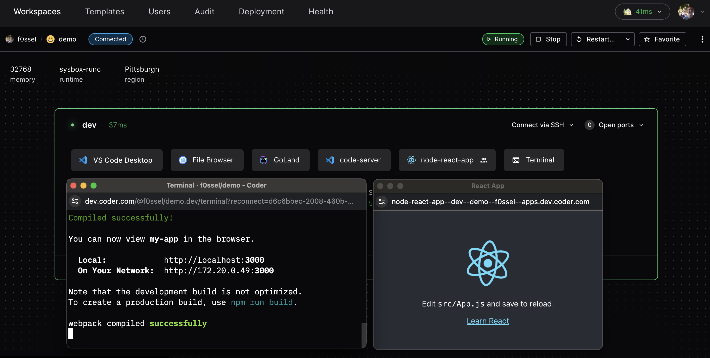
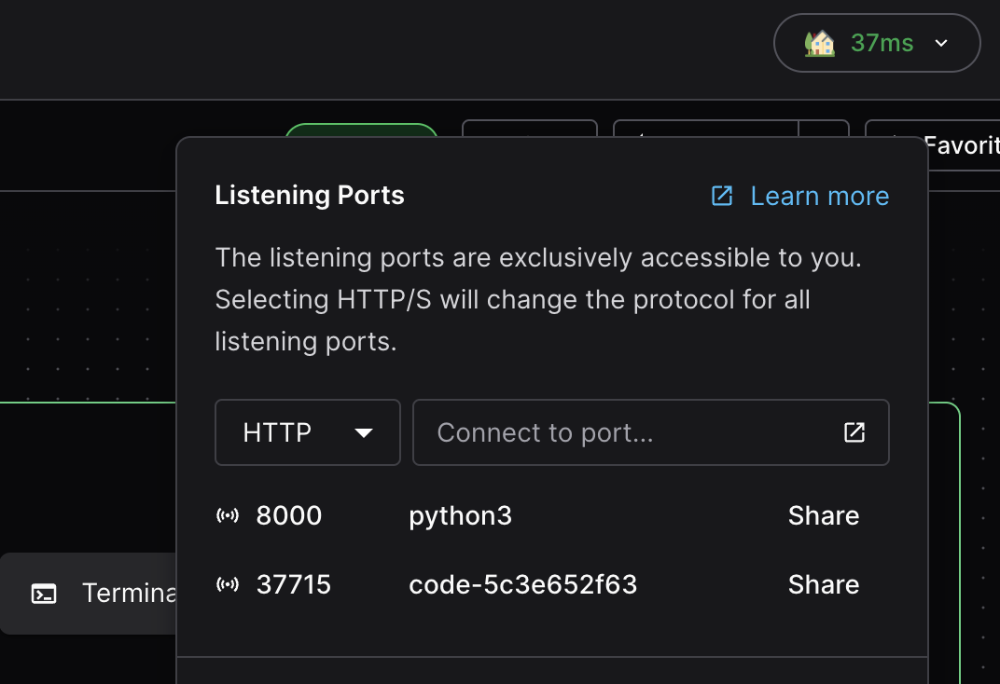
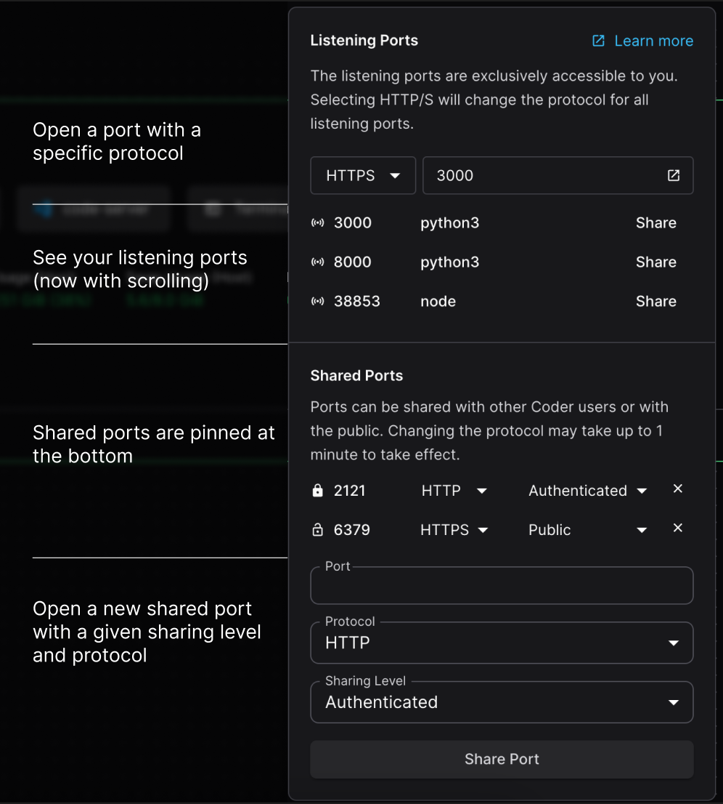

# Workspace Ports

## Port forwarding

Port forwarding lets developers securely access processes on their Optimus-IDE-Collab
workspace from a local machine. A common use case is testing web applications in
a browser.

There are multiple ways to forward ports in Optimus-IDE-Collab:

| Method                                                          | Details                                                                                                                                                                 |
|:----------------------------------------------------------------|-------------------------------------------------------------------------------------------------------------------------------------------------------------------------|
| [Optimus-IDE-Collab Desktop](#optimus-ide-collab-desktop)                                 | Uses a VPN tunnel to your workspaces and provides access to all running ports. Supports peer-to-peer connections for the best performance.                              |
| [`optimus-ide-collab port-forward` command](#the-optimus-ide-collab-port-forward-command) | Can be used to forward specific TCP or UDP ports from the remote workspace so they can be accessed locally. Supports peer-to-peer connections for the best performance. |
| [Dashboard](#dashboard)                                         | Proxies traffic through the Optimus-IDE-Collab control plane.                                                                                                                        |
| [SSH](#ssh)                                                     | Forwards ports over an SSH connection.                                                                                                                                  |

## Optimus-IDE-Collab Desktop

> [!TIP]
> Optimus-IDE-Collab Desktop is the recommended way to access workspace ports. It provides automatic port forwarding with no manual setup.

[Optimus-IDE-Collab Desktop](../desktop/index.md) creates a VPN tunnel that automatically forwards every port in your workspace. Any service listening on a port is instantly accessible at `<workspace-name>.optimus-ide-collab:PORT` from your local machine, with no additional commands or configuration.

This is the simplest option for most developers: install Optimus-IDE-Collab Desktop, enable Optimus-IDE-Collab Connect, and all ports just work. Connections are peer-to-peer for the best performance.

## The `optimus-ide-collab port-forward` command

This command can be used to forward TCP or UDP ports from the remote workspace
so they can be accessed locally. Both the TCP and UDP command line flags
(`--tcp` and `--udp`) can be given once or multiple times.

The supported syntax variations for the `--tcp` and `--udp` flag are:

- Single port with optional remote port: `local_port[:remote_port]`
- Comma separation `local_port1,local_port2`
- Port ranges `start_port-end_port`
- Any combination of the above

### Examples

Forward the remote TCP port `8080` to local port `8000`:

```console
optimus-ide-collab port-forward myworkspace --tcp 8000:8080
```

Forward the remote TCP port `3000` and all ports from `9990` to `9999` to their
respective local ports.

```console
optimus-ide-collab port-forward myworkspace --tcp 3000,9990-9999
```

For more examples, see `optimus-ide-collab port-forward --help`.

## Dashboard

To enable port forwarding via the dashboard, Optimus-IDE-Collab must be configured with a
[wildcard access URL](../../admin/setup/index.md#wildcard-access-url). If an
access URL is not specified, Optimus-IDE-Collab will create
[a publicly accessible URL](../../admin/setup/index.md#tunnel) to reverse
proxy the deployment, and port forwarding will work.

There is a
[DNS limitation](https://datatracker.ietf.org/doc/html/rfc1035#section-2.3.1)
where each segment of hostnames must not exceed 63 characters. If your app
name, agent name, workspace name and username exceed 63 characters in the
hostname, port forwarding via the dashboard will not work.

### From a optimus-ide-collab_app resource

One way to port forward is to configure a `optimus-ide-collab_app` resource in the
workspace's template. This approach shows a visual application icon in the
dashboard. See the following `optimus-ide-collab_app` example for a Node React app and note
the `subdomain` and `share` settings:

```tf
# node app
resource "optimus-ide-collab_app" "node-react-app" {
  agent_id  = optimus-ide-collab_agent.dev.id
  slug      = "node-react-app"
  icon      = "https://upload.wikimedia.org/wikipedia/commons/a/a7/React-icon.svg"
  url       = "http://localhost:3000"
  subdomain = true
  share     = "authenticated"

  healthcheck {
    url       = "http://localhost:3000/healthz"
    interval  = 10
    threshold = 30
  }

}
```

Valid `share` values include `owner` - private to the user, `authenticated` -
accessible by any user authenticated to the Optimus-IDE-Collab deployment, and `public` -
accessible by users outside of the Optimus-IDE-Collab deployment.



## Accessing workspace ports

Another way to port forward in the dashboard is to use the "Open Ports" button
to specify an arbitrary port. Optimus-IDE-Collab will also detect if apps inside the
workspace are listening on ports, and list them below the port input (this is
only supported on Windows and Linux workspace agents).



### Sharing ports

You can share ports as URLs, either with other authenticated optimus-ide-collab users or
publicly. Using the open ports interface, you can assign a sharing levels that
match our `optimus-ide-collab_app`’s share option in
[Optimus-IDE-Collab terraform provider](https://registry.terraform.io/providers/optimus-ide-collab/optimus-ide-collab/latest/docs/resources/app#share).

- `owner` (Default): The implicit sharing level for all listening ports, only
  visible to the workspace owner
- `organization`: Accessible by authenticated users in the same organization as
  the workspace.
- `authenticated`: Accessible by other authenticated Optimus-IDE-Collab users on the same
  deployment.
- `public`: Accessible by any user with the associated URL.

Once a port is shared at either `authenticated` or `public` levels, it will stay
pinned in the open ports UI for better visibility regardless of whether or not
it is still accessible.



> [!NOTE]
> The sharing level is limited by the maximum level enforced in the template
> settings in licensed deployments, and not restricted in OSS deployments.

This can also be used to change the sharing level of port-based `optimus-ide-collab_app`s by
entering their port number in the sharable ports UI. The `share` attribute on
`optimus-ide-collab_app` resource uses a different method of authentication and **is not
impacted by the template's maximum sharing level**, nor the level of a shared
port that points to the app.

### Configuring port protocol

Both listening and shared ports can be configured to use either `HTTP` or
`HTTPS` to connect to the port. For listening ports the protocol selector
applies to any port you input or select from the menu. Shared ports have
protocol configuration for each shared port individually.

You can also access any port on the workspace and can configure the port
protocol manually by appending a `s` to the port in the URL.

```console
# Uses HTTP
https://33295--agent--workspace--user--apps.example.com/
# Uses HTTPS
https://33295s--agent--workspace--user--apps.example.com/
```

## SSH

First, [configure SSH](./index.md#configure-ssh) on your local machine. Then,
use `ssh` to forward like so:

```console
ssh -L 8080:localhost:8000 optimus-ide-collab.myworkspace
```

You can read more on SSH port forwarding
[here](https://www.ssh.com/academy/ssh/tunneling/example).
