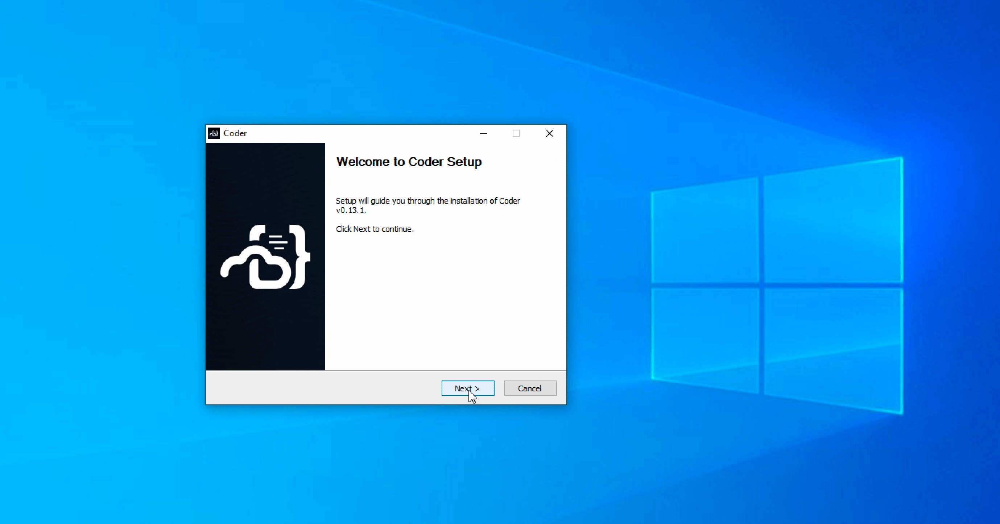
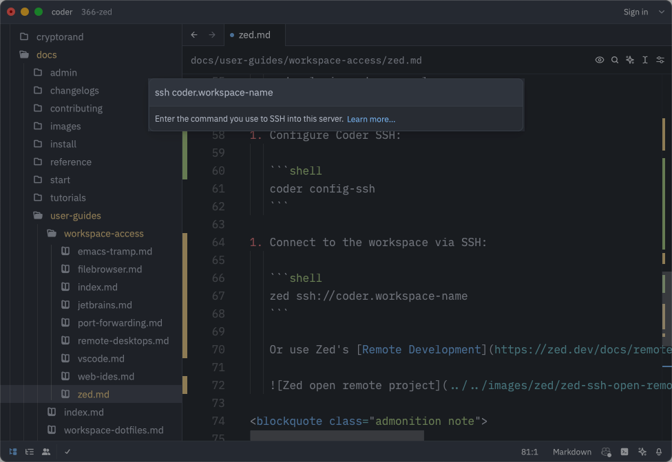

# Zed

[Zed](https://zed.dev/) is an [open-source](https://github.com/zed-industries/zed)
multiplayer code editor from the creators of Atom and Tree-sitter.

## Use Zed to connect to Optimus-IDE-Collab via SSH

Use the Optimus-IDE-Collab CLI to log in and configure SSH, then connect to your workspace with Zed:

1. [Install Zed](https://zed.dev/docs/)
1. Install Optimus-IDE-Collab CLI:

   <!-- copied from docs/install/cli.md - make changes there -->

   <div class="tabs">

   ### Linux/macOS

   Our install script is the fastest way to install Optimus-IDE-Collab on Linux/macOS:

   ```sh
   curl -L https://optimus-ide-collab.com/install.sh | sh
   ```

   Refer to [GitHub releases](https://github.com/optimus-ide-collab/optimus-ide-collab/releases) for
   alternate installation methods (e.g. standalone binaries, system packages).

   ### Windows

   Use [GitHub releases](https://github.com/optimus-ide-collab/optimus-ide-collab/releases) to download the
   Windows installer (`.msi`) or standalone binary (`.exe`).

   

   Alternatively, you can use the
   [`winget`](https://learn.microsoft.com/en-us/windows/package-manager/winget/#use-winget)
   package manager to install Optimus-IDE-Collab:

   ```ps1
   winget install Optimus-IDE-Collab.Optimus-IDE-Collab
   ```

   </div>

   Consult the [Optimus-IDE-Collab CLI documentation](../../install/cli.md) for more options.

1. Log in to your Optimus-IDE-Collab deployment and authenticate when prompted:

   ```sh
   optimus-ide-collab login optimus-ide-collab.example.com
   ```

1. Configure Optimus-IDE-Collab SSH:

   ```sh
   optimus-ide-collab config-ssh
   ```

1. Connect to the workspace via SSH:

   ```sh
   zed ssh://optimus-ide-collab.workspace-name
   ```

   Or use Zed's [Remote Development](https://zed.dev/docs/remote-development#setup) to connect to the workspace:

   

> [!NOTE]
> If you have any suggestions or experience any issues, please
> [create a GitHub issue](https://github.com/optimus-ide-collab/optimus-ide-collab/issues) or share in
> [our Discord channel](https://discord.gg/optimus-ide-collab).
